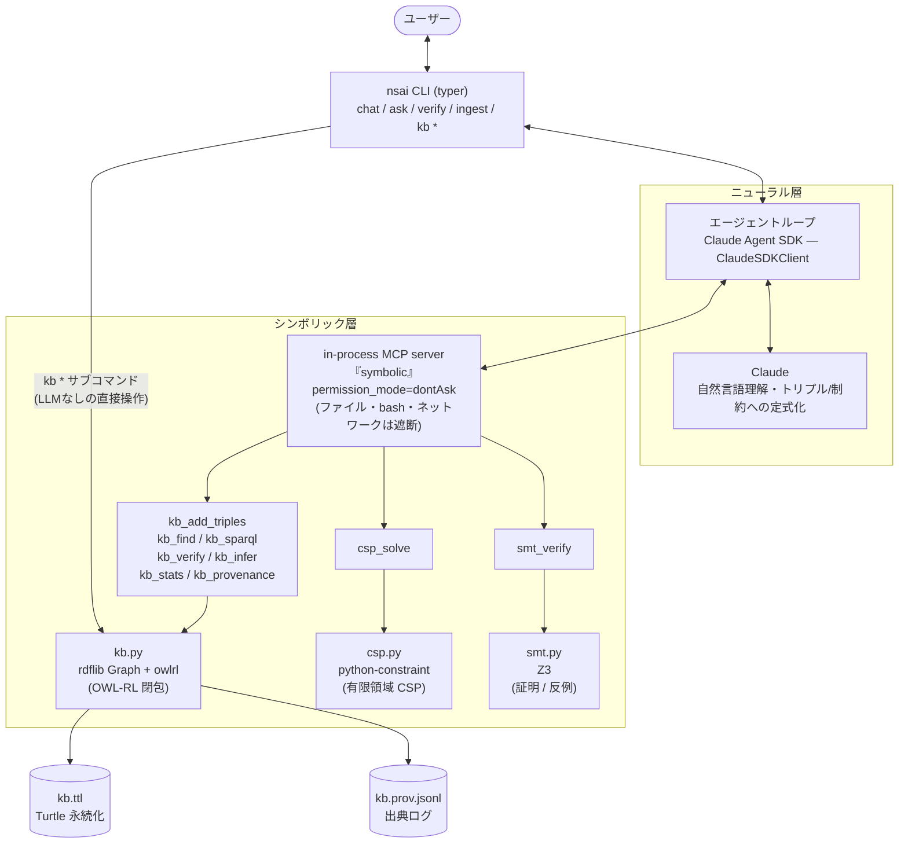
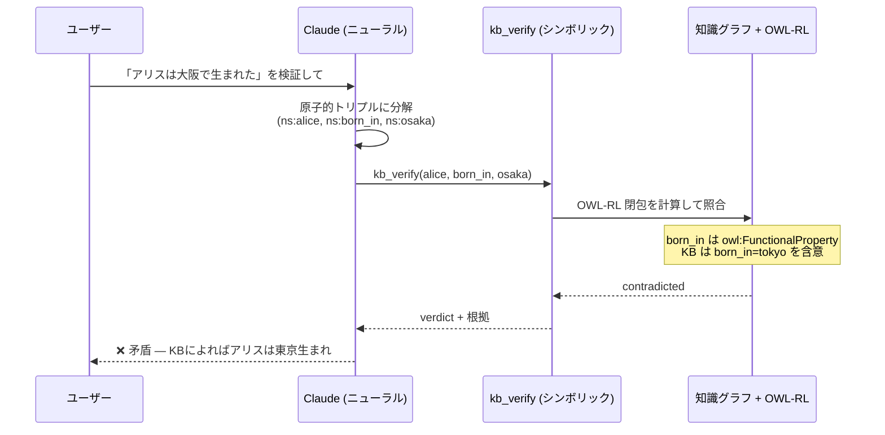

# nsai — Neuro-Symbolic AI Agent CLI

Claude (ニューラル) と RDF 知識グラフ + OWL-RL 推論 + 制約/SMT ソルバー (シンボリック) を組み合わせたエージェント CLI。

LLM は自然言語の理解と定式化だけを担い、**事実の保存・推論・検証・求解はすべて記号層が行う**。記号層が確認するまで、エージェントは事実を断定しない。

## 主な機能

- **知識ベース構築** — 会話や文書から事実をトリプルとして抽出し、Turtle ファイルに永続化(出典ログ付き)
- **推論付き質問応答** — SPARQL + RDFS/OWL-RL 推論で厳密に回答
- **ハルシネーション検証** — 主張をトリプルに分解し、KB との含意 (`entailed`) / 矛盾 (`contradicted`) / 不明 (`unknown`) を判定
- **プランニング** — 制約充足問題を定式化してソルバーで厳密解を列挙
- **数理検証** — Z3 で数値・論理の主張を証明、または反例を生成

## アーキテクチャ



### 検証フロー(ハルシネーション検出)



## セットアップ

```sh
uv sync
export ANTHROPIC_API_KEY=sk-ant-...
```

## 使い方

### エージェント経由(LLM)

```sh
uv run nsai chat                          # 対話モード(マルチターン)
uv run nsai ask "ソクラテスは死ぬ?"         # ワンショット質問
uv run nsai verify "アリスは東京生まれ"      # 主張の検証
uv run nsai ingest document.txt           # 文書から KB 構築
uv run nsai ask -m haiku "..."            # モデル指定(コスト節約)
```

### KB 直接操作(LLMなし)

```sh
uv run nsai kb add ns:socrates rdf:type ns:Human --source "user"
uv run nsai kb add ns:Human rdfs:subClassOf ns:Mortal
uv run nsai kb check ns:socrates rdf:type ns:Mortal   # → entailed
uv run nsai kb source ns:socrates rdf:type ns:Human   # 出典を表示
uv run nsai kb show
uv run nsai kb query "SELECT ?s WHERE { ?s a ns:Human }"
uv run nsai kb infer                                  # 推論結果を実体化
uv run nsai kb export backup.ttl                      # / kb import backup.ttl
uv run nsai kb stats
```

KB ファイルは既定で `./kb.ttl`(`--kb` オプション or `NSAI_KB` 環境変数で変更可)。

## エージェントのツール(9種)

| ツール | 役割 |
|---|---|
| `kb_add_triples` | 事実をトリプルとして保存(source 付き) |
| `kb_find` | パターンマッチ(ワイルドカード可) |
| `kb_sparql` | SPARQL SELECT / ASK |
| `kb_verify` | OWL-RL 推論込みで主張を判定(entailed / contradicted / unknown) |
| `kb_infer` | RDFS/OWL-RL 閉包を KB に実体化 |
| `kb_stats` | KB サイズ統計 |
| `kb_provenance` | トリプルの出典を照会 |
| `csp_solve` | 有限領域の制約充足(スケジューリング等) |
| `smt_verify` | Z3 で数値・論理主張を証明 / 反証 |

セキュリティ: `permission_mode="dontAsk"` + `allowed_tools` により、エージェントは上記9ツール**のみ**使用可能。ファイルシステム・bash・ネットワークへのアクセスは遮断。

## 開発

```sh
uv run pytest        # テスト(22件)
```

## 矛盾検出のモデリングのコツ

1つの主語に対して1つの値しか取れないプロパティ(出生地・首都など)は
`owl:FunctionalProperty` として宣言すると、異なる値の主張が `contradicted` として検出可能になる:

```sh
uv run nsai kb add ns:born_in rdf:type owl:FunctionalProperty
uv run nsai kb add ns:alice ns:born_in ns:tokyo
uv run nsai kb check ns:alice ns:born_in ns:osaka   # → contradicted
```
