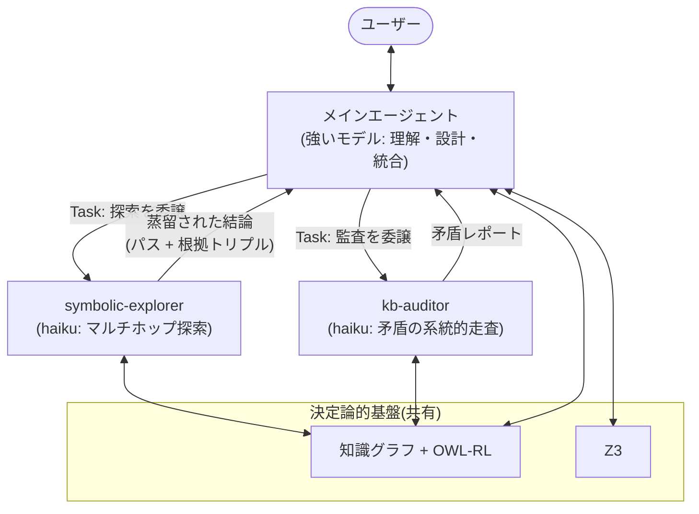

# 将来の拡張: サブエージェントへの決定論的推論の委譲

ステータス: 構想(未実装) / 起案: 2026-07-07

## 概要

現在の nsai はメインエージェント1体がシンボリックツールを直接呼ぶ構成だが、
Claude Agent SDK はサブエージェントをネイティブにサポートしている
(`ClaudeAgentOptions(agents={...})` に `AgentDefinition` を渡すと、
メインエージェントが `Task` ツールで委譲できる)。

これを使い、**決定論的な推論基盤(KB / ソルバー)の上を歩き回る専門サブエージェント**
にツールコールの多い探索・監査タスクを委譲する。



## 動機

1. **コンテキスト隔離** — マルチホップ探索(kb_find → 中間ノード発見 →
   kb_sparql → …)は数十回のツールコールを要する。サブエージェントに委譲すれば
   試行錯誤はメインの会話コンテキストを汚さず、蒸留された結論だけが戻る。
2. **「決定論的な地面の上を、ニューラルが歩く」** — 各ホップの結果は厳密
   (SPARQL)で、ニューラルな判断は経路選択のみ。ハルシネーションの余地が
   経路選択に限定され、返ってきたパスは全トリプルが KB で再検証可能。
   GraphRAG のエージェント版。
3. **コスト構造** — 1ホップの判断は単純なので探索は haiku で十分
   (`AgentDefinition(model="haiku")`)。メインは強いモデルのまま、
   ツールコールの嵩む部分だけ安いモデルに逃がせる。

## 提案するサブエージェント

### symbolic-explorer — オントロジー/知識グラフの agentic search

- **ツール**: kb_find / kb_sparql / kb_verify / kb_stats のみ(読み取り専用)
- **探索戦略**(システムプロンプトで規定):
  1. スキーマの把握 — どんな述語・クラスがあるか kb_sparql で調べる
  2. ホップ — 起点から有望な述語を選んで辿る。行き止まりならバックトラック
  3. 報告 — 発見したパスを根拠トリプル付きで返す(パス上の全トリプルが
     KB で検証可能であること)
- **ユースケース**:
  - 影響分析(コーディングモードと相性が良い): 「API X の仕様変更で壊れる
    モジュールは?」— KB に蓄積した依存関係・契約を推移的に辿り、各候補を
    kb_verify で確認
  - 根本原因分析: 障害事象から因果・依存エッジを遡る
  - マルチホップ QA: 中間エンティティを要する質問
    (「アリスの上司の出身地は?」)

### kb-auditor — 矛盾ハンティング

- **ツール**: kb_find / kb_sparql / kb_verify / kb_provenance
- **役割**: KB 全体を系統的に走査し、owl:FunctionalProperty 衝突や
  sameAs / differentFrom 矛盾を洗い出す。矛盾ごとに kb_provenance で
  出典を引き、どの情報源同士が食い違っているかまで報告する
- **ユースケース**: `ingest` で複数文書を取り込んだ後の整合性チェック、
  コーディングモードで蓄積した契約・インバリアントの定期監査

### (候補)prover — SMT 補題分解

大きな主張を補題に分解し、各補題を smt_verify で証明して積み上げる。
探索よりも定式化の比重が大きいためモデルは強めが必要。優先度は上記2つより低い。

## 実装スケッチ

`agent.py` の `build_options` に追加(50行程度):

```python
from claude_agent_sdk import AgentDefinition

EXPLORER_TOOLS = [
    f"mcp__symbolic__{t}" for t in ("kb_find", "kb_sparql", "kb_verify", "kb_stats")
]

agents = {
    "symbolic-explorer": AgentDefinition(
        description="Multi-hop exploration of the knowledge graph. "
        "Use for questions requiring several hops or unknown paths.",
        prompt=EXPLORER_PROMPT,   # prompts.py に追加
        tools=EXPLORER_TOOLS,
        model="haiku",
    ),
    "kb-auditor": AgentDefinition(
        description="Systematic contradiction sweep over the KB.",
        prompt=AUDITOR_PROMPT,
        tools=AUDITOR_TOOLS,
        model="haiku",
    ),
}
# ClaudeAgentOptions(..., agents=agents) とし、allowed_tools に "Task" を追加
```

メインエージェントのシステムプロンプトには委譲基準を追記する:
「3ホップ以上かかりそうな探索、または KB 全体の走査が必要なタスクは
サブエージェントに委譲せよ」。

## 留保(実装を急がない理由)

- **SPARQL のプロパティパス(`ns:dep+` など)は1クエリで推移閉包を辿れる**。
  agentic search が効くのは「どの述語を辿るべきか事前に分からず、ホップごとに
  判断が要る」探索と、スキーマ自体を発見しながら進む場面に限られる
- 現状の KB は小規模で、探索の委譲は1回の SPARQL より割高になる。
  `ingest` の運用で数百〜数千トリプル規模になってから真価が出る
- サブエージェント呼び出しごとに新しいセッションが立つため、
  少数ツールコールで済むタスクではオーバーヘッドが逆転する

## 導入判断の目安

以下のいずれかを満たしたら実装する:

1. KB が概ね 500 トリプルを超え、マルチホップ質問でメインの応答品質が
   落ちはじめた
2. `ingest` を複数文書で常用しはじめ、取り込み後の整合性チェックが
   手動で回らなくなった
3. コーディングモードで蓄積した契約・依存関係に対して影響分析を
   問い合わせたくなった
