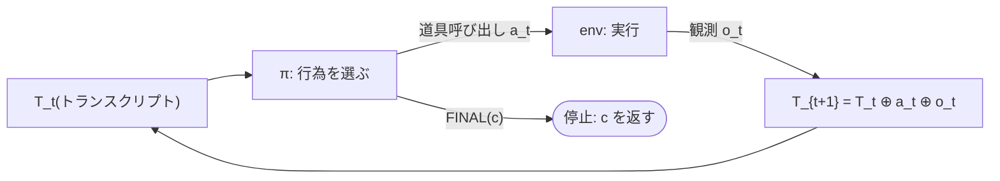
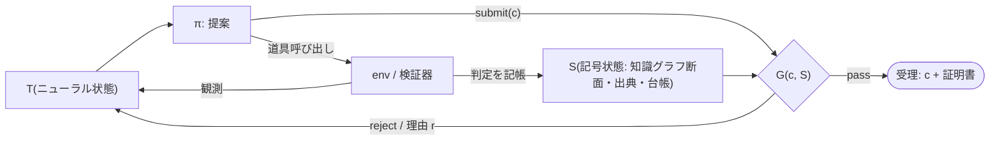

# ゲート付きエージェントループの設計 — ReAct と文脈の形式化から導く

**設計案 v0.1** — 2026-09-21。本書は、ReAct[^react] 型エージェントループと文脈(context[^context])という基礎から出発し、「完了判定をモデルの自己申告から決定論的な関門[^gate]へ移す」ための最小の構造変更を算法として導出する。実装(SDK[^sdk] のフック[^hook])は最終節にのみ置き、本体は実装に依存しない。

位置付け: nsai の実験結果(記号層の寄与の符号は「有無」でなく「取り付け方」が決める; [paper-draft.md](paper-draft.md))を、プロンプト契約ではなくループの制御構造として実現し、ハーネス[^harness]の一形態として公開するための土台。ハーネス構造問題の枠組み(線形トランスクリプト・ボトルネック[^ltb]、六つの構造的問題)は別リポジトリ `harness-resarch` の調査レポート(2026-08-12)に従う。

凡例は文末の脚注にまとめる。本文中の記号・略号・外国語は初出で脚注へリンクする。

---

## 1. ReAct ループの形式化

エージェントの状態を、時刻 t までのトランスクリプト[^transcript] T_t とする。方策[^policy] π はモデル本体であり、T_t だけを見て次の行為 a_t を確率的に選ぶ。

```
a_t  ~  π( · | T_t )                       行為の選択(確率的)
a_t  ∈  Tools ∪ { FINAL(c) }                 道具呼び出し、または候補 c での完了宣言
o_t  =  env(a_t)                             道具の実行結果(観測)
T_{t+1} = T_t ⊕ a_t ⊕ o_t                   トランスクリプトへの追記(⊕ は連結)
停止:  a_t = FINAL(c) のとき、c を答えとして返す
```



この定式化で重要なのは、停止条件が **π が FINAL を出すこと** であり、それ以外の何物でもない点である。停止は T_t の関数であり、しかもその関数を計算するのは、行為を選ぶのと同じ確率的方策 π である。

## 2. 文脈の三重役割と、問題③の形式的表現

T は同時に三つの役割を担っている。

1. **作業記憶** — 途中結果、仮説、計画はすべて T に書かれる。
2. **モデルと世界を結ぶ唯一の通路** — 道具の入出力はすべて T を経由する。
3. **「完了した」の唯一の根拠** — 完了宣言 FINAL(c) が正しいかどうかを判断する材料も T しかない。

三役の同居が、調査レポート §3 が「線形トランスクリプト・ボトルネック」と呼ぶ共通根である。六つの構造的問題のうち問題③(検証が構造化されていない)は、この定式化では次の一文になる。

> 停止述語 `stop(T_t) := [a_t = FINAL(c)]` は T_t のみの関数であり、世界の状態 W にも記号状態 S にも依存しない。しかも π 自身が計算する。

nsai の測定はこの述語の性質をそのまま示した。記号道具を任意の道具として与えた条件(C1[^c1])では、検証道具の使用率が負荷とともに落ち(1-hop 49% → 3-hop 12%)、純ニューラルな探索基線に負ける(EM[^em] 0.790 対 0.860)。プロンプト契約で検証を義務化した条件(rev5[^rev5])は 0.970 に達したが、義務化の主体は依然として π であり、契約を守るかどうかは π の確率的な指示遵守に委ねられている。

## 3. 最小の構造変更: 状態の分離と停止述語の移管

状態を三つに分ける。

| 記号 | 名前 | 中身 | 誰が書くか |
|---|---|---|---|
| T | ニューラル状態 | トランスクリプト | π と道具の出力 |
| S_0 | 記号状態(固定断面) | 課題開始時の知識グラフ[^kg]の断面と出典記録[^prov] | 誰も書かない(π は読むだけ) |
| L | 関門台帳[^ledger] | 検証器の実行記録と受理フラグ | 検証器と関門のみ(π は書けない) |
| S_agent | 記号状態(作業層) | π が課題中に追加した三つ組と、π が起動した閉包の結果 | π(道具経由) |
| W | 世界 | ファイル、環境、外部システム | 道具 |

以下、S = S_0 ∪ L と書く。S_agent は検証器の視界に入らない(§8)。

その上で停止述語を移管する。

```
受理:  FINAL(c) が受理される  ⇔  G(c, S) = pass
       G は決定論的関門。π は候補を提案するだけで、受理はループが決める。
```

これが本設計の全文である。π は「提案者」に、ループは「決定者」になる。調査レポート §4(c)「決定論的ゲートをプロンプトではなくループの制御構造に埋め込む」の形式化にあたる。



## 4. FINAL を型付き行為にする

現行の実験ハーネスは、自由文の末尾から正規表現[^regex]で `FINAL:` 行を抜き出している。これはボトルネックの縮図である。完了宣言が T の中の文字列にすぎないため、ループは「宣言があった」ことしか知らず、「何を根拠に」を知らない。

完了宣言を道具呼び出しにする。

```
submit(candidate: str, evidence: list[EvidenceRef])
```

- `candidate` — 答えそのもの(知識グラフ問答なら CURIE[^curie]、主張判定なら三値、監査なら違反対の集合)。
- `evidence` — 台帳の項目を指す参照。π が「この検査に通した」と主張する根拠。

道具呼び出しにする理由は三つある。第一に、関門が候補文字列を **構造化された入力として** 受け取れる(T を再解析しない)。第二に、受理・拒否の判定と理由を **道具の実行結果として** T に返せるので、π は拒否理由を次の行為に使える。第三に、Stop[^stop] 時点の情報は「トランスクリプトのパス」だけであり(§13)、そこで関門を組むと T の再解析に逆戻りする。

Stop は「submit せずに止まった」場合の **fail-closed[^failclosed] な後詰め** としてのみ使う。

## 5. 台帳と証明書

関門台帳 L ⊂ S は、検証器の実行を一件ずつ記録する。

```
L の項目 = ( validator_id, candidate_exact, inputs, verdict ∈ {pass, warn, reject}, evidence_ptr, t )
```

受理条件は次の通り。

> 候補 c について、必須検証器集合 V_req のすべてに対し、`candidate_exact = c` の項目が存在し、その verdict が pass であること。

「どこかで検証器が呼ばれた」では足りない。**この候補文字列そのもの** に対する合格記録が要る。候補を変えれば台帳は無効になり、再検証が要る。これは rev5 で観測した「検証は通したが別の候補を答える」逸脱を構造的に閉じる。

受理された FINAL は証明書[^cert]を伴う。

```
証明書 = ( c, [L の該当項目], S の断面識別子, 関門版 )
```

証明書は T の外(S)に残り、後から第三者が同じ S の断面に対して再計算できる。ECT[^ect](2608.23623)が提案する「型付き証明書 + 決定論的再生」と目的を共有するが、二点が異なる。本設計の S は OWL-RL[^owlrl] 推論器を備えた知識グラフであり、証明書の根拠は含意・矛盾判定を含む。また関門は行為列ではなく **答えの水準** に置かれ、問答の候補そのものを検査する。

台帳は、論文 2(自己進化)の L1 検証済みレッスン保存庫が読む出典記録の原型でもある。

## 6. 二つの施行変種 — 三つの実験条件

ループ側の施行には二つの変種がある。

| 変種 | 検証器を呼ぶ主体 | ループの役割 | 決定論的な部分 |
|---|---|---|---|
| **A 義務型** | π(道具として呼ぶ) | submit 時に台帳を照合し、欠落があれば構造化理由 r で拒否 | 台帳の照合、拒否、検証器の判定 |
| **B 自動型** | ループ自身 | submit 時に V_req を自ら実行して台帳に記帳し、結果で受理・拒否 | 検証器の起動も含めてすべて |
| (対照)rev5 | π(プロンプトで義務化) | なし(正規表現で FINAL を抜くだけ) | 検証器の判定のみ。呼ぶかどうかは π |

A と B はいずれもループ強制であり、rev5 はプロンプト強制である。A と rev5 の差は「契約の施行主体」、A と B の差は「検証器の起動主体」を分離する。

この対照は Forced-CHECK 論文(arXiv 2607.05458)への応答になりうる。調査エージェントの要約によれば、同論文は「強制チェックの追加だけでは利得を説明できない」と結論しており、その CHECK は学習された制御器の内部にある構造的行為で、検査内容の決定論性は問われていないとされる(**要確認: 原論文未読**。§12 の仮説を確定する前に読むこと)。本設計では、A で「呼ぶことの強制」を、B で「検査の決定論性 + 起動の決定論性」を、それぞれ独立に効かせられる。

## 7. 有界性と fail-closed

拒否は無限に続けない。

```
拒否回数の上限 R(既定 3)。submit の拒否と Stop の差し戻し(§13)を合算して数える
非 submit 行為の上限 N(手番上限)、または課題あたりの時間予算
各検証器の実行時間上限(既存: SPARQL[^sparql] 30 秒、閉包 120 秒、Z3[^z3] 30 秒、CSP[^csp] 探索空間 5M)
いずれかの上限到達時:  FINAL(unknown) を返す。未検証の候補は決して返さない。
```

停止性は次の性質として述べる。π の各ステップが有限時間で返り、検証器が全域[^total]で、拒否回数が R で、非 submit 行為が N で、それぞれ有界なら、ループは有限ステップで「証明書付きの c」か「unknown」のいずれかで停止する。「未検証の c」で停止する経路は存在しない。N の上限がなければ、submit も停止もせずに探索道具を呼び続ける経路が残るため、N は省けない。

## 8. 環境の硬化 — 関門を π の手の届かない場所へ

本設計には塞ぐべき穴がある。nsai の道具集合のうち、知識グラフを書き換えるものが二つある。

| 道具 | 書き換えの内容 | 危険 |
|---|---|---|
| `kb_add_triples` | 三つ組の追加 | π が「これから検査される事実」を自分で書き込んでから検査に通せる |
| `kb_infer` | OWL-RL 閉包の実体化 | 矛盾を含むグラフでは同一性述語(owl:sameAs)の連鎖が無関係な実体を併合し、誤答が「存在する」ようになる(監査で真の違反 5 件が 95 件に見えた原因) |

調査レビュー §3.4 の三本柱(ii)「環境の硬化」、および RHB[^rhb] が示した「検証関数へのアクセス遮断だけでハック率を相対 88% 削減」は、この穴を放置してはならないことを示す。

規則を三つ置く。

1. **関門は課題開始時の断面 S_0 に対して評価する。** 検証器が読む知識グラフは課題開始時に固定した断面であり、`kb_add_triples` の書き込みは作業層 S_agent に積まれる。π の探索(`kb_find`、`kb_sparql`、`kb_path`)は S_0 ∪ S_agent を読んでよいが、検証器は S_0 だけを読む。
2. **閉包は検証器の内部で計算し、実体化しない。** `kb_verify` は必要な閉包を S_0 の複製上で計算して捨てる。π が起動した `kb_infer` の結果は S_agent に落ち、検証器の視界に入らない。
3. **出典による除外。** 断面を固定できない対話モードでは、`source` が当該セッションのエージェント自身である三つ組を検証器の入力から除外する。

いずれも、§11 の「エージェント非書換」の性質を保証するための規則である。§3 の表で「π は S を書けない」としたのはこの意味であり、π の書き込みはすべて S_agent に隔離される。

## 9. 六つの構造的問題への写像

調査レポート §2 の六問題に対し、本設計は次の位置にある。

- **2.1 文脈を唯一の作業記憶とする設計** — 台帳と断面は S にあり T の長さに依存しない。関門は文脈が劣化しても同じ判定を返す。
- **2.2 サブエージェント分離の帯域ボトルネック** — 境界を越えるのは自由文ではなく証明書(§10)。
- **2.3 検証が構造化されていない** — 本設計の主題。停止述語を π から G へ移管する。
- **2.4 権限モデルの粒度不一致** — 関門は操作ごとの承認ではなく、受理条件という方針で書かれる。人間の判断が要るのは方針(V_req)の設計時であって実行時ではない。
- **2.5 命令とデータの非分離** — 関門は S を読み、T を読まない。T に注入された「検証済み」という文字列は判定を偽造できない。判定は **計算されるもの** であって **引用されるもの** ではないからである。
- **2.6 ハーネスとモデルの共進化** — V_req は「現行モデルの限界についての仮定」の明示的な一覧である(調査レポート §4(d))。モデル更新で不要になった検証器は、台帳の pass 率が 1.0 に張り付くことで検出でき、取り外せる。

## 10. 委譲境界

サブエージェントへ委譲する場合、返ってくるのは自由文の報告ではなく証明書である。副エージェントの submit は親の台帳に記帳され、親は同じ受理条件で照合する。C2f[^c2f] で観測した「自由文の受け渡しで答えが失われる」(修正案 H1[^h1] で構造化受け渡しに修正)を形式化したもので、SubagentStop[^substop] を後詰めに使える。

## 11. 検証器のインターフェース

```
V : (candidate, task_context, S_0) → (verdict ∈ {pass, warn, reject}, evidence)
```

検証器に要求する性質:

| 性質 | 意味 |
|---|---|
| 決定論的 | 同じ入力と同じ S_0 に対して常に同じ verdict |
| 全域 | 必ず有限時間で返る(時間上限で reject に落ちる) |
| 証拠付き | verdict の根拠(該当三つ組、反例、違反対)を S への参照として返す |
| モデル非依存 | π の種類・版に依存しない |
| エージェント非書換 | π が入力(S_0)を改変できない(§8) |

既存の実装はそのまま検証器の実例になる。

| 検証器 | 検査内容 | 課題 |
|---|---|---|
| `kb_check_answer` | 存在・型・起点除外 | 知識グラフ問答 |
| `kb_verify` | 最終ホップの三つ組の含意(OWL-RL 閉包上) | 知識グラフ問答、主張判定 |
| `kb_violations` | 閉包前の関数プロパティ違反の列挙 | 矛盾監査 |
| `smt_verify` | 数値・論理主張の証明または反例 | コーディング検証 |

`warn` の扱いは V_req の設計で決める。既定では warn は pass と同値ではなく、π に「全ホップの再導出」を求める拒否理由として返す(rev5 の運用と同じ)。

## 12. 実験計画(提案のみ、未実行)

MetaQA[^metaqa] の開発用 600 問(rev5 と同一集合)で比較する。

**設計前に測れる数値(2026-09-21 実測)。** rev5 の記録 `results/metaqa-C1-rev5.jsonl`(600 件、実費 $38.3)で、verify-before-FINAL 契約の「呼ぶこと」の違反を数えた。

| 違反の種類 | 件数 |
|---|---|
| `kb_check_answer` を一度も呼ばずに答えた | 0 / 600 |
| `kb_verify` を一度も呼ばずに答えた | 1 / 600(1-hop、誤答) |
| 誤答 18 件のうち検査を呼んでいないもの | 0 |

つまり Sonnet 5 では、プロンプト契約の「呼ぶこと」の遵守率はすでに 1.0 であり、**ループ強制が「呼ばせる」ことで EM を上げる余地は MetaQA + Sonnet 5 にはない**。残る 18 件の誤答は、検査を呼んだ上での誤りである(検査した候補と答えた候補の不一致は記録に残っておらず、台帳があれば初めて数えられる)。

したがって実験は「rev5 を超えるか」ではなく、**「プロンプト契約なしでもループ強制だけで rev5 に届くか」「プロンプト遵守が崩れる条件で差が出るか」** を問う形にする。

| 条件 | プロンプト契約 | ループ強制 | 目的 | 費用の目安 |
|---|---|---|---|---|
| rev5(実測済み) | あり | なし | 基準 0.970 | — |
| C1-rev2[^rev2](実測済み) | なし | なし | 下限の基準 0.790(同一 600 問) | — |
| GA∅ 義務型・契約なし | なし(rev2 相当の素のプロンプト) | 台帳照合 | ループ強制単独で契約と同じ 0.970 に届くか、0.790 との差 +0.18 のどこまで回復するか | 約 $40 |
| GB∅ 自動型・契約なし | なし | 検証器も起動 | GA∅ との差 = 起動の決定論性 | 約 $40 |
| GA∅-haiku | なし | 台帳照合 | プロンプト遵守が弱いモデルで差が開くか(対照: rev5-haiku) | 約 $15 × 2 |

採点は、GA∅・GB∅ の各条件では正規表現ではなく、受理された submit の証明書に含まれる c を読む。拒否上限到達の unknown は誤答として数える(fail-closed の費用を隠さない)。

仮説: (仮説1)GA∅ が rev5 に届けば、契約の効力はプロンプトの文言ではなく「検査を通す」という構造にある。0.790 と 0.970 の間に落ちれば、その位置がループ強制単独の寄与を与える。(仮説2)GA∅ ≈ GB∅ なら、利得の源泉は「検査の決定論性」であって「起動の決定論性」ではない。(仮説3)haiku では rev5-haiku < GA∅-haiku となり、ループ強制の価値はプロンプト遵守が崩れるところで現れる。(仮説4)拒否回数の分布はホップ[^hop]数とともに増え、fail-closed の unknown は 3-hop に集中する。

## 13. SDK での実現(設計ではなく実装対応)

導入済みの Claude Agent SDK 0.2.111 で、本設計は次の対応で実現できる。

| 設計要素 | SDK の機構 | 備考 |
|---|---|---|
| submit 道具 | MCP[^mcp] 道具として定義 | 候補と証拠参照を構造化入力で受ける |
| 関門 G | PreToolUse[^pretool] フック(照合子[^matcher] = submit の道具名) | `tool_input` から候補を取り、台帳を照合。拒否は `permissionDecision: deny` + 理由 |
| 台帳への記帳 | PostToolUse[^posttool] フック(照合子 = 検証器の道具名) | 実行結果を台帳 L へ書く。B 自動型では PreToolUse 内で検証器を直接呼ぶ |
| fail-closed 後詰め | Stop フック | 台帳の受理フラグが立っていなければ `decision: block` で差し戻す。差し戻しは R に算入する |
| 委譲境界 | SubagentStop フック | 副エージェントの証明書を親台帳に転記 |

注意点が三つある。第一に、Stop フックの入力は `transcript_path` と `stop_hook_active` だけで候補を持たないため、関門本体を Stop に置かない(§4)。第二に、Stop の差し戻し後に π が再び submit せず停止すれば Stop は再度呼ばれる(`stop_hook_active` が真)。そのため Stop フックは台帳の受理フラグを読んで「この課題で既に受理済みか」を知り、差し戻し回数を R に算入して上限で unknown に落とす。第三に、MCP 道具の名前は `mcp__symbolic__kb_check_answer` のように接頭辞付きで届くため、照合子はこの完全名で書く。

実装の前提条件を一つ挙げる。§8 規則 2 は「検証器は S_0 の複製上で閉包を計算し、実体化しない」を要求するが、現行の `kb.py` では π が呼んだ `kb_infer` が同一プロセス内のグラフに閉包を実体化し、その後の `kb_verify` が同じグラフを読む(ディスクへの書き戻しは 2026-07-13 に修正済みだが、メモリ内の共有は残っている)。フック実装の最初の確認事項は、検証器の経路が生きているグラフではなく S_0 を読むことである。

---

## 脚注(凡例・注釈)

[^react]: ReAct — Reason + Act。思考と道具呼び出しを交互に行い、観測をトランスクリプトへ追記して繰り返すエージェントループの基本形(Yao ら, 2023)。
[^context]: context(文脈) — モデルが一度に読める入力全体。本書ではトランスクリプト T と同一視する。
[^gate]: 関門(ゲート) — 出力が必ず通過し、通過の可否を決定論的に決める検査点。
[^sdk]: SDK — Software Development Kit。ここでは Claude Agent SDK(Python)。
[^hook]: フック(hook) — SDK がループの特定時点(道具実行の前後、停止時)で呼ぶ利用者定義の処理。処理結果で続行・拒否・差し戻しを決められる。
[^harness]: ハーネス — モデル本体を除くエージェントの工学層(道具の配送、文脈管理、安全機構、サブエージェント編成、統制)。調査レポート §1 の定義に従う。
[^ltb]: 線形トランスクリプト・ボトルネック — 単一の線形テキストトランスクリプト + 同期的道具呼び出しを唯一の万能インターフェースとした設計判断。調査レポート §3 が六問題の共通根として同定した。
[^transcript]: トランスクリプト(transcript) — ユーザー入力、モデル出力、道具の入出力を時系列に並べた記録。
[^policy]: 方策(policy) — 状態から行為を選ぶ関数。ここではモデル本体 π。
[^c1]: C1 — nsai の実験条件。記号道具を任意で使える単一エージェント。
[^em]: EM — Exact Match。予測が正解と完全一致した割合。
[^rev2]: rev2 — プロンプト版 2。記号道具を任意の道具として与えるだけで、検証契約を持たない C1 の素の条件。MetaQA で EM 0.790。
[^rev5]: rev5 — プロンプト版 5。回答検証道具 `kb_check_answer` と verify-before-FINAL 契約をプロンプトで義務化した条件。論文の主結果(EM 0.970)。
[^kg]: 知識グラフ(KG) — RDF[^rdf] 三つ組で表した事実の集合。nsai では rdflib + owlrl。
[^rdf]: RDF — Resource Description Framework。「主語・述語・目的語」の三つ組で事実を表す W3C の規約。
[^sparql]: SPARQL — RDF グラフへの問い合わせ言語。
[^z3]: Z3 — Microsoft Research の SMT(充足可能性モジュロ理論)ソルバー。数値・論理主張の証明と反例生成に使う。
[^csp]: CSP — Constraint Satisfaction Problem(制約充足問題)。有限領域の割当・順序問題を厳密に解く。
[^hop]: ホップ(hop) — 知識グラフ上で答えに至るまでに辿る辺の数。MetaQA は 1・2・3-hop の問題からなる。
[^h1]: H1 — [design-revision-plan.md](design-revision-plan.md) の修正案「構造化された委譲受け渡し」。副エージェントの FINAL 行を親が逐語で写す契約。仮説番号ではない。
[^matcher]: 照合子(matcher) — フックをどの道具名に対して発火させるかを指定する文字列。
[^prov]: 出典記録(provenance) — 三つ組ごとに「誰が・いつ・何を根拠に」を記録したもの。nsai では `kb.prov.jsonl`。
[^ledger]: 台帳(ledger) — 検証器の実行を一件ずつ記録した記号状態の一部。§5。
[^regex]: 正規表現(regex) — 文字列パターン照合。現行ハーネスは `FINAL:\s*(...)` で答えを抜く。
[^curie]: CURIE — Compact URI。`ns:Alice` のような接頭辞付きの短縮識別子。
[^stop]: Stop — SDK のフック事象。エージェントが「完了」として停止しようとする瞬間に呼ばれる。`decision: block` で差し戻せる。
[^failclosed]: fail-closed — 判定できないときは「通さない」側に倒す方針。反対は fail-open。
[^cert]: 証明書(certificate) — 受理された答えに添付する、台帳項目と断面識別子の束。第三者が再計算できる。
[^ect]: ECT — Evidence-Carrying Termination(arXiv 2608.23623)。主張ごとに痕跡への束縛を持つ型付き証明書がなければ完了宣言(COMPLETE)を許さない手法。
[^owlrl]: OWL-RL — OWL 2 の規則ベース推論プロファイル。含意・矛盾判定に用いる。
[^total]: 全域(total) — すべての入力に対して有限時間で値を返す性質。
[^rhb]: RHB — Reward Hacking Benchmark。道具使用エージェントの近道行動を測るベンチマーク。調査レビュー §3.3。
[^c2f]: C2f — nsai の実験条件。副エージェントへの委譲をプロンプトで強制した条件。自由文の受け渡しで答えが失われる不具合(51 件)を H1 構造化受け渡しで修正した。
[^substop]: SubagentStop — SDK のフック事象。副エージェントが停止しようとする瞬間に呼ばれる。
[^metaqa]: MetaQA — 映画知識グラフ上のマルチホップ問答ベンチマーク。nsai の主評価。
[^mcp]: MCP — Model Context Protocol。道具をモデルへ提供するための規約。nsai の記号道具は同一プロセス内の MCP サーバーとして提供される。
[^pretool]: PreToolUse — SDK のフック事象。道具実行の直前に呼ばれ、`tool_name`・`tool_input` を受け取り、`permissionDecision` で allow / deny を返せる。
[^posttool]: PostToolUse — SDK のフック事象。道具実行の直後に呼ばれ、実行結果を受け取る。
