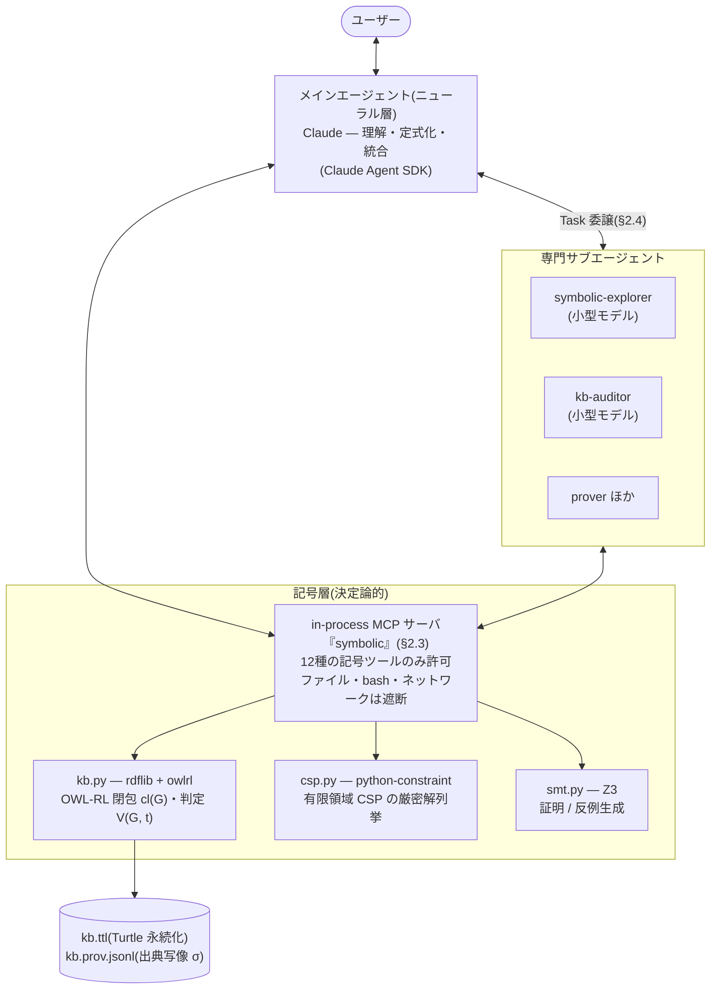
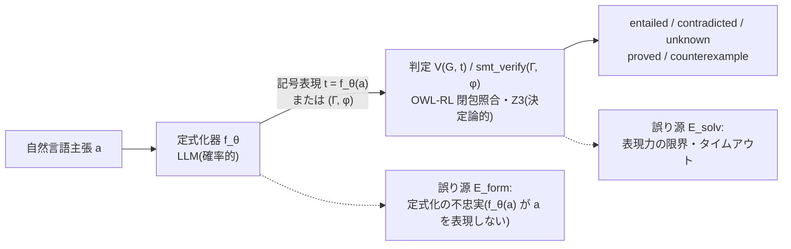
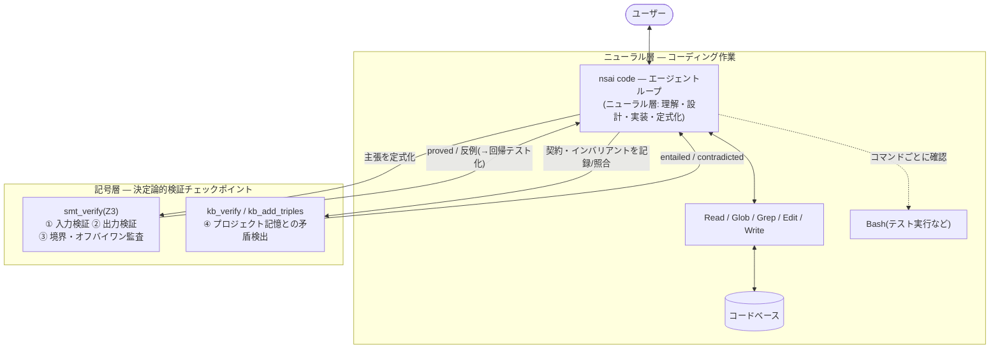
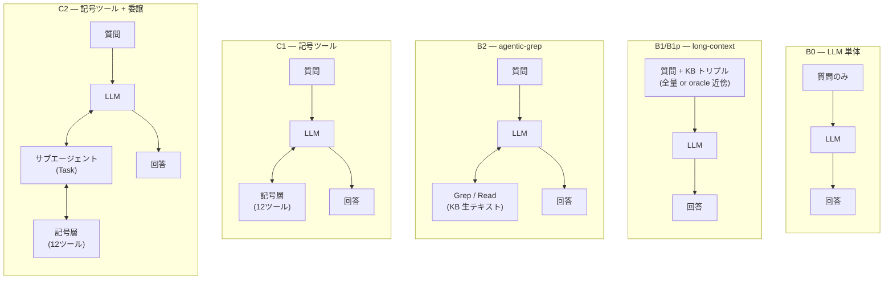
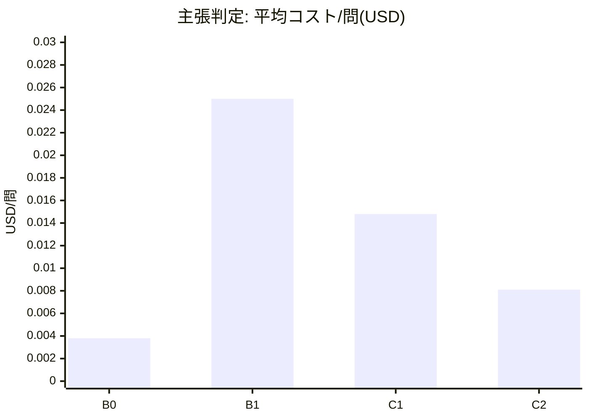
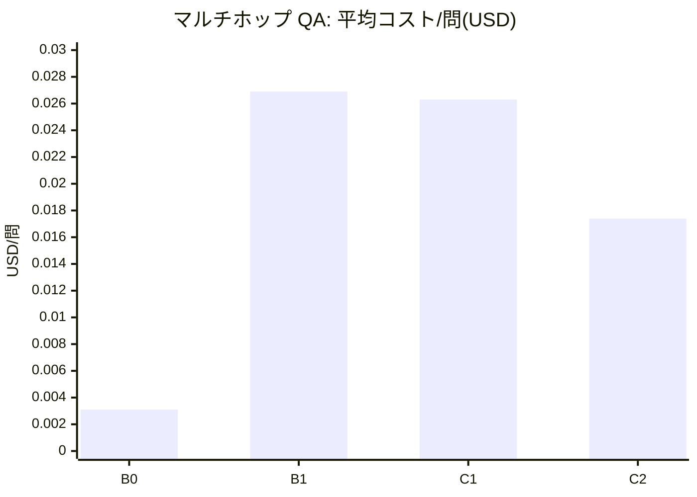

# 記号層に接地された LLM エージェント: 知識グラフ・制約ソルバー・SMT による検証可能なニューロシンボリック分業

**ドラフト v0.7** — 2026-07-19、主実験・追試完了、全数値実測。v0.7 で査読指摘 M1(未使用サンプルでの held-out 評価)・M3(ニューラル版ゲートのアブレーション B2g による有効成分の分解)・M5(rev5・B2 の run 間分散)に応える新規実験結果を統合した(M2/M4/M6/M7 の数値修正は v0.6 で適用済み)。数値の正は `results/*.jsonl`(正誤キー `correct`)であり、集計の照合記録は [results-summary.md](results-summary.md) にある。実験設計の原文は [experiment-plan.md](experiment-plan.md)、設計修正の経緯は [design-revision-plan.md](design-revision-plan.md)、書誌検証の記録は [related-work-survey.md](related-work-survey.md) を参照。引用文献は全件一次情報源で書誌検証済み(2026-07-07)。
投稿先候補: NeSy / AAAI・IJCAI(ニューロシンボリック枠)/ ACL・EMNLP Findings(tool-augmented LLM 枠)。

---

## Abstract

大規模言語モデル(LLM)は自然言語の理解と柔軟な問題定式化に優れる一方、事実の想起・多段推論・自己検証を同一の確率的機構で行うため、誤りを「検証済み」として断定するハルシネーションを構造的に排除できない。本論文では**役割の分業**による解を提案する: LLM は自然言語の理解と記号表現への定式化のみを担い、事実の保存・推論・検証・求解はすべて決定論的な記号層 — RDF 知識グラフ + OWL-RL 推論、有限領域制約ソルバー(CSP)、SMT ソルバー(Z3) — が行う。この設計を実装したエージェント `nsai` を、合成 KB による制御実験、MetaQA(133,582 トリプルの KB 付きマルチホップ QA 600 問とそのエンティティ置換摂動版)、およびコーディング検証タスク(QuixBugs、EvalPlus、自作境界バグスイート)で評価した。

中心的な発見は、記号層の寄与の符号を決めるのが層の**有無**ではなく**取り付け方**だということである。(1)MetaQA において、記号 KB ツールを任意の道具として与えたエージェントは EM 0.790 と、記号ツールを一切持たない純ニューラルな agentic 検索ベースライン(0.860)を**下回る**。同一の記号能力を出力経路上の必須決定論ゲート — 回答バリデータと verify-before-FINAL 契約 — として取り付け直すと 0.970 に達する(McNemar 判別対 66/0、p=2.7e-20)。経路探索まで記号化する追加は利得を生まない(0.962、p=0.3): 有効成分は探索の記号化ではなくゲートである。この 0.970 は開発に一切用いなかった新規 600 問(各ホップ 200、シード 7)でも 0.977 と再現し(対 B2 0.883、McNemar 61/5、p=2.6e-13)、適応的過学習は見られない。有効成分を分解すると、利得の大部分は記号ツールを持たない agentic-grep に grep ベースの検査契約を強制した純ニューラル版ゲート B2g で到達でき(B2 0.860 → B2g 0.950、+.090、p=9e-13)、決定論的検査はその上にさらに有意な残余を加える(B2g → rev5 0.970、+.020、判別対 18/6、p=0.023)。符号を反転させる有効成分は出力経路上の**強制ゲート**であり、その強制はニューラルにも実装できるが決定論はなお有意に上乗せする。(2)KB 矛盾監査では、矛盾を含む KB 上で自由に参照される OWL-RL 推論器が真の違反 5 件を 95 件の擬似違反に増幅(19 倍)して Precision を 0.05(= 5/95)に崩壊させるが、閉包前の決定論的違反列挙(provenance 同梱)への置き換えで全 24 run が P=R=1.0 に回復し、コストは約 1/75 になる。(3)ネガティブコントロールとして、決定論的検査を LLM 判定者に置き換えた場合、n=20 では判定者による誤完了宣言の低減は検出されなかった(haiku、19/20 vs 15/20、Fisher 片側 p=0.091、差の 95%CI (−0.03, +0.42) はゼロを跨ぐ; この n では 20 ポイントの低減すら検出力 0.38 で捉えられない)。加えて本セルは初期 5 問の結果を見た後に 15 問を追加した逐次デザインである。判定者に効果があるとしても、モデル能力の効果(19/20 vs 2/20、p=2.9e-08、頑健)より一桁以上小さい — ゲートの有効成分は「検証を増やすこと」自体ではなく決定論性であると解釈するが、判定者利得の不在を積極的に主張するにはデータが不足している。一方、null の結果も明記する: 3値主張判定は B0 以外の全条件が全規模で飽和し(正解率 1.000)、偽検証率の条件間分離は現データでは検証できなかった。SMT 組み込みによる修正率の改善も検出されなかった(plain ≒ nsai; 分離はソルバー系統テスト生成のスイート健全性 50%→100% に現れる)。誤り分析は残存誤りが定式化・解釈層に局在すること(3-hop 失敗の約 93% が起点属性の誤読)を示し、この分析がゲート設計を直接導いた: 過去の失敗 126 問中 106 問を回復し、対照 126 問での退行はゼロであった。

---

## 1. Introduction

LLM ベースのエージェントは、質問応答・知識管理・コーディングにおいて広く実用化されつつある。しかしその中核をなす LLM は、**事実の記憶・推論・検証を単一の確率的な次トークン予測で行う**という設計上の制約を持つ。この結果、次の3つの失敗様式が系統的に現れる:

1. **偽検証(false verification)** — 誤った、あるいは根拠のない主張を「確認済みの事実」として断定する。検証を求められた場合でも、LLM は自身のパラメトリック知識と文脈からの尤度で「もっともらしさ」を判定するに過ぎず、判定自体がハルシネーションでありうる。
2. **多段推論の劣化** — 中間エンティティを要するマルチホップ推論は、ホップ数と候補事実数の増大に対して急速に劣化する。文脈に全事実を与える long-context 構成でも、注意機構による「文脈からの検索」は決定論的なグラフ照合の代替にならない。
3. **自己検証の循環性** — 「自分の出力を自分で確認する」self-verification 系の手法 (Wang et al., 2023; Manakul et al., 2023; Dhuliawala et al., 2024) は、検証器が被検証器と同じ機構・同じバイアスを共有するため、系統誤差を検出できない。

これらに共通する根本原因は、**生成と検証が同じ機構に同居している**ことである。本論文はこの観察に基づき、徹底した分業アーキテクチャを提案する:

> **LLM は自然言語の理解と記号表現への定式化のみを担い、事実の保存・推論・検証・求解はすべて決定論的な記号層が行う。記号層が確認するまで、エージェントは事実を断定しない。**

この原則を実装したエージェント `nsai` において、記号層は3つの決定論的コンポーネントからなる: (a)RDF 知識グラフ + OWL-RL 推論(事実の保存と含意・矛盾判定)、(b)有限領域制約ソルバー(割当・スケジューリング等の厳密解列挙)、(c)SMT ソルバー Z3(数値・論理主張の証明と反例生成)。LLM から見ればこれらは 12 種のツールであり(§2.3、§2.7)、主張の検証は `kb_verify` が **entailed / contradicted / unknown** の3値を根拠付きで返す。判定は OWL-RL 閉包上の照合であって尤度ではないため、同じ KB に対して常に同じ答えを返し、「知らないことを知らない」と言える。

ただし本実行の実験結果は、この分業の枠組みに重要な但し書きを付ける。従来のニューロシンボリック研究は主として記号層が**何を**計算するか(論理・制約・証明)を問うてきたが、我々の測定が示したのは、記号層が**エージェントループのどこに結合するか**が寄与の符号を決めるということである。記号ツールを「使ってもよい道具」として与えられたエージェントは、負荷が高い場面ほどそれを使わず(kb_verify 使用率は 1-hop 49% → 3-hop 12% と逆転する)、記号ツールを持たない純ニューラルな agentic 検索に精度で負ける(0.790 < 0.860)。同一の記号能力を、出力が必ず通過する決定論ゲートとして取り付け直すと大差で勝つ(0.970)。さらにネガティブコントロールは、このゲートを LLM 判定者で代替できないことを示す — 同系列の判定者は生成器と同じ誤り分布からの2回目のサンプルであり、決定論的検査が機械的に検出できる矛盾を有意には検出できない。すなわち記号層が価値を生むのは**ゲートとして**であり、ツールとしてでも判定者としてでもない。

分業には副次的な利点がある。第一に、**探索・監査の委譲**である。知識グラフのマルチホップ探索や全域的な矛盾走査はツールコールが嵩み、メインエージェントの文脈を圧迫する。これらを読み取り専用ツールのみを持つ専門サブエージェント(symbolic-explorer / kb-auditor)に委譲し、蒸留された結論だけを文脈に戻す。サブエージェントの作業は決定論的なツールの上を歩くだけなので、**安価な小型モデルで十分**という仮説が立つ(RQ5)。第二に、**構造の決定論的抽出**である。コードの import・呼び出し・継承といった構造的事実は `ast` による静的解析で LLM を介さず抽出でき(code2kb)、LLM は契約や意図といった意味層の抽出に専念できる。第三に、**コーディングへの拡張**である。ファイル操作等のコーディング作業はニューラル層が行い、境界条件・入力検証・ループ終了条件といった「危ういロジック」の検証のみを SMT に委ねるハイブリッドコーディングモードにより、分業原則は事実 QA を超えてソフトウェア開発にも適用できる。

本論文の貢献は以下である:

1. **対になった証拠を持つ設計テーゼ(査読対応でアブレーション分解・強化)**: 同一の記号能力が、任意ツールとして提供されると純ニューラルな agentic ベースラインに負け(EM 0.790 < 0.860)、出力経路上の強制ゲートとして取り付けると決定的に勝つ(0.970; McNemar 判別対 66/0、p=2.7e-20)。取り付け方 — ツールかゲートか — が LLM エージェントにおける記号層の寄与の符号を反転させることの、我々の知る限り初の統制された実証である。査読(M3)に応えて有効成分を分解するアブレーション B2g(記号ツールを持たない agentic-grep に grep ベースの verify-before-FINAL 契約を強制)を追加した結果、利得の大部分(B2 0.860 → B2g 0.950、+.090、判別対 59/5、p=9e-13)は決定論を用いない純ニューラルなプロトコル強制で達成でき、決定論的チェッカーはその上にさらに有意な残余を加える(B2g → rev5 0.970、+.020、判別対 18/6、p=0.023)。すなわち符号を反転させる有効成分は「出力経路上の強制ゲート」であり、強制はニューラルにも実装可能だが決定論はなお有意に上乗せする。このアブレーションはテーゼを反証するのではなく分解して強化する。中心値 0.970 は開発に一切用いなかった新規 600 問(held-out)で 0.977 と再現し(≥ 開発値、適応的過学習なし; McNemar 対 B2 61/5、p=2.6e-13)、開発セット固有の規約への過適合を排除した(§4.2)。
2. **有効成分を単離するアブレーション**: ゲートの上に決定論的経路走査(`kb_path`)を足しても有意な追加利得はない(0.962 vs 0.970、判別対 5/10、p=0.3)。利得は出力のゲートから来るのであり、探索過程の記号化からではない(§4.2)。
3. **設計を根拠付ける機構レベルの誤り分析**: (a)3-hop 失敗の約 93% は起点エンティティの属性誤読であり、KB 照合で機械的に検出可能; (b)任意の `kb_verify` は保護的(使用時 EM が 2/3-hop で +11–13 pt)だが使用率がホップ数と逆転する(49% → 12%)— 助言でなく強制の動機; (c)見かけの「委譲は QA に有害」の一部は生存バイアスとハンドオフ配管の混入であり、エージェントレベルの結論がハーネス効果に交絡され得ることの例示(§5)。
4. **第二領域(KB 監査)での再現**: 矛盾を含む KB 上の OWL-RL 閉包推論器への自由アクセスは能動的に有害(sameAs 連鎖増幅により 5→95(19 倍)/ 20→393(19.65 倍)の擬似違反、Precision 0.05 = 5/95、run 間・条件間でビット同一の誤予測)である一方、閉包前の違反列挙ツール `kb_violations`(provenance 同梱)は全 4 グリッド × 2 構成 × 3 run で P=R=1.0 を達成し、コストを約 $15 から約 $0.2/run に削減(§4.3)。
5. **非退行対照付きの回復プロトコル**: 過去に失敗したタスクのみをゲート付きプロトコルで再走して 106/126(84%)を回復、同数 126 タスクの対照群で退行ゼロ(§4.2)。
6. **「検証を増やす」と「決定論的に検証する」を分離するネガティブコントロール**: 矛盾仕様 20 問のコーディング完了宣言に対する LLM 判定者(loop-judge)は、n=20 では誤宣言の低減が検出されず(19/20 vs 15/20、Fisher 片側 p=0.091、差の 95%CI (−0.03, +0.42)、20 ポイント低減に対する検出力 0.38、初期 5 問後に 15 問追加の逐次デザイン)、最も明示的な矛盾層ではむしろ自己判定より悪く、合成含意型の矛盾は強いモデルすら両条件で破る(各 2/5)。支配的なのはプロトコルでなくモデル能力である(19/20 vs 2/20、p=2.9e-08、頑健)。判定者利得は、あるとしてもモデル能力効果より一桁以上小さく、n=20 ではセカンドオピニオンの利得は検出されなかった(§4.4)。

### 1.1 Scope

本論文は汎用コーディングエージェントとしての総合的優位を主張しない。主張の守備範囲は「明示的な事実・制約・境界条件が関与するタスクにおいて、記号層への**ゲートとしての**接地が検証可能性と精度を改善する」ことである。リポジトリ探索や API 理解が律速となるタスク(フル SWE-bench)、シェル操作・環境構築が主体のタスク(Terminal-Bench 等)は測定対象と直交するため対象外とする。実リポジトリへの外的妥当性確認として計画した SWE-bench Verified 境界バグサブセット(実験4d)は、機械フィルタの適合が 9/500 問と計画規模(30–50 問)に届かず保留中であり、本論文では未実施として扱う(§3.7)。どこで効き、どこでは効かないかを明示することが、本論文の誠実な主張形式である — 実際、主張検証(RQ1)とバグ修正(RQ4-4a)では条件間分離が出なかったことを null として報告する。

---

## 2. System

`nsai` は Claude Agent SDK 上に構築されたエージェント CLI である。図1に全体アーキテクチャを示す。



**図1: `nsai` の全体アーキテクチャ。** ニューラル層(メインエージェントとサブエージェント)は MCP ツール境界を通じてのみ記号層に到達でき、事実の保存・推論・検証・求解はすべて記号層の決定論的コンポーネントが行う。通常モードではファイル・bash・ネットワークが遮断されるため、エージェントが記号層を迂回して外界に触れる経路は存在しない。

### 2.1 設計原則

システム全体は単一の原則から導かれる: **ニューラル層(LLM)は理解と定式化、記号層は事実と判定。** LLM が生成するのは(i)トリプル、(ii)SPARQL クエリ、(iii)CSP の変数・領域・制約、(iv)SMT の式、のいずれかの記号表現であり、それらの評価結果 — 含意・矛盾・解・証明・反例 — は決定論的に計算される。エージェントのシステムプロンプトは「記号層が確認するまで事実を断定しない」ことを行動規範として明示する。

### 2.2 記号層

**知識グラフ(kb.py)** — KB は RDF トリプルの有限集合 $`G = \{(s, p, o)\}`$ として表現され、Turtle ファイルに永続化される。全追加は出典写像 $`\sigma`$(トリプル → 情報源)として provenance ログ(JSONL)に記録される。推論は OWL-RL ルール集合 $`\mathcal{R}`$ による演繹閉包で行う:

```math
\mathrm{cl}(G) \;=\; \bigcap \{\, H \mid H \supseteq G,\ H \text{ is closed under } \mathcal{R} \,\}
```
すなわち $`G`$ を含み $`\mathcal{R}`$ について閉じた最小のグラフ(最小不動点)である。$`\mathrm{cl}`$ は単調($`G \subseteq \mathrm{cl}(G)`$)かつ決定論的で、同じ $`G`$ に対して常に同じ閉包を返す(owlrl による実装)。扱う語彙は `rdfs:subClassOf` 連鎖、`owl:FunctionalProperty`、`owl:sameAs` / `owl:differentFrom` 等の OWL-RL プロファイルである。主張検証 `kb_verify` は、主張トリプル $`t = (s, p, o)`$ に対する全域的・決定論的な判定関数 $`V(G, t)`$ であり、次のように定義される:

```math
V(G, t) = \begin{cases} \textbf{entailed} & \text{if } t \in \mathrm{cl}(G) \\[4pt] \textbf{contradicted} & \text{if } (p,\, \texttt{rdf:type},\, \texttt{owl:FunctionalProperty}) \in \mathrm{cl}(G) \,\wedge\, \exists\, o' \neq o.\ (s, p, o') \in \mathrm{cl}(G) \\ & \text{or } p = \texttt{owl:sameAs} \,\wedge\, (s,\, \texttt{owl:differentFrom},\, o) \in \mathrm{cl}(G) \\[4pt] \textbf{unknown} & \text{otherwise} \end{cases}
```
1値プロパティ(出生地・首都等)を `owl:FunctionalProperty` として宣言することで、異なる値の主張が contradicted として検出可能になる。functional 衝突の判定は「異なる項は異なる個体を指す」という固有名仮定(UNA)を採用する — ただし $`o`$ と $`o'`$ が `owl:sameAs` で同一視される場合は閉包への伝播により第1分岐(entailed)が先に成立するため、誤検出は生じない。矛盾検出は健全側に不完全である: 上記2形以外の矛盾(OWL-RL で表現できない衝突)は unknown に落ち、「矛盾」と誤って断定されることはない。

**CSP(csp.py)** — 有限領域制約充足。インスタンス $`(X, D, C)`$(変数 $`X = (x_1, \dots, x_n)`$、有限領域 $`D_i`$、制約集合 $`C`$)に対し、解集合

```math
\mathrm{Sol} = \{\, v \in D_1 \times \cdots \times D_n \mid \forall c \in C.\ v \models c \,\}
```
を厳密に列挙する(python-constraint による実装。解数が上限を超える場合は打ち切りを明示)。$`\mathrm{Sol} = \emptyset`$(解なし)も確定的に報告される。

**SMT(smt.py)** — Z3 による数値・論理主張の証明。仮定の連言 $`\Gamma`$ と目標 $`\varphi`$ に対し

```math
\mathrm{smt\_verify}(\Gamma, \varphi) = \begin{cases} \textbf{proved} & \text{if } \Gamma \wedge \neg\varphi \text{ is unsat (hence } \Gamma \models \varphi \text{)} \\ \textbf{counterexample } m & \text{if } m \models \Gamma \wedge \neg\varphi \end{cases}
```
を返す。反例 $`m`$ は具体的な変数割当であり、そのまま回帰テストの入力に変換できる。目標を与えない場合は $`\Gamma`$ の充足判定(モデル探索)として働く。

**検証の形式的性質(条件付き健全性)** — 自然言語主張 $`a`$ は LLM 定式化器 $`f_\theta`$ によって記号表現 $`t = f_\theta(a)`$(または $`(\Gamma, \varphi)`$)に写像され、判定は $`V(G, t)`$ が行う。$`V`$ と $`\mathrm{cl}`$ は決定論的なので、**$`f_\theta(a)`$ が $`a`$ を忠実に表現しているならば、判定は $`\mathrm{cl}(G)`$ に関して正しい**。したがってエンドツーエンドの誤りは

```math
\Pr[\mathrm{error}] \;\le\; \underbrace{\Pr[f_\theta(a) \not\simeq a]}_{\text{formalization}} \;+\; \underbrace{\Pr[\mathrm{inexpressible}]}_{\text{symbolic layer}}
```
と上から抑えられる(第1項は定式化の不忠実、第2項は記号層の表現力不足)。すなわち確率的な誤りは定式化層に局在する。これは SatLM (Ye et al., 2023) の「パースされた仕様に対する解の正しさ」保証と同型であり、§5 の層別誤り分析の理論的根拠である。図2にこのパイプラインと誤りの生じうる箇所を示す。



**図2: 検証パイプラインと誤りの局在。** 確率的な機構は定式化器 $`f_\theta`$ のみであり、判定は決定論的に計算される。したがって誤りは $`E_{\mathrm{form}}`$(不忠実な定式化)と $`E_{\mathrm{solv}}`$(記号層の表現力不足)に分解される。エージェント統合に固有の第3の誤り源 $`E_{\mathrm{deleg}}`$(委譲の不履行・結論の誤統合)は §2.4 の委譲機構に属する。§5 の層別誤り分析はこの分解に基づく。

### 2.3 エージェントループとツール境界

メインエージェントは in-process MCP サーバ経由で 12 種の記号ツール(`kb_add_triples`, `kb_find`, `kb_sparql`, `kb_verify`, `kb_infer`, `kb_stats`, `kb_provenance`, `kb_check_answer`, `kb_violations`, `kb_path`, `csp_solve`, `smt_verify`)と `Task`(サブエージェント委譲)のみを許可される(`permission_mode="dontAsk"` + allowed_tools)。このうち `kb_check_answer` / `kb_violations` / `kb_path` は、本実行の誤り分析から設計された記号ゲート群である(§2.7)。通常モードではファイルシステム・bash・ネットワークはツール境界で遮断され、エージェントが記号層を迂回して外界に触れる経路は存在しない。この閉じた構成は、実験における条件統制(§3.1)にも直接利用される。

### 2.4 サブエージェント委譲

ツールコールの嵩む探索・監査は `Task` ツールで専門サブエージェントに委譲される。各サブエージェントは定義されたツールのみを持ち、試行錯誤は自身の文脈内に閉じ、蒸留された結論だけがメインの文脈に戻る。

| サブエージェント | モデル | ツール | 役割 |
|---|---|---|---|
| symbolic-explorer | 小型(haiku) | kb_*(読み取り専用) | 知識グラフのマルチホップ探索。全トリプル検証済みの根拠パスを返す |
| kb-auditor | 小型(haiku) | kb_*(読み取り専用)+ provenance | KB 全域の矛盾走査。食い違う情報源のペアまで特定する |
| prover | 継承 | smt_verify, kb_find/sparql | 大きな主張を補題に分解し、SMT で積み上げ証明 |
| test-generator※ | 継承 | smt_verify, csp_solve, Read | 反例・境界値・同値クラス代表値から pytest テストを系統的に生成 |
| loop-judge※ | 継承 | kb_*, smt_verify, Bash | ループ終了条件を機械判定可能な述語の合取として KB に記録し、毎イテレーション DONE / CONTINUE / STALLED を決定論的に判定 |

※ はコーディングモード限定。explorer / auditor に小型モデルを既定とするのは、「決定論的なツールの上を歩く作業に大きなモデルは不要」という仮説(RQ5)に基づく設計判断であり、§4.5 で検証する。

### 2.5 静的解析による KB 構築(code2kb)

コードベースの構造的事実 — モジュールの import、関数呼び出し、クラス継承、定義位置 — は Python `ast` により決定論的に抽出され、LLM を介さず KB に格納される。LLM 抽出(`ingest`)は契約・意図・設計判断といった静的解析では取れない意味層を担当する。この分業により、構造層は網羅的かつ再現可能であり(RQ6)、下流の影響分析(「関数 X を変更すると壊れうる呼び出し元は?」)は symbolic-explorer が構造層の上を決定論的に辿ることで答えられる。

### 2.6 ハイブリッドコーディングモード

`nsai code` はファイル操作ツール(Read/Glob/Grep/Edit/Write)をニューラル層に許可し、bash はコマンドごとのユーザー確認ゲート付きで開放する(実験・サンドボックス用に確認を省く `--full-auto`、全許可の `--bypass-permissions` を持つ)。コーディング作業自体は通常のエージェントと同様にニューラル層が行い、記号層は次の検証チェックポイントとして機能する:

1. **入力検証** — 既存バリデーションを通過しつつ事前条件を破る値の存在を `smt_verify` で探索。反例は具体的なエッジ入力であり、ガード追加と回帰テスト化に直結する。
2. **出力検証** — 実装後に「このガード下では返り値は必ず区間 [0, len−1] 内」等の主張を Z3 で証明。反証されれば反例がテストケースになる。
3. **境界・オフバイワン監査** — ループ範囲・ページネーション・日付演算を整数制約として符号化し、目視でなく証明で確認する。
4. **プロジェクト記憶** — 証明済みインバリアントや API 契約を出典付きで KB に蓄積し、後の変更が記録と矛盾すれば `contradicted` として検出する。



**図3: ハイブリッドコーディングモード。** コーディング作業自体はニューラル層がファイル操作ツールで行い、記号層は上記①–④の検証チェックポイントとして機能する。SMT の反例は具体的な変数割当であり、そのまま回帰テストに変換される。

### 2.7 記号ゲート群 — 誤り分析から設計された必須決定論チェック

v0.5 までの `nsai` において、記号層は「エージェントが参照できるツール」だった。本実行の誤り分析(§5)は、この取り付け方こそが弱点であることを示した — 保護的なツールほど、負荷の高い場面で使われない。そこで記号層の一部を**出力経路上の必須ゲート**に転換する4つの機構を追加した。いずれも既存の決定論的コンポーネント(§2.2)の再包装であり、新たな確率的機構は導入しない:

- **S1: `kb_check_answer` — 回答バリデータ。** FINAL 回答を出す前に必ず通す決定論的検査: (i)**存在検査** — 候補回答が KB に実在するエンティティか(捏造 ID・大文字小文字の揺れを即棄却)、(ii)**型照合** — 質問の要求型(年・人物・作品等)と候補の KB 上の述語位置の整合、(iii)**起点除外検査** — マルチホップ設問で候補が起点エンティティの直接属性なら警告(3-hop 失敗の支配モードを名指しで検出する; §5.1)。起点除外は評価データセットの解答規約に由来するため、「設問の意味論を記号検査にコンパイルする」一般原則の実例として位置付ける。
- **S4: verify-before-FINAL 契約。** 「FINAL 直前に最終ホップのトリプルを `kb_verify` に通し、entailed でなければ探索を続行する」ことをプロンプト規律でなくプロトコルとして強制する。`kb_verify` は使用時に保護的だが任意では使用率がホップ数と逆転する(§5.1)ため、使用を回答の前提条件にする。
- **S3: `kb_violations` + 推論由来トリプルのタグ付け(監査ゲート)。** functional property / disjointness 違反を**閉包前の主張トリプル上で**列挙し、各違反に根拠トリプルと provenance を同梱して1回の呼び出しで返す。併せて、`kb_infer` 実行後の `kb_find`/`kb_sparql` 結果には `asserted` / `inferred` のタグを付け、閉包出力が基底主張になりすませないようにする。さらに `kb_infer` は KB が制約違反を含む場合にカスケード警告を発する — 矛盾 KB 上の閉包は監査級の証拠ではない(§4.3)。
- **S2: `kb_path` — 決定論的経路走査。** 起点と述語連鎖から、連鎖に一致する検証可能なエッジ列と終端集合を両方向に決定論的に走査して返す。ニューラル層の役割を「質問 → 述語連鎖」の写像のみに縮小するアブレーションとして導入した(結果: ゲートの上に追加利得なし; §4.2)。

これらの系譜(prompt_rev 2–6)と各実験での使用は §3.1 の表に示す。

---

## 3. Experimental Setup

4つの研究課題を検証する。RQ1: 記号層による検証は偽検証率を LLM 単体より大幅に下げるか。RQ2: KB 規模の増大・マルチホップに対して記号層接地は優位か。また探索委譲には損益分岐点があるか。RQ3: 系統的な矛盾走査は文脈読解による矛盾発見より高精度か。RQ4: SMT 組み込みコーディングは境界バグの検出・修正・テスト品質を改善するか。副次的に RQ5(小型モデル委譲のコスト効率)、RQ6(静的解析構造層の寄与)を分析する。

### 3.1 比較条件

| 条件 | 構成 |
|---|---|
| **B0** | LLM 単体(ツールなし・事実を与えない)。パラメトリック知識の限界と汚染プローブ |
| **B1** | LLM + 全事実(KB の全トリプルを Turtle のまま)をプロンプトに同梱する long-context ベースライン(合成 KB でのみ可能) |
| **B1p** | oracle 検索付き long-context: 質問エンティティの近傍(距離順 BFS)を文脈長上限まで同梱する one-shot 構成。実務の RAG に対応(MetaQA で B1 の代替) |
| **B2** | **agentic-grep**: C1/C2 と同一のエージェントループを持つが、記号ツールの代わりに KB の生テキストへの Grep/Read のみを持つ純ニューラル agentic 検索。**最も強い非記号ベースライン** |
| **C1** | nsai(記号ツールあり・サブエージェント委譲なし)。記号層そのものの寄与 |
| **C2** | nsai フル(委譲可能)。委譲の追加寄与はアブレーション C2−C1 で測る |
| **C2f** | C2 + 委譲の強制(プロンプトで Task 使用を義務付け)。C2 で自発委譲が生じない場合の委譲効果の測定 |

この条件系は**はしご構造**をなす: B0→B1p が「文脈に事実を与える」寄与、**B1p→B2 が「エージェント性(反復探索)」の寄与、B2→C1 が「記号接地」の寄与**をそれぞれ分離する。B2 の導入により、「記号ツールの効果」と「エージェントとして探索できることの効果」を混同せずに測れる。



**図4: 比較条件の情報経路。** B0/B1/B1p はツールを持たず、事実はプロンプト経由でのみ与えられる。B2 は C1/C2 と同一のエージェントループで KB 生テキストを反復検索するが記号ツールを持たない。C1/C2 は同一の事実集合を記号層経由でのみ参照し、両者の差は委譲の有無だけである。

C1/C2 の実装差分はエージェント構成の `subagents` フラグのみであり、他の交絡はない。記号条件のプロンプト・ツール構成は誤り分析に基づいて版管理した(**prompt_rev 系譜**):

| prompt_rev | 内容 | 使用した実験 |
|---|---|---|
| 2 | 初期版(記号ツールは任意の道具) | MetaQA 主走(B0/B1p/B2/C1/C2/C2f)、摂動版、監査(修正前)、合成スイープ |
| 3 | H1: 委譲ハンドオフの構造化(explorer の `FINAL:` 逐語コピー契約) | C2f null 応答の再走(§4.2) |
| 4 | S3: `kb_violations` + kb_infer カスケード警告 + asserted/inferred タグ | 監査再走(§4.3) |
| 5 | S1+S4: `kb_check_answer` + verify-before-FINAL 契約 | MetaQA 失敗126再走・対照126、全600再走(§4.2) |
| 6 | rev5 + S2: `kb_path` 記号トラバーサル | MetaQA 全600再走(アブレーション、§4.2) |

rev5/rev6 は rev2 に対する**修正版の再測定**であり、同一問題セット上の対応あり比較(McNemar)で評価する。

**モデルと反復**: 主系は sonnet、合成系スイープ・実験4a/4c は haiku でも追試した(opus 追試は未実施)。反復は実施できた範囲を正直に報告する: 合成系スイープは計画 5 run のうち run 0 のみ、MetaQA は各条件単一 run(600 問の対応あり比較)、監査は各セル 3 run。同一問題セットに対する対応あり比較のため、2値正誤には McNemar 正確検定、比率には Fisher 正確検定を用いる(有意水準 5%)。全実行についてハーネスが正誤ラベル・コスト・トークン数・ツールコール数(種類別)・ターン数・壁時計時間を JSONL に記録する。コスト(USD)は Max サブスクリプション OAuth 経由の推定値である。

### 3.2 データセット

**合成 KB(制御実験)** — 生成器 `kbgen` は家系・組織・地理ドメインのスキーマから、規模・ホップ数・矛盾数を独立制御した KB と、QA ペア・検証主張・注入矛盾を同時生成する(シード固定)。**全 gold ラベルは生成時に OWL-RL 閉包で検証される**ため、データセットと `kb_verify` が食い違うことは構造的にない。使用したインスタンスは: 規模スイープ s100/s500/s2000/s5000(トリプル数 100–5000; 各規模 3値主張判定 48 問 + マルチホップ QA 32 問)、B2 用 claims 追試 450 問(s500 300 問 + 推論必須 kind のみの s5000-inference 150 問)、監査グリッド a500/a2000 × 矛盾 5/20 件注入(§3.6)。汚染はゼロである。

**公開ベンチマーク(外的妥当性)** — KB・テストが明示的に付属するものを用いた。実験2: **MetaQA** (Zhang et al., 2018)(133,582 トリプルの映画 KB 付き 1/2/3-hop QA; 各ホップ 200 問 = 計 600 問)、およびその**エンティティ置換摂動版**(実体名を無作為な一意 ID に KB ごと置換するため正解は保存される; 汚染・記憶の統制)。実験4: **QuixBugs** (Lin et al., 2017)(Python、評価ハーネスで実行可能な 31 問)、**EvalPlus**(HumanEval+/MBPP+; Liu et al., 2023 — 原典は HumanEval (Chen et al., 2021) と MBPP (Austin et al., 2021))の正解実装由来 40 関数、**自作境界バグスイート**(手書き 30 問: ページネーション・区間演算・インデックス・日付・丸め。隠しテストを別途保持)、および完了判定用の**実行不能仕様 20 問**(§3.7)。

**MetaQA held-out セットの構築(M1 対応)** — ゲート設計に用いた開発 600 問への適応的過学習を排除するため、同一の MetaQA test split から開発 600 問を全て除外(benchloader `--exclude`)した上で新規 600 問(各ホップ 200、シード 7)を抽出した held-out セット(`data/metaqa-heldout`)を構築した。開発セットとの重複ゼロを検証し、KB(`kb.ttl`)は開発セットとバイト単位で同一(sha256 一致)である。その摂動版(`data/metaqa-heldout-pert`、摂動シード 42、開発摂動版と同一の全単射・不透明 ID 置換手続き)も併せて用意した。held-out 上の rev5 実行は PROMPT_REV=5 に固定した worktree の凍結コードから走らせ(全 600 レコードで prompt_rev=5 を確認)、rev5 のプロンプト・ゲート仕様が held-out 走行の前に凍結され走行後も不変であることを担保する(§4.2)。

当初計画に含めていた ProofWriter / PrOntoQA / FEVER / CLUTRR / 2WikiMultiHopQA / LiveCodeBench は**未実施**であり、今後の課題である(§7)。特に RQ1 の推論必須主張判定は合成 claims が飽和したため(§4.1)、深い規則連鎖を持つ公開ベンチマークでの再検証が必要である。SWE-bench (Jimenez et al., 2024) Verified (Chowdhury et al., 2024) 境界バグサブセット(実験4d)は、パッチ AST 差分による機械フィルタを実装・実行したが適合が 9/500 問(比較演算子 2、min/max ガード 7)と計画規模に届かず、保留中(未実施扱い)である。

**汚染対策** — (1)B0 を汚染プローブとして常時報告する。(2)B1p/B2/C1/C2 は同一の事実集合を見るため汚染は全条件に同方向に働き、条件間差分は依然有効 — 主張の根拠は絶対値でなく差分に置く。(3)MetaQA にはエンティティ置換摂動版を用意し、原版とのギャップを LLM 記憶依存度の測定として報告する。記号層は置換に不変のため C1/C2 のギャップ ≈ 0 が予測となる(結果: §4.2)。

### 3.3 指標と統計検定の形式的定義

タスク集合を $`i \in \{1, \dots, N\}`$、gold ラベルを $`y_i`$、システムの予測を $`\hat{y}_i`$ と書く。3値判定のラベル集合は $`\Lambda = \{\textsf{e}, \textsf{c}, \textsf{u}\}`$(entailed / contradicted / unknown)。

**偽検証率(FVR)** — 正解が contradicted または unknown の主張を「正しい(entailed)」と断定した割合:

```math
\mathrm{FVR} = \frac{\left|\{\, i : y_i \in \{\textsf{c}, \textsf{u}\} \wedge \hat{y}_i = \textsf{e} \,\}\right|}{\left|\{\, i : y_i \in \{\textsf{c}, \textsf{u}\} \,\}\right|}
```
これをハルシネーションの操作的定義とする。誤りの向きを区別しない accuracy と異なり、FVR は「誤って検証済みと断定する」失敗のみを数える。

**Exact Match(QA)** — $`\mathrm{EM} = \frac{1}{N} \sum_i \mathbb{1}[\hat{y}_i = y_i]`$。表記揺れを排除するため回答は CURIE で返させ、文字列正規化後の完全一致で判定する。

**矛盾検出(実験3)** — 注入した矛盾の集合を $`D`$、システムが報告した集合を $`\hat{D}`$ とし、$`P = |D \cap \hat{D}| / |\hat{D}|`$、$`R = |D \cap \hat{D}| / |D|`$、$`F1`$ はその調和平均。

**委譲の損益分岐(実験2)** — KB 規模 $`n = |G|`$ における条件 $`X`$ のコストを $`\mathrm{cost}_X(n)`$、精度を $`\mathrm{EM}_X(n)`$ とし、損益分岐点を

```math
n^* = \min \{\, n : \mathrm{cost}_{C2}(n) \le \mathrm{cost}_{C1}(n) \,\wedge\, \mathrm{EM}_{C2}(n) \ge \mathrm{EM}_{C1}(n) \,\}
```
と定義する(委譲のオーバーヘッドが探索ツールコールの節約で回収される最小規模)。

**Mutation score(実験4b)** — 生成された変異体の集合を $`M`$、テストスイートが検出(kill)した部分集合を $`K \subseteq M`$ とし $`\mathrm{MS} = |K| / |M|`$。境界変異(`<` ↔ `<=`、$`\pm 1`$ 定数等)の部分集合 $`M_{\mathrm{bd}} \subseteq M`$ に限定した $`\mathrm{MS}_{\mathrm{bd}}`$ を別掲する。加えて**スイート健全性(suite validity)** — 生成テストが正解実装の上で全通過し、採点対象になれる率 — を報告する(結果的にこれが主要な判別軸となった; §4.4)。oracle 等価変異体(EvalPlus の plus-tests でも区別できない変異体)を分母から除いた正規化スコア $`\mathrm{MS}_{\mathrm{norm}}`$ も併記する。

**早期完了率(実験4c)** — 完了宣言の総数のうち、宣言時点で隠しテストが失敗しているものの割合(実行不能仕様に対する DONE 宣言 = 誤宣言)。

**統計検定** — 同一問題セットに対する対応あり比較には McNemar 正確検定を用いる: 条件 A のみ正解の件数を $`n_{10}`$、条件 B のみ正解の件数を $`n_{01}`$ とし、帰無仮説の下で $`n_{10} \sim \mathrm{Bin}(n_{10} + n_{01},\, \tfrac{1}{2})`$ となることから正確両側 $`p`$ 値を計算する(一致対は寄与しない)。独立比率(実験4c)には Fisher 正確検定を用いる。有意水準はいずれも 5%。

### 3.4 実験1: 主張検証とハルシネーション抑制(RQ1)

KB に対する主張の3値判定(entailed / contradicted / unknown)。合成 claims は各規模 48 問で、entailed(明示トリプル + **推論でのみ導ける**もの: subClassOf 連鎖、functional+sameAs)、contradicted(functional / differentFrom 衝突)、unknown(KB が沈黙する尤もらしい主張)を混合する。指標は正解率と FVR。追試として B2(agentic-grep)に claims 450 問(うち推論必須 kind のみ 150 問)を与え、「grep では推論必須項目が原理的に解けない」という分離仮説を検定した。

### 3.5 実験2: マルチホップ QA と委譲(RQ2)

中間エンティティを要する質問への回答。合成 KB(s100–s5000、各 QA 32 問)で規模スケーリングを、MetaQA(600 問)でホップ構造を測る。回答は CURIE で返させ Exact Match で採点する。分析は(1)KB 規模に対する精度とコストの曲線(B1 vs C1/C2)、(2)MetaQA のはしご分析(B0→B1p→B2→C1/C2; §3.1)、(3)B1p は付帯情報として gold 回答が同梱文脈に入っていたか(`gold_in_context`)を記録し、one-shot 検索の構造的上限を分解する、(4)C2 の委譲発生率をツールログから確認し、自発委譲が生じない場合は C2f(強制委譲)で委譲の効果を測る、(5)rev5(S1+S4 ゲート)の効果を「失敗 126 問の再走 + 同数対照」および全 600 問再走の対応あり比較で測り、rev6 で S2 の追加寄与をアブレーションする、(6)摂動版での頑健性。

### 3.6 実験3: 矛盾検出の精度(RQ3)

クリーンな合成 KB(主張 500 / 2000 件)に矛盾を c ∈ {5, 20} 件注入し(functional 衝突・disjointness 衝突)、注入時に相異なる出典を provenance に記録する。B1(全トリプル+全出典ログを文脈で読ませる)/ C1 / C2(kb-auditor 委譲可)で、検出の Precision / Recall、コストを比較する(2×2 グリッド × 各 3 run)。修正版(rev4 = S3 `kb_violations`)での再走により、「誤り分析 → 設計修正 → 同一ベンチマークでの回復」の一巡を測定する。

### 3.7 実験4: ハイブリッドコーディング(RQ4)

**(4a)境界バグの監査・修正** — QuixBugs(Python 31 問)+ 自作境界バグスイート 30 問。素のコーディングエージェント(ファイルツールのみ; plain)vs `nsai code`(SMT あり)で、修正後の隠しテスト通過率を測る。sonnet / haiku の両方で実施(天井の確認)。

**(4b)テスト生成の変異検出力** — EvalPlus の正解実装から数値・境界ロジック中心の 40 関数 + 自作スイート 30 問。LLM 直書きテスト vs test-generator(ソルバー系統)を mutation testing の mutation score・境界変異限定スコア・**スイート健全性**で比較する。oracle 等価変異体を除いた正規化スコアを併記する。

**(4c)完了判定プロトコル(loop-judge)— ネガティブコントロール** — 小さな Python 修正タスク 50 問(仕様 + 実装 + 隠しテスト)。うち 30 問は実行可能、**20 問は意図的に矛盾した仕様(実行不能)**であり、3つの難度層に層化した: *direct-example*(2つの要件が同一の明示入力に異なる出力を割り当てる)、*rule-vs-example*(ワーク例が明記された規則に反する)、*implied*(単独では健全な2規則が特定入力でのみ衝突する)、+ 初期セット(original)各 5 問。実行不能性は機械検証済みである(全タスクの隠しケースに同一入力・異期待値のペアが存在することをスクリプトで確認: 20/20)。エージェントは `FINAL: DONE` か `FINAL: STALLED` で終える必要があり、実行不能仕様での正解は STALLED。条件は **self**(エージェント自身が完了判定)vs **judge**(loop-judge サブエージェントが全宣言を承認)× sonnet / haiku。この実験は「ゲートの利得は検証ステップの追加自体か、検証者の決定論性か」を分離するネガティブコントロールである: 追加の検証者が記号検査ではなく**別の LLM**である場合を測る。

**(4d)SWE-bench Verified 境界バグサブセット** — 未実施(保留)。gold パッチが境界・数値条件の小変更であるタスクの AST 差分機械フィルタは実装・実行済みだが、適合 9/500 問と計画規模(30–50 問)に届かなかった(§3.2)。

### 3.8 副次実験(RQ5, RQ6)

**RQ5**: 合成系スイープ(claims + QA)の全条件、および 4a/4c を haiku でも実施し、「決定論的なツールの上を歩く作業に大きなモデルは不要」を検定する。**RQ6**(code2kb の構造層の寄与)は**未実施**であり、再設計方針を §4.5 に記す。

---

## 4. Results

数値はすべて `results/*.jsonl` からの実測値である(正誤キー `correct`)。§4.0 はメトリクス凍結前のパイロットであり、主張の根拠には用いない。

### 4.0 パイロット実行(予備結果)

本実行に先立ち、メトリクス定義・プロンプト・構造化抽出の検証を目的とするパイロットを実施した(週1マイルストーン)。設定: 合成 KB 479 トリプル(シード 42)、3値主張判定 10 問 + マルチホップ QA 10 問、モデルは haiku、各条件 1 run(n=20/条件)。

**表0: パイロット結果(n=20、haiku、1 run — 予備値であり主張の根拠には用いない)**

| 条件 | 主張判定 正答率 (n=10) | QA EM (n=10) | 偽検証率 | コスト/問 | 秒/問 | ツールコール/問 |
|---|---|---|---|---|---|---|
| B0 | 0.30 | 0.00 | 0.00 | \$0.003 | 7.9 | 0 |
| B1 | 1.00 | 1.00 | 0.00 | \$0.026 | 11.8 | 0 |
| C1 | 1.00 | 1.00 | 0.00 | \$0.021 | 18.0 | 3.8 |
| C2 | 1.00 | 1.00 | 0.00 | \$0.013 | 13.6 | 3.3 |

予備的な観察(いずれも n が小さく、本実行で再検証する):

1. **汚染ゼロの確認**: B0(事実を与えない)の正解は gold が unknown の3問のみで、QA は全問不正解 — 合成 KB の無作為エンティティはパラメトリック知識で解けないことを確認した。また B0 は誤った主張を「検証済み」と断定せず一貫して unknown 側に倒れた(偽検証率 0)。この保守性がモデル・規模・推論必須問題でも維持されるかが RQ1 本実行の焦点となる。
2. **479 トリプルでは B1 も天井**: B1/C1/C2 は全問正解。この規模では long-context ベースラインが十分機能しており、仮説どおりなら B1 の劣化は KB 規模スケーリング(実験2)で現れる。条件間の差はまずコスト構造に出た: KB 全文同梱の B1 は主張判定で \$0.025/問 に対し、必要な照合だけをツールで行う C1 は \$0.015、委譲する C2 は \$0.008 と最安。一方レイテンシはツール往復分 C1/C2 が長い。
3. **ハーネスの改善点**: B0 で構造化抽出に失敗した回答が1件あり(20×4条件中)、回答フォーマット指示を強化した。本パイロットの結果をもってメトリクス定義を凍結した。





**図5: パイロットのコスト構造(haiku、各セル n=10、1 run — 予備値)。** 主張判定では、KB 全文を毎問同梱する B1 に対し、必要な照合だけをツールで行う C1 が約4割安く、委譲する C2 が最安となる。マルチホップ QA では C1 の探索ツールコールがメイン文脈に蓄積して B1 と同等のコストまで嵩む一方、C2 は探索を安価なサブエージェントに逃がすことでコストを吸収する — 委譲の便益が探索の多いタスクで先に現れるという観察であり、実験2の損益分岐分析($`n^*`$、§3.3)の動機となる。B0 は事実を参照しないため最安だが、表0 のとおり正答できない。

### 4.1 主張検証とハルシネーション抑制(RQ1)— 飽和により検証不能(null)

**表1: 3値主張判定の正解率(合成 KB、各規模 48 問、run 0)**

| 条件 | s100 | s500 | s2000 | s5000 |
|---|---|---|---|---|
| B0(sonnet / haiku) | 0.458 / 0.458 | 0.271 / 0.271 | 0.312 / 0.312 | 0.375 / 0.375 |
| B1(sonnet / haiku) | 1.000 / 1.000 | 1.000 / 1.000 | 1.000 / 1.000 | 1.000 / 1.000 |
| C1(sonnet / haiku) | 1.000 / 1.000 | 1.000 / 1.000 | 1.000 / 1.000 | 1.000 / 1.000 |
| C2(sonnet / haiku) | 1.000 / 1.000 | 1.000 / 1.000 | 1.000 / 1.000 | 1.000 / 1.000 |
| B2(agentic-grep、追試) | — | 300/300 = 1.000 | — | 150/150 = 1.000(推論必須 kind のみ) |

主要な観察:

1. **B0 以外の全条件が全規模で飽和した(1.000)。** 記号ツールの有無(B1/B2 vs C1/C2)でもモデル規模(sonnet vs haiku)でも分離しない。「記号層は推論必須の主張判定に必要」という RQ1 の分離仮説は、**現データでは検証不能(null)**である。
2. **grep でも推論必須項目が解けた理由を調査した。** (a)閉包の実体化がベンチマーク生成物に漏れていないこと、(b)gold ラベルがプロンプト・ファイル名等から漏れていないことをそれぞれ確認した上で、真因は**推論深度の浅さ**と特定した: 合成 claims の推論必須項目は subClassOf 連鎖 ≤3 段・sameAs 1 hop に留まり、かつプロンプトが OWL の推論規則(subClassOf の推移性等)を明示しているため、LLM は数行の生トリプルを読めば規則を頭の中で適用できる。RQ1 を判別可能にするには、規則連鎖の深さを独立制御し「文脈内で規則適用を積み上げることが原理的に困難」な領域までスケールさせる再設計が必要である(§7)。
3. **B0 の誤りは一貫して保守側に倒れた**: B0 は全規模・全問で unknown と予測し(48/48 × 4 規模、sonnet/haiku とも)、その結果 FVR = 0.000(誤った主張を entailed と断定した例はゼロ)。正解は gold が unknown の項目のみである。事実を与えられない LLM は「知らない」と言えており、ハルシネーションはむしろ**事実らしき文脈を与えられた後**の統合・解釈の層で生じる — これは §4.2 以降の観察(誤読・満足化・転記)と整合する。

### 4.2 マルチホップ QA とスケーリング(RQ2)— 取り付け方の反転

#### 合成 KB スケーリング(s100–s5000)

精度では分離しなかった: B1(全文インライン)は 5000 トリプルまで QA EM 0.938–1.000 を維持し、**文脈崩壊仮説はこの規模帯では不成立**。C1/C2 も同水準である。分離は**コスト**に出た:

**表2: 合成 QA+claims のコスト(80 問/規模、USD)**

| 規模 | B1 sonnet | B1 haiku | C1 sonnet | C2 sonnet | C2 haiku |
|---|---|---|---|---|---|
| s100 | 1.52 | 0.67 | 1.51 | 2.50 | 0.84 |
| s500 | 5.18 | 2.09 | 1.49 | 2.31 | 0.84 |
| s2000 | 18.82 | 6.96 | 1.56 | 2.38 | 0.89 |
| s5000 | 45.29 | 16.68 | 1.48 | 2.38 | 0.89 |

B1 のコストは KB 規模に対して線形に増大する(sonnet $1.52→$45.29)一方、**C1/C2 はフラット**である(必要な照合だけをツールで行うため)。すなわち記号接地の第一の利得は、この規模帯では精度でなく**コストのスケーラビリティ**である。

#### MetaQA 主結果(133,582 トリプル、600 問)

**表3: MetaQA Exact Match(hop 別 / 全体 / コスト、各条件 600 問)**

| 条件 | prompt_rev | 1-hop | 2-hop | 3-hop | 全体 | コスト |
|---|---|---|---|---|---|---|
| B0 | — | .360 | .110 | .110 | .193 | $5.92 |
| B1p(oracle-BFS one-shot) | 2 | .940 | .945 | .585 | .823 | $126.54 |
| B2(agentic-grep) | 2 | .935 | .810 | .835 | **.860** | $22.28 |
| C1(記号ツール任意) | 2 | .905 | .685 | .780 | .790 | $21.23 |
| C2(+委譲可) | 2 | .895 | .765 | .825 | .828 | $29.49 |
| C2f(委譲強制、null 補正後) | 2→3 | — | — | — | .825 | $46.83+$4.28 |
| **C1-rev5(S1+S4 ゲート)** | 5 | **.950** | **.980** | **.980** | **.970** | $38.26 |
| C1-rev6(rev5 + kb_path) | 6 | .950 | .990 | .945 | .962 | $37.53 |
| B2g(agentic-grep + 強制 grep 検査契約) | — | .945 | .945 | .960 | **.950** | $30.72 |

**注(表3):** B2g は prompt_rev の変種ではなく、B2(Grep/Read のみ・記号ツールなし)に grep ベースの verify-before-FINAL 契約(QA_GREP_VERIFY)をハーネス側で強制した条件である(既存プロンプトは不変)。有効成分の分解に用いる(はしご点5、§4.2)。

**はしご分析(B0 → B1p → B2 → C1 → rev5、および分解 B2 → B2g → rev5)**:

1. **B0 → B1p(文脈に事実を与える)**: EM .193 → .823。ただし 3-hop は .585 で頭打ちになる。この「文脈の壁」は one-shot 検索の構造問題として完全に分解できる: B1p の同梱近傍に gold 回答が入っていた場合の EM は .926(3-hop で .857)、入っていなかった場合は .118(3-hop .122)であり、3-hop では文脈長制約により gold-in-context 率自体が 63% に落ちる。**壁は LLM の読解力ではなく、一発の近傍検索が正解を掴めないことにある。**
2. **B1p → B2(エージェント性)**: EM .823 → .860、3-hop は .585 → .835。反復探索できるエージェントは文脈の壁を破る。**壁を破るのはエージェント性であって、記号接地ではない。**
3. **B2 → C1(記号接地、任意ツールとして)**: EM .860 → **.790 に低下**。同一のエージェントループで、生テキスト grep を記号ツールに置き換えると精度はむしろ下がる。ツールとしての記号層は、この条件では agentic 検索に**負ける**。誤り分析(§5.1)はその機構を示す: 保護的な `kb_verify` は使用時 EM が未使用時より高い(2-hop +12.7 pt、3-hop +10.8 pt)にもかかわらず、使用率がホップ数と逆転する(1-hop 49% → 3-hop 12%)— 最も必要な場面ほど使われない。
4. **C1 → rev5(同じ記号能力を必須ゲートに)**: EM .790 → **.970**(hop 別 .950/.980/.980)。S1(`kb_check_answer`)+ S4(verify-before-FINAL)のゲート化により、記号条件は agentic 検索を明確に逆転する。McNemar(対応あり、判別対 $`n_{10}/n_{01}`$): **rev5 vs B2 = 66/0、p = 2.7e-20**; rev5 vs C1-rev2 = 108/0、p = 6.2e-33(改良は一方向 — rev5 が落として rev2 が取った問題はゼロ)。
5. **B2 → B2g → rev5(有効成分の分解、査読対応アブレーション)**: 査読(M3)は「利得は決定論性からか、それとも出力経路への検査強制一般からか」が MetaQA 上で分離されていないと指摘した。これに応え、記号ツールを持たない B2 に、rev5 の記号ゲートを段階的に模した grep ベースの verify-before-FINAL 契約を強制した条件 **B2g** を追加した(既存プロンプトは一切変更せず、rev-6 期のハーネス実装 QA_GREP_VERIFY): (a)最終ホップのエッジを `kb.ttl` に対し両方向 grep で発見できること、(b)候補の存在検査 + 起点除外検査と連鎖の再導出。結果は EM **.950**(元 600 問、.945/.945/.960)。分解(対応あり McNemar、元 600 問): **B2g vs B2 = 59/5、p = 9.0e-13**(強制プロトコル成分 +.090)、**rev5 vs B2g = 18/6、p = 0.0227**(決定論的チェッカー成分 +.020、小さいが有意・方向は一貫)。すなわち利得の大部分は決定論を用いない純ニューラルなプロトコル強制で到達でき、査読の代替仮説は部分的に正しいが、**決定論はその上になお有意な残余を上乗せする**。このアブレーションはテーゼを反証せず、有効成分を「出力経路への検査強制(主)+ 決定論(有意な上乗せ)」に分解して強化する。
6. **rev6 アブレーション(S2 `kb_path` の追加)**: EM .962。rev5 との差は判別対 5/10(rev6 のみ正解 5、rev5 のみ正解 10)、p = 0.30 で**有意でない**。経路探索まで記号化しても追加利得はない — **有効成分は探索の記号化ではなく、出力のゲートである。**

**失敗タスクの回復と非退行**: rev5 を全 600 問に適用する前に、C1-rev2 の失敗 126 問のみを rev5 で再走したところ **106/126(84%)が回復**した(hop 1/2/3 = 9/19, 59/63, 38/44)。同数の対照 126 問(rev2 正解)では **126/126 で退行ゼロ**。誤り分析 → ゲート設計 → 対照付き回復という一巡である(§5.4)。残余は rev5 全体で 18 問(1-hop 10、2-hop 4、3-hop 4)であり、最大の残余クラスは 1-hop の実体リンク系(.950)である。

**摂動版(エンティティ置換)— 汚染プローブ**:

**表4: MetaQA 摂動版 EM(rev2 系、C1/C2/B0 は 600 問、B2 は 300 問)**

| 条件 | 1-hop | 2-hop | 3-hop | 全体 | 原版との差 |
|---|---|---|---|---|---|
| B0 | .000 | .000 | .000 | **.000** | −.193(完全崩壊) |
| B2 | .810 | .940 | .640 | .797 | −.037(マッチ300問) |
| C1 | .810 | .930 | .665 | .802 | +.012 |
| C2 | .810 | .920 | .630 | .787 | −.041 |

**注(表4):** B2 摂動版は 300 問(各ホップ 100)のみ実施したため、原版との差は原版の**同一 300 問**に揃えた対応あり比較で示す(原版マッチ 300 問 EM .833、差 −.037; ホップ別マッチ差 1-hop −.090 / 2-hop +.140 / 3-hop −.160)。原版全 600 問(.860)との単純差 −.063 は分母が異なるため用いない。B0/C1/C2 は原版・摂動版とも 600 問での差である。McNemar 正確検定(マッチ 300 問)は全体で有意でなく(判別対 b=38/c=27、p=0.21)、頑健性の結論を支持する — ただしホップ別では 1-hop・3-hop が摂動で低下、2-hop はむしろ上昇し(各 p<.05)、総差 −.037 はホップ間で符号の異なる効果の相殺である。

実体名を一意 ID に置換すると **B0 は 0.000 に完全崩壊**する — B0 の正解は記憶由来である。一方、B2/C1/C2 はほぼ不変であり、これらは本当に KB を探索して解いている(agentic 検索も記憶ではない)。興味深いのは 2-hop が摂動で**上がる**ことである(C1 +.245、C2 +.155、B2 も .940 と最高): 原版の 2-hop 低下は経路追跡の失敗ではなく、表層名による満足化(§5.1)であり、不透明 ID はそれを禁じて機械的な連鎖実行を強制する。

**委譲(C2 / C2f)— 生存バイアスの教訓**: C2 の自発委譲は 600 問中 0 件であり、C2(.828)と C1(.790)の差は委譲によるものではない。委譲をプロンプトで強制した C2f は当初 EM .788 で、「委譲は QA で損」と読める。しかし内訳分析で、C2f の 51 件(8.5%)は pred=null であり、その `tool_calls` は委譲キー `Agent` を含む(`Agent` 1 回のみが 23/51、残り 28 件は `kb_find`/`kb_sparql`/`kb_stats` を併用、うち 2 件は `Agent` を 2–3 回)— サブエージェントの回答が自由文ハンドオフで失われる**配管バグ**だった。ここで null を分母から除いた「非 null 正解率」0.862(473/549)は全条件最高に見えるが、これは**生存バイアス**である(ハンドオフに失敗しやすい難問が分母から消える)。ハンドオフを構造化する H1 修正(rev3: explorer の `FINAL:` 逐語コピー契約)で null 51 件を再走すると 22/51 が正解し(残 null 12 件; 再々走で 5/12)、null 補正後の EM は (473+22)/600 = **0.825 ≈ C2 (0.828) < B2 (0.860)** となる。**会計規則**: 本則は H1 再走一段のみを算入する(473+22 = 495/600 = 0.825)。再々走(診断リトライ)の 5/12 まで算入すれば 500/600 = 0.833 になるが、他条件に同じ多段救済を与えない非対称性を避けるため一段で止め、比較を C2/B2 と揃える(残る 2 問は両段後も恒久 null)。結論: **委譲は QA では精度・コストとも非委譲を上回らなかった**(損益分岐 $`n^*`$ は観測範囲に存在しない)。ただしこのエピソードの方法論的教訓は結論そのものより重要である — エージェントレベルの結論はハーネスの配管に交絡され得るし、生存バイアス込みの推定(0.862)は結論を誤って反転させるところだった。委譲のコスト優位は監査タスクでは観測される(§4.3)。

#### Held-out 評価と run 分散(査読対応: M1・M5)

査読(M1)は、中心値 0.970 がゲート設計に用いたのと同一の 600 問で測られている点(適応的過学習の危険)を最重要の懸念とした。これに応え、開発 600 問を全て除外して同一 test split から抽出した**新規 600 問**(各ホップ 200、シード 7、重複ゼロ検証済み、KB はバイト単位で同一; §3.2)で rev5 と B2 を再測定した。

**表5: 開発セット vs held-out セット EM(rev5・B2、各 600 問)**

| 条件 | セット | 1-hop | 2-hop | 3-hop | 全体 | コスト |
|---|---|---|---|---|---|---|
| C1-rev5 | 開発 | .950 | .980 | .980 | .970 | $38.26 |
| C1-rev5 | **held-out** | **.950** | **.990** | **.990** | **.977** | $28.52 |
| B2 | 開発 | .935 | .810 | .835 | .860 | $22.28 |
| B2 | **held-out** | .950 | .815 | .885 | .883 | $20.89 |

held-out での rev5 は全ホップで開発値と同等以上(全体 .977 ≥ .970)であり、**適応的過学習の割引は不要**である。分離も未使用データで再現した: held-out 上の rev5 vs B2 の対応あり McNemar は **61/5、p = 2.63e-13**(開発は 66/0、p = 2.71e-20)。2-hop は開発とほぼ完全に一致し(B2 .815 vs .810)、held-out 集合は 3-hop がやや易しいのみである。

**run 間分散(M5)**。監査実験(§4.3)が同一条件で run 間に P=1.0/P=0.05 の双峰性を示したことは、単一 run の危うさの内部証拠である。そこで中心比較の 2 条件を各 3 run 化した。

**表6: rev5・B2 の 3 run EM(開発 600 問)**

| 条件 | run0 | run1 | run2 | 平均 | 範囲 | ホップ別範囲(1/2/3-hop) |
|---|---|---|---|---|---|---|
| C1-rev5 | .970 | .970 | .973 | .971 | .003 | .945–.950 / .980–.985 / .980–.990 |
| B2 | .860 | .850 | .863 | .858 | .013 | — |

rev5–B2 のギャップ(.113)は最大の run 間変動(.013)の約 **10 倍**であり、監査ドメインで見られた双峰性は MetaQA のゲート条件には現れない。中心比較は run 分散に対して頑健である。[脚注: B2 の run1/run2 レコードは現行 main の prompt_rev=6 を担うが、B2 のプロンプト文は rev2 以降不変であり(rev 3–6 は C1/C2/C2f/監査系プロンプトへの追記のみ)、比較可能性は影響を受けない。rev5 の追加 run は PROMPT_REV=5 に固定した worktree から起動し、全レコードで prompt_rev=5 を確認した。]

**摂動 held-out(rev5)**。held-out セットの摂動版(実体名を一意 ID に置換、摂動シード 42)でも rev5 を走らせた: EM **.870/.975/.815、全体 .887**($82.16、エラー 0)。rev2 期の摂動 C1(開発、.810/.930/.665、全体 .802)に対しゲートは **+.085 の優位を保つ** — ゲートの利得は摂動下でも持続する。ただし正直な但し書きを付す: 原名と摂動の held-out(同一問題)の対応あり比較は **63/9、p = 4.18e-11** であり、摂動は依然として 1-hop(実体リンク)と 3-hop(長連鎖の走査)で実精度を奪い、絶対 EM は .977 → .887 に低下し、探索コストは 3 倍に膨らむ($28.52 → $82.16)。結論: ゲートの相対優位は摂動下でも保たれるが、記号層が置換に完全不変というわけではなく、絶対値は落ちる。

### 4.3 矛盾検出(RQ3)— 崩壊・機構・修正・完全回復

**表7: 矛盾監査の Precision / Recall(2×2 グリッド × 3 run、コストは 1 run あたり)**

| 条件 | Precision / Recall | コスト/run |
|---|---|---|
| B1(全文 + 出典ログ同梱) | 12/12 run で P = R = 1.00 | $0.24–0.74 |
| C1(rev2、記号ツール任意) | 双峰: P = R = 1.0 は 12 run 中 2、6 run で P が 0.03–0.06 に崩壊(R ≈ 1.0)、2 run は逐次 provenance 修復で P = 1.0 だが R 0.50–0.60、1 run は P = R = 0、1 run は P 0.83 | $1.03–10.13(グリッド平均) |
| C2(rev2、auditor 委譲) | 双峰: 12 run 中 4 で P が 0.03–0.06 に崩壊、1 run R 0.35、7 run は P = R = 1.0 | $0.24–0.60 |
| **C1/C2(rev4 = S3 ゲート)** | **4 グリッド × 2 構成 × 3 run = 24/24 で P = R = 1.00** | **$0.14–0.30(平均 ~$0.2)** |

この規模(≤2000 主張)では B1 が完勝する — 監査の見出し精度は本実験の主張ではない。主張は**機構**にある:

1. **崩壊の機構: 推論器の中毒。** 失敗 run の予測集合を KB と機械的に突き合わせると、それは OWL-RL 閉包が生む擬似違反集合と一致した。矛盾を含む KB 上では functional property 違反が衝突オブジェクト間の `owl:sameAs` を含意し、この sameAs が連鎖して(a500c5 では導出 281 対)、閉包にのみ存在する見かけの違反を製造する: 基底 KB の真の違反 **5 件が 95 件に**(19 倍)、大グリッドでは **20 件が 393 件に**(19.65 倍)膨張した。Precision ≈ 0.05(= 5/95 = 0.053、大グリッドでは 20/393 = 0.051)は LLM のハルシネーションではない — 報告された項目はすべて推論グラフに実在する。
2. **逐語転記。** 失敗 run の予測集合には run 間・C1/C2 間で**ビット単位に同一**のものが複数ある(a500c5 で C1 run0 = C2 run1 の 86 件、a2000c20 で C1 run0 = C2 run0 の 393 件、a2000c5 で 3 run が同一の 145 件)。エージェントはニューロシンボリックの教義どおりのこと — 決定論的推論器に従いその出力を写すこと — を正確に実行していた。**決定論は誤りを封じ込めるどころか、増幅して固定した。** P = 1.00 を得た run は、`kb_infer` を呼ばなかったか、その出力を `kb_provenance` で濾過した run に他ならない。
3. **トリプル単位の修復はスケールしない。** 部分的に機能した唯一の戦略 — 候補違反を1件ずつ provenance 照会で確認 — は、a500c20 の 1 run で **$15.51 のコストと 343 回のツールコール(うち 318 回が kb_provenance 照会)**を要してなお **R = 0.60** で頭打ちだった。修復ループは仕事の形が間違っている。
4. **修正: 閉包の前に列挙し、判定に provenance を同梱する(S3)。** 開放的な推論器アクセスを `kb_violations`(閉包前の主張トリプル上での違反列挙 + provenance 同梱の一括返却)に置き換え、閉包由来トリプルに inferred タグと汚染警告を付けた(rev4)。再走の結果、**同一のエージェントが 24/24 run で P = R = 1.0** を達成し、双峰性は消失、コストは修復戦略の最悪 run $15.51 に対し **約 $0.2/run(約 1/75)**になった。公正な比較として、rev2 のグリッド平均コスト($1.03–10.13/run)に対し rev4 は平均 $0.22/run であり、~5–46 倍の削減にあたる($15.51 は rev2 の最悪 run(逐次修復戦略)であり、1/75 はワーストケース対 rev4 平均の比である)。モデルもプロンプト戦略も(新ツールの説明以外)変えていない。

この故障は LLM にも推論器にも KB にもなく、**合成**にある: 前提条件(無矛盾性)がタスクそのものによって破られる推論ツールを、その前提を検査できない消費者(LLM)に晒したことにある。監査結果はゲートテーゼの対偶である — **ゲートされていない記号推論器は、無いより悪くなり得る。** 同時に、「誤りは定式化・報告層に局在し、記号層自体は健全」という §5 の主張の機構レベルの直接実証でもある: 違反の定式化を記号層の内側に閉じ込めるだけで、同じ LLM の Precision が 0.05 から 1.0 に回復した。

### 4.4 ハイブリッドコーディング(RQ4)

**(4a)バグ修正 — 分離なし(null)。**

**表8: 修正後の隠しテスト通過タスク数(コストは全タスク合計)**

| スイート | 条件 | sonnet | haiku |
|---|---|---|---|
| QuixBugs (31) | plain | **31/31**($0.90) | 29/31($1.34) |
| QuixBugs (31) | nsai(SMT) | 30/31($3.33) | 29/31($1.57) |
| bugsuite (30) | plain | **30/30**($0.67) | 30/30($1.07) |
| bugsuite (30) | nsai(SMT) | 30/30($1.77) | 30/30($1.12) |

sonnet でも haiku でも plain ≒ nsai であり、天井は haiku でも降りない。nsai はコストだけ 1.2–3.7 倍になる。「SMT で修正率が上がる」はこのタスク帯では**支持されない**: 修正タスクは探索(バグ箇所の特定)が律速で、記号層の出番が検証段に来ない。negative result として報告する。

**(4b)テスト生成 — 分離は変異検出力でなくスイート健全性に出る。**

**表9: テスト生成(suite validity / 有効スイート上の変異 kill 率)**

| データ | 条件 | suite validity | kill 率 | 境界変異 kill | tests/課題 | コスト |
|---|---|---|---|---|---|---|
| EvalPlus (40) | LLM 直書き | 32/40 = 80% | 0.930 | 0.924 | 14.5 | $0.71 |
| EvalPlus (40) | testgen(ソルバー系統) | 38/40 = **95%** | 0.930 | 0.916 | 16.1 | $14.87 |
| bugsuite (30) | LLM 直書き | 15/30 = **50%** | 0.951 | 0.963 | 14.3 | $1.08 |
| bugsuite (30) | testgen(ソルバー系統) | 30/30 = **100%** | 0.972 | 0.974 | 15.5 | $13.33 |

**注(表9):** tests/課題 列は **valid スイートのみ**(正解実装で全通過したスイート)を分母とした平均である。全スイート(無効スイート含む)を分母にすると 14.3 / 15.8 / 13.4 / 15.5 とやや低くなる(kill 率・境界 kill 率・validity・コストは表記のとおり valid スイート上で算出)。

有効スイート上の kill 率・境界 kill 率は両条件で同等(0.930–0.972)であり、当初仮説「ソルバー系統テストは変異検出力が高い」は支持されない。分離は **suite validity** — 生成テストが正解実装の上で全通過し、そもそも採点対象になれる率 — に出る: LLM 直書きは、制約が明示的な bugsuite で半数のスイートが壊れる(正解実装に対して誤った期待値を主張する)のに対し、ソルバー系統は 100% 健全である。主張は「変異検出力が高い」ではなく「**壊れないスイートを生成する信頼性が高い**」である。なお EvalPlus の見かけの kill 天井(~0.93)は oracle 等価変異体が原因であり(HumanEval-39: 生存 17 変異体 = 全て plus-tests でも区別不能な等価変異体で、正規化後は両条件 1.000; データセット平均の正規化 kill は 0.986 / 0.981)、判別軸は bugsuite にある。testgen のコストは 12–14 倍であり、validity 差とのトレードオフとして報告する。

**(4c)完了判定 — ネガティブコントロール: LLM 判定者はゲートではない。**

§4.2–4.3 のゲートに対する自然な反論は「追加の検証ステップなら何でも効くのではないか」である。これを、追加の検証者が記号検査ではなく**別の LLM**(loop-judge)である場合で直接検定した。

**表10: 実行不能仕様 20 問での誤完了宣言(tier 別: original / direct-example / rule-vs-example / implied、各 5 問)**

| セル | 誤宣言(n=20) | tier 別 | コスト(実行不能 20 問) |
|---|---|---|---|
| self haiku | **19/20** | 5/5・4/5・5/5・5/5 | $2.07 |
| judge haiku | 15/20 | 3/5・5/5・2/5・5/5 | $4.07 |
| self sonnet | **2/20** | 0/5・0/5・0/5・2/5 | $3.64 |
| judge sonnet | 3/20 | 0/5・0/5・1/5・2/5 | $6.49 |

実行可能 30 問は全セルで隠しテスト通過 30/30・早期完了ゼロ(天井)。実行不能 20 問での知見:

1. **n=20 では LLM 判定者による誤宣言の低減は検出されない。** haiku: self 19/20 vs judge 15/20、Fisher 片側 p = 0.091(n.s.)、self−judge 早期完了率差の 95%CI (−0.03, +0.42)(Newcombe)はゼロを跨ぐ。ただしこの n はそもそも検出力が低い: 仮に真の効果が本論文自身の想定する 20 ポイント低減(0.95→0.75)であっても、n=20/セルの片側 Fisher 検定でそれを検出できる確率は **0.38** にすぎない — したがって p=0.091 という n.s. は「効果なし」の証拠ではなく、当該効果量に対して検出力不足であることの反映である。**設計上の但し書き**: このセルは pre-registered な n=20 ではなく、初期 5 問(self 5/5 vs judge 3/5)を見た後に 15 問を追加した逐次デザインであり(`coding4c-*-inf15.jsonl` のタイムスタンプは初期結果の後)、中間解析への補正は行っていない。初期セット n=5 で見えた分離(5/5 vs 3/5)は拡張で縮んだ。judge の勝ちは original と rule-vs-example に散発し、**direct-example 層では self より悪い**(5/5 vs 4/5)。sonnet では self 2/20 vs judge 3/20 で区別できない。
2. **支配的なのはモデル能力である。** 同一プロトコル下で self haiku 19/20 vs self sonnet 2/20、p = 2.9e-08。完了宣言の信頼性を決めるのはプロトコルでなくモデルであり、弱いモデルへの judge オーバーヘッド(コスト 2–2.5 倍)はほとんど買い物にならない。
3. **implied 層(2規則の合成矛盾)は sonnet を両条件で破る**(self / judge とも 2/5 誤宣言)。判定者は救えない。ところがこの層の矛盾は機械的には決定可能である: 要件を SMT 制約にコンパイルすれば、STALLED は充足不能性(UNSAT)から従う。**ニューラル検証の失敗境界が、記号検証の入口と一致する。**

考察: 判定者は同じモデル系列から取られ、同じ仕様を読む。したがってその誤りは生成器の誤りと**相関**する — 同じ誤り分布からの2回目のサンプルであって、直交した検査ではない。judge が効いた場面(haiku の rule-vs-example、2/5 vs 5/5)の機構は仕様全体の読み直し、すなわち厳密性でなく多様性の利得であり、多様性は保証には積み上がらない。§4.2 のゲートが買っているのは、LLM と**独立な誤りモデル**を持つ検査であり、検証ステップの追加自体ではない。仕様→SMT の UNSAT ゲートはこのネガティブ結果の構成的対応物であり、今後の課題とする(§7)。

**(4d)** 未実施(フィルタ適合 9/500 で保留; §3.7)。

### 4.5 副次分析(RQ5, RQ6)

**RQ5 — 小型モデル委譲・小型モデル実行のコスト効率。** 合成系スイープでは haiku C2 が**全規模で claims / QA とも 1.000** を維持し、コストは $0.84–0.89 と sonnet C2($2.31–2.50)の約 1/3、sonnet B1 の s5000($45.29)の約 1/50 である。「決定論的なツールの上を歩く作業に大きなモデルは不要」は合成系では成立する。一方、コーディング系では 4a は haiku でも分離せず(表8)、4c では haiku において self/judge の差が n=20 で有意に届かない(表10)— 完了宣言の信頼性はモデル能力が支配する。記号ゲート(S1/S3/S4)は弱いモデルの誤りが外に漏れない構造を作るため、「haiku メイン + 記号ゲート」構成の測定が自然な次段である(§7)。

**RQ6 — 静的解析構造層(code2kb)。** 未実施。B2(agentic 検索)の強さを踏まえると、「LLM 抽出よりエッジ再現率が高い」という当初の対抗軸は弱い — agentic 検索は必要なエッジをその場で読める。再設計の軸は(a)**網羅性**(影響分析のように「全呼び出し元」を漏れなく要する問い — grep の再現率は保証がない)と(b)**検証可能性**(構造層のエッジは ast 由来で決定論的に再検査できる)に置く。高結合・スパゲッティコードのリポジトリでの影響分析が判別的なテストベッドとなる見込みである(future work)。

---

## 5. Error Analysis

C1/C2 の誤答集合 $`E`$ を、互いに素な3層 $`E = E_{\mathrm{form}} \uplus E_{\mathrm{deleg}} \uplus E_{\mathrm{solv}}`$ に分割する(§2.2 の条件付き健全性に基づく分解)。分類は pred / gold / ツールログを KB と機械的に突き合わせて行った(トランスクリプト目視でなく、「pred が起点エンティティの直接属性か」等を KB 照合で判定)。本節の結論を先に述べる: **誤りは定式化・解釈層に局在し、その誤りクラスは決定論的検査で機械的に検出可能であり、検出をゲート化すると回復する** — 分析(§5.1–5.3)→ 設計(§2.7)→ 回復(§5.4)。

### 5.1 定式化・解釈層 $`E_{\mathrm{form}}`$(ニューラル)— 支配的

- **3-hop 失敗の約 93% は起点属性の誤読である。** C1(rev2)の 3-hop 失敗 44 件のうち、「起点映画自身の属性を答える」(30 件; 例: 起点映画の監督を最終回答として返す)+「1–2 ホップで停止」(11 件)で 41/44 ≈ 93% を占める。pred が起点エンティティの直接属性であることは KB 照合で機械検証済みである。SPARQL の構文ミス・フォーマット起因は 0、純粋な実体リンク失敗も ≈0。さらに **B2 も同じ誤読をする**(B2/C1/C2 の全条件共通失敗 17 件中 12 件が同型)— 誤りは記号ツールの使い方ではなく**質問解釈の意味層**にあり、ツール系に依存しない。これが「定式化層への局在」の直接実証であり、同時に「この誤りは KB 検査で機械的に検出できる」というゲート設計(S1 の起点除外検査)の根拠である。
- **2-hop の失敗は表層名による満足化(satisficing)である。** 摂動(一意 ID 化)で C1 の 2-hop は +.245 改善する。摂動で直った 55 件の内訳は、中間エンティティを最終回答として返す returned_pivot(25 件)と起点の別名を返す echoed_start(21 件)が支配的で、真の同名衝突は 6 件に過ぎない。表層的にもっともらしい名前が視界にあると連鎖実行を打ち切る — 不透明 ID はこの近道を禁じ、機械的な連鎖実行を強制する。失敗 pred には KB に存在しない捏造 ID も含まれ、これも S1 の存在検査で機械検出可能である。
- **保護的な検証ツールほど、必要な場面で使われない。** C1(rev2)の `kb_verify` 使用率はホップ数と逆転する: 1-hop 49% → 2-hop 27% → 3-hop 12%。使用時の EM は未使用時より一貫して高い(1/2/3-hop で +4.7 / +12.7 / +10.8 pt)。すなわち検証は保護的だが、負荷(探索の長さ)が上がるほどエージェントは検証を省く。これが S4(verify-before-FINAL の契約化)の直接の動機である — 規律は助言では守られず、プロトコルで強制する必要がある。

### 5.2 委譲層 $`E_{\mathrm{deleg}}`$(エージェント)

C2 の自発委譲は 0/600 であり、E_deleg は C2f(強制委譲)で顕在化した: 51 件(8.5%)が委譲(`tool_calls` の `Agent` キー)呼び出し後に pred=null(`Agent` 単独 23 件、kb_* 併用 28 件)— サブエージェントの結論が自由文ハンドオフで失われる**配管の誤り**であり、推論の誤りではない。H1 修正(構造化ハンドオフ: `FINAL:` 行の逐語コピー契約)で null は 51 → 12 件に減り(12 件の再々走では 5 件正解・null 残 2)、補正後 EM 0.825 は C2(0.828)と同水準に戻った。教訓は2つ: (i)委譲の失敗はハンドオフの構造化という工学で解消可能、(ii)null を分母から除いた 0.862 という生存バイアス推定は「委譲が最良」という誤結論を導くところだった — エージェントレベルの測定はハーネス配管との交絡を常に疑う必要がある。

### 5.3 ソルバー層 $`E_{\mathrm{solv}}`$(記号)

古典的な表現力不足・タイムアウトによる誤りは主要な誤り源にならなかった。代わりに観測されたのは**前提条件の違反**である: OWL-RL 閉包の健全性は KB の無矛盾性を前提とするが、監査タスクの KB は構成上その前提を満たさない。矛盾 KB 上の閉包は sameAs 連鎖で擬似違反を製造し(5→95、20→393)、LLM はそれを忠実に転記した(§4.3)。これは「記号層は与えられた式を正しく評価している」のに系全体が誤る事例であり、$`E_{\mathrm{solv}}`$ の定義を「表現力・時間の限界」から「**契約(前提条件)の管理**」まで広げる必要を示す。修正(S3)は推論器を直すのではなく、ツール契約を直した — 違反列挙を閉包前に行い、前提違反を警告し、判定に provenance を同梱する。

### 5.4 分析 → 設計 → 回復のループ

上記の各誤りクラスは、それぞれ対応する決定論的ゲートを導いた:

| 誤りクラス(分析) | ゲート(設計) | 回復(測定) |
|---|---|---|
| 起点属性の誤読・捏造 ID・満足化(§5.1) | S1 `kb_check_answer` | 失敗 126 問中 106 回復(84%)、対照 126 問で退行ゼロ; 全 600 問 EM .790 → .970(§4.2) |
| 検証省略(使用率逆転; §5.1) | S4 verify-before-FINAL 契約 | 同上(S1 と併用) |
| ハンドオフ配管(§5.2) | H1 構造化ハンドオフ | null 51 → 12、EM 0.788 → 0.825(§4.2) |
| 閉包の前提違反・転記(§5.3) | S3 `kb_violations` + タグ + 警告 | 監査 P 0.03–0.06 → 24/24 run で P = R = 1.0、コスト ~1/75(§4.3) |

§2.2 の条件付き健全性が予言した「誤りの定式化層への局在」は、単なる責任分解を超えて**設計資源**であることが分かった: 局在した誤りは決定論的に検出可能であり、検出を出力経路上のゲートにすると、モデルにもプロンプト戦略にも触れずに回復する。「LLM の検証をどう信じるか」という問題は、「LLM の出力がどの決定論的検査を通ってから外に出るか」というより小さく検査可能な問題に還元された。

---

## 6. Related Work

**ニューロシンボリック AI.** 記号推論と学習の統合は長い系譜を持ち、Kautz (2022) の taxonomy や Garcez and Lamb (2023)、Sarker et al. (2021) のサーベイに整理されている。Kautz の分類では本システムは Neuro[Symbolic] — ニューラルなエージェントが記号推論エンジンを内部サービスとして呼ぶ構成 — に位置づく。従来の研究が主として問うてきたのは記号層が**何を**計算するか(論理・制約・証明)である。本研究はそれが**エージェントループのどこに結合するか**を問い、同一の記号能力でも結合部位(任意ツール vs 必須ゲート)が寄与の符号を反転させることを統制実験で示した(§4.2)。

**Tool-augmented LLM とプログラム補助推論.** 外部ツールで LLM を補強する枠組みとして Toolformer (Schick et al., 2023) や ReAct (Yao et al., 2023) がある。ReAct は外部 API との相互作用が chain-of-thought のハルシネーションを軽減すると報告するが、その外部層は検索であり推論・検証は LLM 側に残る。推論を実行系に外部化する PAL (Gao et al., 2023) と Program of Thoughts (Chen et al., 2023) は「分解・定式化だけを LLM の仕事として残し、求解はインタプリタに委譲する」分業を明示的に定式化した原典であり、本研究はこの分業原理を汎用インタプリタから形式的記号層(OWL-RL / CSP / SMT)へ一般化し、計算のみならず**事実の保存と主張の判定そのもの**を記号層に移す。さらに本研究の測定は、ツールとして提供するだけでは分業が実行されない(検証使用率の逆転、§5.1)ことを示しており、分業の**強制機構**(ゲート)が独立の設計次元であることを付け加える。

**LLM + 形式論理ソルバー.** Logic-LM (Pan et al., 2023)、LINC (Olausson et al., 2023)、SatLM (Ye et al., 2023) は、LLM を自然言語から形式表現への翻訳器としてのみ用い、推論は決定論的ソルバー(それぞれ記号ソルバー群、一階述語論理証明器、Z3)が行う。Proof of Thought (Ganguly et al., 2024) も同型の分業を DSL 経由の Z3 検証として実現する。本研究はこの「LLM=翻訳器、ソルバー=推論器」の分業を単発の QA から**永続的な KB を持つエージェント**に拡張し、出典管理・矛盾検出・マルチセッションの知識蓄積・コーディング検証までを単一アーキテクチャで扱う。また誤りが翻訳(定式化)層に局在するという同系研究の観察を、エージェント設定で層別誤り分析として定量化した(§5)。これらの研究ではソルバーは呼び出し可能な道具であり、ツール vs ゲートという結合様式の比較や、前提条件(無矛盾性)がタスク自身によって破られる場合の失敗様式(§4.3)は扱われていない。

**知識グラフと RAG.** LLM と KG の統合は Pan et al. (2024) が KG-enhanced LLM / LLM-augmented KG / 相乗型の3枠組みに整理している。KBQA の系譜(MetaQA 上の代表手法として EmbedKGQA; Saxena et al., 2020)、GraphRAG (Edge et al., 2024)、および KG 上をエージェントが探索する Think-on-Graph (Sun et al., 2024) は、構造化知識による LLM の接地を目指す。しかし多くの構成では、検索されたトリプルを文脈に注入して最終判断を LLM に委ねる(Think-on-Graph では探索・枝刈り・推論の主体が LLM であり、GraphRAG では KG 自体が LLM の生成物である)。これに対し本研究では判定自体(entailed/contradicted/unknown)と回答の妥当性検査(`kb_check_answer`)を決定論的照合が行い、LLM は判定結果を報告する側に回る。B1p(オラクル検索)/ B2(agentic 検索)ベースラインとの比較はこの設計差の効果を直接測り、記号構造が探索を**誘導**するだけでは agentic 検索に勝てず、出力を**ゲート**して初めて勝つことを示した(§4.2)。

**自己検証とハルシネーション検出.** Self-Consistency (Wang et al., 2023)、SelfCheckGPT (Manakul et al., 2023)、Chain-of-Verification (Dhuliawala et al., 2024) 等の self-verification 系は、検証器も確率的であるという循環性を持つ(CoVe の4段階検証はすべて LLM 内部で完結する)。本研究の kb_verify / smt_verify は被検証器と機構を共有しない外部の決定論的検証器であり、この差は §4.4 のネガティブコントロールで**直接測定**した: 同系列の LLM 判定者は、決定論的検査なら機械的に決定できる矛盾仕様に対して誤完了宣言を有意に減らせず(p = 0.091)、最も明示的な矛盾層では自己判定より悪かった — 検証器が生成器と誤り分布を共有するという循環性の実測である。FEVER (Thorne et al., 2018) 系の事実検証タスクは3値ラベルが本システムの判定と同型であり、抽出込みのエンドツーエンド評価への拡張は今後の課題である。

**LLM とソフトウェア検証.** LLM による形式検証支援として、ループ不変条件の生成・ランキング (Chakraborty et al., 2023; Bharti et al., 2025) や形式仕様の自動生成 (SpecGen; Ma et al., 2025) が研究されており、いずれも「LLM 生成物を決定論的検証器が裁定する」構図を持つ。本研究のハイブリッドコーディングモードは、完全な形式検証ではなく「危ういロジックの局所的な証明/反証」という軽量な統合点を選び、SMT の反例を回帰テストへ直結させる点、およびループ終了条件の形式化による完了判定(loop-judge)を含む点に特徴がある。ただし測定の結果、この統合点は修正タスクでは分離を生まず(§4.4 4a)、価値はソルバー系統テスト生成のスイート健全性(§4.4 4b)と、LLM 判定では閉じない矛盾仕様の検出(§4.4 4c — 仕様→SMT ゲートの動機)に現れた。

**近接する同時代研究.** 本研究に最も近いのは次の2系統である。(i)**LLM+複数ソルバー**: MCP-Solver (Szeider, 2025) は MCP 経由で LLM を MiniZinc・PySAT・Z3 に接続し、「LLM が定式化、ソルバーが求解」の分業と複数ソルバー統合を実現する。ただしソルバーへのツールアクセス層であり、永続 KB・出典管理・検証を組み込んだエージェントループを持たない。(ii)**KG 上の LLM エージェント**: SymAgent (Liu et al., 2025) は KG を動的環境とみなし LLM エージェント(Planner/Executor)が多段推論するが、推論の主体は LLM であり決定論的推論器には委譲しない。また永続 KG をエージェントメモリとする Zep (Rasmussen et al., 2025) や A-MEM (Xu et al., 2025) は保存を構造化するが、記憶の構築・検索・整合性判断が LLM/埋め込みに依存し、決定論的な含意・矛盾判定を持たない。整理すると、メモリ系は「保存はするが推論・検証が LLM 依存」、ソルバー・検証系は「検証はするが単発タスクで永続知識がない」— 本研究は両者(永続 KB + 決定論的判定 + 複数ソルバー + 委譲)を単一エージェントに統合し、その寄与をアブレーションで分離した上で、寄与が結合様式(ゲート化)に依存することを示す点で異なる。

---

## 7. Limitations

- **RQ1(主張検証)の飽和**: 合成 claims では B0 以外の全条件(KB 全文貼り付け・agentic-grep 含む)が全規模で 1.000 となり、記号接地の必要性を判別できなかった。原因は推論深度の浅さ(subClassOf ≤3 段、sameAs 1 hop)とプロンプトでの推論規則の明示にある(§4.1)。テーゼの証拠には使わず null として報告する。推論深度を独立制御し、深い規則連鎖で文脈内推論が原理的に困難になる領域までスケールさせる再設計が今後の課題である。
- **ベンチマーク形状がニューラルベースラインに有利で、ゲートの形も規定する**: MetaQA はエンティティが逐語で現れ KB テキストが行指向(grep 向き)であるため、B2 が強く出やすい。中心値 0.970 は開発に一切用いなかった新規 600 問で 0.977 と再現し(§4.2)、開発セットへの適応的過学習は否定されたが、正直な限界は残る: ゲート**設計**そのものは開発セットの誤り分析から導かれており、held-out は同一ベンチマークの未使用サンプルであってクロスベンチマークではない。特にゲートの一成分(起点除外検査)は MetaQA の解答規約(S1)を検査にコンパイルしたものであり、「設問意味論の記号検査へのコンパイル」という一般パターンの MetaQA 外への一般性は未検証である。
- **単一モデル系列・限られた反復**: 実験は Claude ファミリー(sonnet 主系、haiku 追試; opus 未実施)に限られる。MetaQA の中心比較(rev5・B2)は査読(M5)に応えて 3 run 化し、run 間分散を報告した(rev5 .970/.970/.973、B2 .860/.850/.863; ギャップ .113 は最大 run 変動 .013 の約 10 倍、§4.2)が、その他の条件の見出し数値は条件毎単一 run + 対応あり McNemar である。合成スイープは計画 5 run のうち run 0 のみ、監査は 3 run/セル。分業アーキテクチャ自体はモデル非依存だが、定式化性能の絶対値は移らない可能性がある。
- **合成監査 KB**: 監査グリッドは合成かつ小規模(≤2000 主張、注入された functional/disjointness 違反)で、この規模では全文脈ベースライン B1 も P/R 1.0 を達成する。監査実験の貢献は見出し精度ではなく機構(推論器の中毒と転記)とコストである。有機的な矛盾を持つ実 KB は今後の課題。`kb_violations` の違反クラスも現在は functional / disjointness に限られる。
- **ゲートのコスト**: rev5 は 600 問 $38.26 と、rev2($21.23)・B2($22.28)の約 1.8 倍である。精度 +0.11–0.18 とのトレードオフは明示されるべきである。
- **ネガティブコントロールの射程**: 完了宣言の実験は手書きの実行不能仕様 20 問・セル毎単一 run で、判定者はエージェントと同じモデル系列である。異系列や best-of-N の判定者なら誤りの相関が切れる可能性があり、未検証。主張は「この標準的な判定者構成は決定論的ゲートの代替にならない」に限定する。
- **閉世界の KB**: kb_verify の contradicted / unknown は KB に対する判定であり、KB 自体の正しさ・網羅性は保証しない。誤った事実が出典付きで格納されれば、システムは一貫して誤る(garbage in, consistent garbage out)。出典ログはこの監査可能性を担保する装置であって、真実性の保証ではない。監査実験(§4.3)は、この「一貫した誤り」が推論器を経由して増幅され得ることも示した。
- **表現力の限界**: OWL-RL で表せない含意(存在量化、数値範囲推論等)は判定不能であり unknown に落ちる。SMT 符号化も LLM の定式化に依存し、符号化しにくい性質(浮動小数の実挙動、並行性)には及ばない。
- **スケーラビリティ**: OWL-RL 閉包の計算コストは KB 規模に対して非自明であり、13万トリプル規模(MetaQA)では閉包・SPARQL にタイムアウトガード(30–120 秒)を課し、判定は主として主張トリプル上の直接照合で行った。閉包計算の増分化は今後の課題である。
- **コーディング評価の範囲**: 実験4の主張は境界・数値条件ロジックに限定され、総合的なソフトウェア開発能力には及ばない(§1.1)。4a は null(plain ≒ nsai)、4d は未実施(フィルタ適合 9/500 で保留)である。当初計画の ProofWriter / PrOntoQA / FEVER / CLUTRR / 2WikiMultiHopQA / LiveCodeBench も未実施であり、外的妥当性の主張は MetaQA(+摂動版)と合成 KB に基づく。

---

## 8. Conclusion

LLM を定式化器に限定し、事実の保存・推論・検証・求解を決定論的な記号層に委ねる分業アーキテクチャを提案し、エージェント `nsai` として実装した。合成 KB による制御実験と MetaQA(133,582 トリプル、600 問+摂動版)での評価が示したのは、分業の成否を決めるのが記号層の**取り付け方**だということである: 記号ツールを任意の道具として与えたエージェントは純ニューラルな agentic 検索に負け(EM 0.790 < 0.860)、同一の記号能力を出力経路上の必須決定論ゲート(回答バリデータ + verify-before-FINAL)として取り付けると大差で勝つ(0.970; McNemar 66/0、p=2.7e-20)。経路探索の記号化は追加利得を生まず(0.962、p=0.3)、有効成分はゲートである。第二領域(KB 矛盾監査)では対偶を観測した — ゲートされない記号推論器は矛盾 KB 上で擬似違反を増幅し(Precision 0.05)、閉包前の決定論的列挙にゲート化すると完全回復する(24/24 run で P=R=1.0、コスト約 1/75)。そしてネガティブコントロールでは、n=20 で LLM 判定者による誤完了宣言の低減は検出されなかった(19/20 vs 15/20、Fisher 片側 p=0.091、差の 95%CI (−0.03, +0.42); 20 ポイント低減に対する検出力は 0.38、かつ初期 5 問後に 15 問を追加した逐次デザイン)。判定者の利得は、あるとしてもモデル能力の効果(19/20 vs 2/20、p=2.9e-08、頑健)より一桁以上小さい — 同系列の判定者は生成器と同じ場面で失敗する。ゲートの有効成分を決定論性そのものと解釈するが、判定者利得の不在を n=20 のデータから積極的に主張することはしない。

誤り分析は残存誤りが定式化・解釈層に局在すること(3-hop 失敗の約 93% が機械検出可能な起点属性の誤読で、記号ツールの有無に依存しない)を示し、この局在が設計資源となった: 誤りクラスごとに決定論的ゲートを設計し、失敗 126 問中 106 問を回復(対照 126 問で退行ゼロ)、監査 Precision を 0.05 から 1.0 に回復した。「LLM の検証をどう信じるか」という問題は、「LLM の出力がどの決定論的検査を通ってから外に出るか」というより小さく検査可能な問題に還元される。null の結果も明確である: 主張判定は現行の合成データでは全条件が飽和し(RQ1)、SMT 組み込みは修正タスクの成功率を変えず(RQ4-4a)、委譲は QA では非委譲を上回らなかった。今後の課題は、推論深度をスケールさせた主張判定の再設計、仕様→SMT の UNSAT ゲート(矛盾仕様検出の構成的解)、記号ゲート付きカスケード(3条件 union の 3-hop 上限 0.915 が示す余地)、「安価なモデル + 記号ゲート」構成、閉包計算の増分化、他 LLM ファミリーへの一般化検証である。

---

## References

全書誌は一次情報源(公式プロシーディングス・ACL Anthology・arXiv・DBLP・Crossref)で検証済み(2026-07-07 時点)。

- Austin, J., Odena, A., Nye, M., Bosma, M., Michalewski, H., Dohan, D., Jiang, E., Cai, C., Terry, M., Le, Q., Sutton, C. (2021). Program Synthesis with Large Language Models. arXiv:2108.07732 [preprint].
- Bharti, V., Jha, S., Kumar, D., Jalote, P. (2025). Loop Invariant Generation: A Hybrid Framework of Reasoning optimised LLMs and SMT Solvers. arXiv:2508.00419 [preprint, under review].
- Chakraborty, S., Lahiri, S. K., Fakhoury, S., Musuvathi, M., Lal, A., Rastogi, A., Senthilnathan, A., Sharma, R., Swamy, N. (2023). Ranking LLM-Generated Loop Invariants for Program Verification. Findings of EMNLP 2023. arXiv:2310.09342.(著者順は ACL Anthology 版に従う)
- Chen, M., Tworek, J., Jun, H., Yuan, Q., et al. (2021). Evaluating Large Language Models Trained on Code. arXiv:2107.03374 [preprint].(HumanEval)
- Chen, W., Ma, X., Wang, X., Cohen, W. W. (2023). Program of Thoughts Prompting: Disentangling Computation from Reasoning for Numerical Reasoning Tasks. TMLR 2023. arXiv:2211.12588.
- Chowdhury, N., Aung, J., Shern, C. J., et al. (2024). Introducing SWE-bench Verified. OpenAI. https://openai.com/index/introducing-swe-bench-verified/ [Web 資料; 著者欄は投稿前に原典ページで要目視確認]
- Dhuliawala, S., Komeili, M., Xu, J., Raileanu, R., Li, X., Celikyilmaz, A., Weston, J. (2024). Chain-of-Verification Reduces Hallucination in Large Language Models. Findings of ACL 2024, pp. 3563–3578. arXiv:2309.11495.
- Edge, D., Trinh, H., Cheng, N., Bradley, J., Chao, A., Mody, A., Truitt, S., Metropolitansky, D., Ness, R. O., Larson, J. (2024). From Local to Global: A Graph RAG Approach to Query-Focused Summarization. arXiv:2404.16130 [preprint; 投稿前に venue 再確認].
- Ganguly, D., Iyengar, S., Chaudhary, V., Kalyanaraman, S. (2024). Proof of Thought: Neurosymbolic Program Synthesis allows Robust and Interpretable Reasoning. NeurIPS 2024 System-2 Reasoning At Scale Workshop. arXiv:2409.17270.
- Gao, L., Madaan, A., Zhou, S., Alon, U., Liu, P., Yang, Y., Callan, J., Neubig, G. (2023). PAL: Program-aided Language Models. ICML 2023, PMLR 202:10764–10799. arXiv:2211.10435.
- Garcez, A. d'A., Lamb, L. C. (2023). Neurosymbolic AI: the 3rd wave. Artificial Intelligence Review, 56(11), 12387–12406. arXiv:2012.05876. DOI 10.1007/s10462-023-10448-w.
- Ho, X., Duong Nguyen, A.-K., Sugawara, S., Aizawa, A. (2020). Constructing A Multi-hop QA Dataset for Comprehensive Evaluation of Reasoning Steps. COLING 2020, pp. 6609–6625. arXiv:2011.01060.(2WikiMultiHopQA)
- Jain, N., Han, K., Gu, A., Li, W.-D., Yan, F., Zhang, T., Wang, S., Solar-Lezama, A., Sen, K., Stoica, I. (2025). LiveCodeBench: Holistic and Contamination Free Evaluation of Large Language Models for Code. ICLR 2025. arXiv:2403.07974.
- Jimenez, C. E., Yang, J., Wettig, A., Yao, S., Pei, K., Press, O., Narasimhan, K. (2024). SWE-bench: Can Language Models Resolve Real-World GitHub Issues? ICLR 2024. arXiv:2310.06770.
- Kautz, H. A. (2022). The third AI summer: AAAI Robert S. Engelmore Memorial Lecture. AI Magazine, 43(1), 105–125. DOI 10.1002/aaai.12036.
- Lin, D., Koppel, J., Chen, A., Solar-Lezama, A. (2017). QuixBugs: A Multi-Lingual Program Repair Benchmark Set Based on the Quixey Challenge. SPLASH Companion 2017, pp. 55–56. DOI 10.1145/3135932.3135941.
- Liu, B., Zhang, J., Lin, F., Yang, C., Peng, M., Yin, W. (2025). SymAgent: A Neural-Symbolic Self-Learning Agent Framework for Complex Reasoning over Knowledge Graphs. WWW 2025. arXiv:2502.03283. DOI 10.1145/3696410.3714768.
- Liu, J., Xia, C. S., Wang, Y., Zhang, L. (2023). Is Your Code Generated by ChatGPT Really Correct? Rigorous Evaluation of Large Language Models for Code Generation. NeurIPS 2023. arXiv:2305.01210.(EvalPlus / HumanEval+ / MBPP+)
- Ma, L., Liu, S., Li, Y., Xie, X., Bu, L. (2025). SpecGen: Automated Generation of Formal Program Specifications via Large Language Models. ICSE 2025. arXiv:2401.08807. DOI 10.1109/ICSE55347.2025.00129.
- Manakul, P., Liusie, A., Gales, M. J. F. (2023). SelfCheckGPT: Zero-Resource Black-Box Hallucination Detection for Generative Large Language Models. EMNLP 2023, pp. 9004–9017. arXiv:2303.08896.
- Olausson, T. X., Gu, A., Lipkin, B., Zhang, C. E., Solar-Lezama, A., Tenenbaum, J. B., Levy, R. (2023). LINC: A Neurosymbolic Approach for Logical Reasoning by Combining Language Models with First-Order Logic Provers. EMNLP 2023, pp. 5153–5176. arXiv:2310.15164.(Outstanding Paper Award)
- Pan, L., Albalak, A., Wang, X., Wang, W. Y. (2023). Logic-LM: Empowering Large Language Models with Symbolic Solvers for Faithful Logical Reasoning. Findings of EMNLP 2023, pp. 3806–3824. arXiv:2305.12295.
- Pan, S., Luo, L., Wang, Y., Chen, C., Wang, J., Wu, X. (2024). Unifying Large Language Models and Knowledge Graphs: A Roadmap. IEEE TKDE, 36(7), 3580–3599. arXiv:2306.08302. DOI 10.1109/TKDE.2024.3352100.
- Rasmussen, P., Paliychuk, P., Beauvais, T., Ryan, J., Chalef, D. (2025). Zep: A Temporal Knowledge Graph Architecture for Agent Memory. arXiv:2501.13956 [preprint].
- Saparov, A., He, H. (2023). Language Models Are Greedy Reasoners: A Systematic Formal Analysis of Chain-of-Thought. ICLR 2023. arXiv:2210.01240.(PrOntoQA)
- Sarker, M. K., Zhou, L., Eberhart, A., Hitzler, P. (2021). Neuro-symbolic artificial intelligence. AI Communications, 34(3), 197–209. arXiv:2105.05330. DOI 10.3233/AIC-210084.
- Saxena, A., Tripathi, A., Talukdar, P. (2020). Improving Multi-hop Question Answering over Knowledge Graphs using Knowledge Base Embeddings. ACL 2020, pp. 4498–4507. DOI 10.18653/v1/2020.acl-main.412.(EmbedKGQA)
- Schick, T., Dwivedi-Yu, J., Dessì, R., Raileanu, R., Lomeli, M., Hambro, E., Zettlemoyer, L., Cancedda, N., Scialom, T. (2023). Toolformer: Language Models Can Teach Themselves to Use Tools. NeurIPS 2023. arXiv:2302.04761.(著者リストは camera-ready 版9名に従う)
- Sinha, K., Sodhani, S., Dong, J., Pineau, J., Hamilton, W. L. (2019). CLUTRR: A Diagnostic Benchmark for Inductive Reasoning from Text. EMNLP-IJCNLP 2019, pp. 4506–4515. arXiv:1908.06177.
- Sun, J., Xu, C., Tang, L., Wang, S., Lin, C., Gong, Y., Ni, L. M., Shum, H.-Y., Guo, J. (2024). Think-on-Graph: Deep and Responsible Reasoning of Large Language Model on Knowledge Graph. ICLR 2024. arXiv:2307.07697.
- Szeider, S. (2025). MCP-Solver: Integrating Language Models with Constraint Programming Systems. arXiv:2501.00539 [preprint].
- Tafjord, O., Dalvi, B., Clark, P. (2021). ProofWriter: Generating Implications, Proofs, and Abductive Statements over Natural Language. Findings of ACL-IJCNLP 2021, pp. 3621–3634. DOI 10.18653/v1/2021.findings-acl.317.
- Thorne, J., Vlachos, A., Christodoulopoulos, C., Mittal, A. (2018). FEVER: a Large-scale Dataset for Fact Extraction and VERification. NAACL-HLT 2018, pp. 809–819. DOI 10.18653/v1/N18-1074.
- Wang, X., Wei, J., Schuurmans, D., Le, Q., Chi, E., Narang, S., Chowdhery, A., Zhou, D. (2023). Self-Consistency Improves Chain of Thought Reasoning in Language Models. ICLR 2023. arXiv:2203.11171.
- Xu, W., Liang, Z., Mei, K., Gao, H., Tan, J., Zhang, Y. (2025). A-MEM: Agentic Memory for LLM Agents. NeurIPS 2025. arXiv:2502.12110.
- Yao, S., Zhao, J., Yu, D., Du, N., Shafran, I., Narasimhan, K., Cao, Y. (2023). ReAct: Synergizing Reasoning and Acting in Language Models. ICLR 2023. arXiv:2210.03629.
- Ye, X., Chen, Q., Dillig, I., Durrett, G. (2023). SatLM: Satisfiability-Aided Language Models Using Declarative Prompting. NeurIPS 2023. arXiv:2305.09656.
- Zhang, Y., Dai, H., Kozareva, Z., Smola, A., Song, L. (2018). Variational Reasoning for Question Answering with Knowledge Graph. AAAI 2018. arXiv:1709.04071. DOI 10.1609/aaai.v32i1.12057.(MetaQA — データセット名は論文本文でなく公式リポジトリ由来)

---

## Appendix(予定)

- A. 合成 KB 生成器の詳細(スキーマ、注入アルゴリズム、gold ラベル検証)と RQ1 飽和調査の詳細(閉包実体化・ラベル漏れの確認手順)
- B. プロンプト全文(B0/B1/B1p/B2/C1/C2/C2f、prompt_rev 2–6 の差分)と構造化抽出の仕様
- C. 記号ゲート群(S1–S4)のツール仕様と rev4/rev5/rev6 の実装差分
- D. MetaQA 摂動版の生成手順(KB ごとのエンティティ置換、正解保存性の検証)
- E. コスト・レイテンシの全計測値(コストは Max サブスクリプション OAuth 経由の推定値)
- F. 誤り分析の分類基準(KB 照合による機械分類の手順)と代表例、実行不能仕様 20 問の機械検証手順
