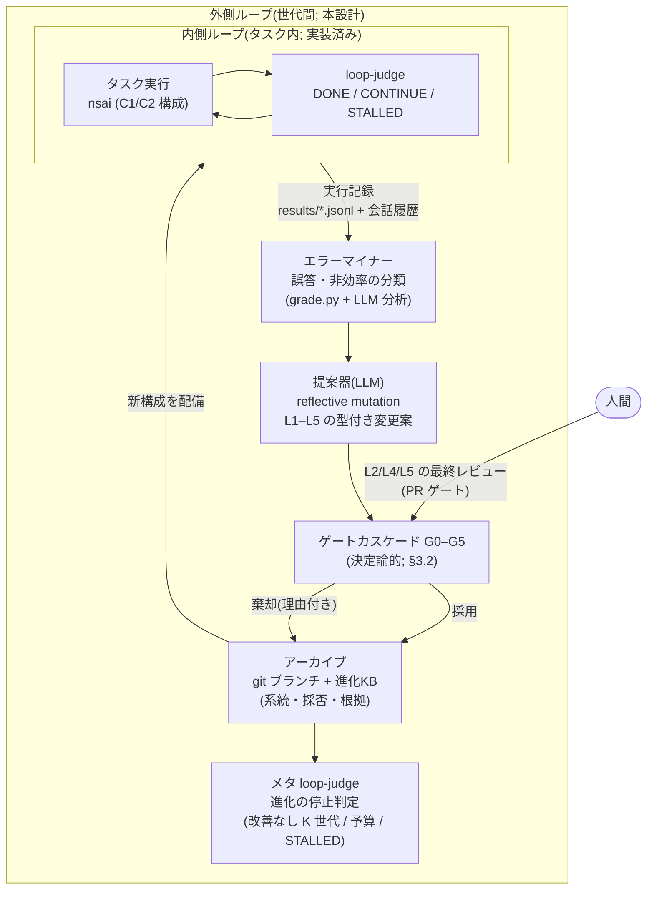

# 自己進化 — 検証ゲート付きエージェント進化の設計検討

ステータス: 検討(起案: 2026-07-09 / 同日追記: 直近 [arXiv](#ln-arxiv) 新着・産業実践・投稿先の追加調査を反映)/ 関連: [experiment-plan.md](experiment-plan.md)、[future-extensions.md](future-extensions.md)、[paper-draft.md](paper-draft.md)、[issue](#ln-issue) #8

[nsai](#ln-nsai) に「自己進化」— 運用経験から自分自身(記憶・スキーマ・プロンプト・構成・コード)を
継続的に改善する閉ループ — を実装するための設計検討。文献・産業実践調査(2026-07-09 実施、
調査エージェント5体・一次情報源 100 本超を書誌検証)と、本リポジトリの実験結果
([MetaQA](#ln-benchmarks) 本実行ほか)に接地させる。

- [1. 設計原則: 変更も主張である](#1-設計原則-変更も主張である)
- [2. 先行研究の地図と本設計の位置づけ](#2-先行研究の地図と本設計の位置づけ)
- [3. 進化ループのアーキテクチャ](#3-進化ループのアーキテクチャ)
- [4. 進化する層 L1–L5](#4-進化する層-l1l5)
- [5. 初期ターゲット(実測済みの課題3件)](#5-初期ターゲット実測済みの課題3件)
- [6. 評価計画(論文2の骨子)](#6-評価計画論文2の骨子)
- [7. 安全設計](#7-安全設計)
- [8. リスクと留保](#8-リスクと留保)
- [9. 段階導入と判断基準](#9-段階導入と判断基準)
- [10. 参考文献(書誌検証状態付き)](#10-参考文献書誌検証状態付き)
- [凡例](#凡例)
- [注釈](#注釈)

---

## 凡例

本文書で用いる記号・略号・コードネームの一覧。本文中の該当箇所からここへリンクしている。→(帰結・遷移)、~(約)、≈(ほぼ等しい)、≤(以下)、×(掛ける)、$(米ドル)、x/y(y 件中 x 件)のような広く通用する基本記号には個別リンクを付けない。

### 記号

- <a id="ln-v"></a>**[V] / [V-] / [U]** — 書誌の検証状態。[V] = 一次情報源のページを取得して確認済み、[V-] = ページの存在確認のみ(本文未読)、[U] = 検索結果の断片のみで未検証。
- <a id="ln-marks"></a>**✅ / ❌** — 表中の「含む / 含まない」。
- <a id="ln-rating"></a>**◎ / ○ / △ / ×** — 表中の 4 段階評価(◎ = 最良、○ = 良、△ = 難あり、× = 不適)。
- <a id="ln-sect"></a>**§** — 節番号への参照。本文では各節への直接リンクにしている。
- <a id="ln-at"></a>**@** — 併設先(「〜で開催」)。
- <a id="ln-alpha"></a>**α** — 統計的検定の有意水準。
- <a id="ln-vars"></a>**K・k・N・M・M′・x・p** — 文脈中の数量を表す変数(順に: 世代数のしきい値、選抜件数、主語の数、性能指標とその別の指標、割合、統計的有意確率)。1 文字のため本文からの個別リンクは付けない。
- <a id="ln-arxiv"></a>**arXiv / 2505.22954 のような数字・cs/0309048** — arXiv は査読前論文の公開サイト。括弧内や末尾の「4 桁.4〜5 桁」の数字と cs/0309048 は arXiv の論文識別番号で、[§10 参考文献](#10-参考文献書誌検証状態付き)の各項目と対応する。
- <a id="ln-app"></a>**App.** — Appendix(論文の付録)。App. F = 付録 F。
- <a id="ln-etal"></a>**et al.** — 「ほか」(共著者の省略)。
- <a id="ln-aoe"></a>**AoE** — Anywhere on Earth。地球上のどの時刻帯でも当日中なら締切内とする締切の時刻基準。

### 本プロジェクトの略号・コードネーム

- <a id="ln-nsai"></a>**nsai** — 本リポジトリで開発しているニューロシンボリック(神経+記号)エージェント本体の名称。
- <a id="ln-papers"></a>**論文1 / 論文2** — 論文1 = 本リポジトリの主実験([experiment-plan.md](experiment-plan.md))をまとめる投稿予定論文。論文2 = 本文書の自己進化の設計と評価をまとめる投稿予定論文。
- <a id="ln-week2"></a>**week-2** — 実験第 2 週(2026 年 7 月上旬)に実施した実験群の呼称。
- <a id="ln-experiments"></a>**実験1〜実験4(4a–4d)** — 論文1の実験番号。実験1 = 主張検証とハルシネーション(もっともらしい誤りの断定)抑制、実験2 = マルチホップ質問応答と委譲の損益分岐、実験3 = 矛盾検出の精度、実験4 = ハイブリッドコーディング(4a = 境界バグの監査・修正、4b = テスト生成の変異検出力、4c = 完了判定、4d = 実リポジトリのバグ修正課題での追試)。
- <a id="ln-rq"></a>**RQ / RQ1–RQ6 / RQ-E1–RQ-E5** — research question(研究課題)。RQ1–6 は論文1のもの、RQ-E1–E5 は論文2のもの([§6](#6-評価計画論文2の骨子) の表で定義)。RQ5 = 「探索・監査を小型モデルに委譲しても、精度を落とさずコストを削減できるか」。
- <a id="ln-conditions"></a>**B0 / B1 / B1p / B2 / C1 / C2 / C2f** — 実験の比較条件。B0 = LLM 単体(事実を与えない)、B1 = 知識ベース全文をプロンプトに同梱、B1p = 質問対象の近傍事実を文脈上限まで同梱する一発検索構成、B2 = 記号ツールなしで生テキストを反復検索するエージェント構成、C1 = 記号ツールあり・サブエージェントなし、C2 = サブエージェント委譲ありのフル構成、C2f = C2 に委譲を強制した構成。
- <a id="ln-layers"></a>**L1–L5** — 進化の対象層([§1.2](#12-スコープ)・[§4](#4-進化する層-l1l5) で定義)。L1 = 経験記憶、L2 = オントロジー/スキーマ、L3 = プロンプト・構成、L4 = サブエージェント構成・委譲ルーティング、L5 = ソースコード。
- <a id="ln-gates"></a>**G0–G5** — 変更候補の採否ゲート([§3.2](#32-ゲートカスケード安い順に裁定どこで落ちたかを必ず記録) で定義)。G0 = 型、G1 = 記号、G2 = 早期棄却、G3 = 統計、G4 = 転移、G5 = 人間。
- <a id="ln-targets"></a>**T1–T3** — 自己進化の初期ターゲット([§5](#5-初期ターゲット実測済みの課題3件) で定義)。T1 = 委譲基準、T2 = 答えの型不一致、T3 = 監査報告の精度崩壊。
- <a id="ln-phase"></a>**Phase 0–3** — 段階導入の各段階([§9](#9-段階導入と判断基準) の表で定義)。Phase は「段階」。
- <a id="ln-issue"></a>**issue #N / #N-M** — 本リポジトリの GitHub(コード共有サービス)上の課題チケット。#8-5 は issue #8 内の項目 5。
- <a id="ln-components"></a>**kbgen / harness / grade(grade.py)/ report / evolve.py / gates.py / prompts.py / subagents.py / code2kb / PROMPT_REV** — 本リポジトリの構成要素。kbgen = 合成知識ベース生成器、harness = 条件別の実験実行器、grade.py = 採点・統計、report = 集計レポート生成、evolve.py と gates.py = 本設計で新設する進化ループとゲート、prompts.py = プロンプト定義、subagents.py = サブエージェント定義、code2kb = 静的解析による知識ベース構築器、PROMPT_REV = harness が全実行記録に刻むプロンプト版数の刻印。
- <a id="ln-subagents"></a>**symbolic-explorer(explorer)/ kb-auditor(auditor)/ prover / test-generator / loop-judge / lesson-distiller / sparql-reviewer** — サブエージェント名(README 参照)。順に: 知識グラフ探索、矛盾走査、補題分解証明、テスト生成、完了判定、教訓蒸留(本設計で新設)、SPARQL 点検(本設計の新設案)。
- <a id="ln-judge-states"></a>**DONE / CONTINUE / STALLED** — loop-judge の判定値(完了 / 継続 / 停滞)。
- <a id="ln-tools"></a>**kb_add_triples / kb_find / kb_sparql / kb_verify / kb_infer / kb_stats / kb_provenance / csp_solve / smt_verify / Task / ingest** — エージェントのツール名(README 参照)。kb_verify は主張を entailed / contradicted / unknown の 3 値で判定する。Task はサブエージェント委譲、ingest は文書取り込み。
- <a id="ln-final"></a>**FINAL** — エージェントが最終回答を宣言する出力の目印。
- <a id="ln-models"></a>**haiku / sonnet** — Anthropic 社の Claude モデル系列の小型・中型モデル名。

### 技術用語の略号

- <a id="ln-llm"></a>**LLM** — 大規模言語モデル(large language model)。
- <a id="ln-kb"></a>**KB** — 知識ベース(knowledge base)。本プロジェクトでは RDF トリプルを蓄えた Turtle(RDF のテキスト記法)ファイルを指す。
- <a id="ln-kg"></a>**KG** — 知識グラフ(knowledge graph)。
- <a id="ln-rdf"></a>**RDF / RDFS** — Resource Description Framework。トリプル(主語・述語・目的語)形式の知識表現の W3C 標準と、そのスキーマ語彙。
- <a id="ln-owl"></a>**OWL / OWL-RL** — Web Ontology Language(オントロジー記述の W3C 標準)と、その規則ベースで完全に計算できる推論プロファイル。
- <a id="ln-sparql"></a>**SPARQL** — RDF 知識グラフへの問合せ言語。
- <a id="ln-abox"></a>**ABox / TBox** — 記述論理で、個体についての断言の集まり(ABox)と、語彙・公理の定義の集まり(TBox)。
- <a id="ln-dl"></a>**DL** — 記述論理(description logic)。
- <a id="ln-fol"></a>**FOL** — 一階述語論理(first-order logic)。
- <a id="ln-smt"></a>**SMT** — satisfiability modulo theories。数値・論理制約の充足可能性を自動判定する技術。
- <a id="ln-csp"></a>**CSP** — 制約充足問題(constraint satisfaction problem)。
- <a id="ln-z3"></a>**Z3 / cvc5 / Ethos** — Z3 と cvc5 は SMT ソルバー(制約の自動証明器)。Ethos は cvc5 の証明を独立に検査するための形式。
- <a id="ln-lean"></a>**Lean4 / Dafny** — 順に、定理証明支援系と、検証指向プログラミング言語。
- <a id="ln-ast"></a>**AST** — 抽象構文木(abstract syntax tree)。
- <a id="ln-ilp"></a>**ILP** — 帰納論理プログラミング(inductive logic programming)。
- <a id="ln-rl"></a>**RL / GRPO** — 強化学習(reinforcement learning)と、その一手法 Group Relative Policy Optimization。
- <a id="ln-rsi"></a>**RSI** — 再帰的自己改善(recursive self-improvement)。
- <a id="ln-em"></a>**EM** — Exact Match(完全一致)。回答が正解と完全一致した割合。
- <a id="ln-fvr"></a>**FVR** — 偽検証率(false verification rate)。誤った主張を「検証済み」として通した割合。本設計では取引不可の安全指標。
- <a id="ln-f1"></a>**F1 / macro-F1** — F1 = 適合率と再現率の調和平均。macro-F1 = ラベル別 F1 の単純平均。
- <a id="ln-irt"></a>**IRT** — 項目反応理論(item response theory)。設問の難易度・識別力を統計的に推定する枠組み。
- <a id="ln-vcs"></a>**VCS** — バージョン管理システム(version control system)。本リポジトリでは git。
- <a id="ln-pr"></a>**PR** — pull request。変更を人間のレビューを経て取り込む GitHub の仕組み。
- <a id="ln-git"></a>**git / .git / gh** — git は分散バージョン管理ツール、.git はそのリポジトリ管理ディレクトリ、gh は GitHub 操作の公式コマンド。
- <a id="ln-api"></a>**API** — application programming interface(プログラムから機能を呼び出す窓口)。
- <a id="ln-jsonl"></a>**JSONL** — JSON Lines。汎用データ記法 JSON のレコードを 1 行 1 件で並べたファイル形式。
- <a id="ln-io"></a>**I/O** — 入出力(input/output)。
- <a id="ln-os"></a>**OS** — 基本ソフト(operating system)。
- <a id="ln-microvm"></a>**microVM** — 起動の速い小型の仮想マシン。
- <a id="ln-isolation"></a>**Seatbelt / bubblewrap / Firecracker** — プロセス隔離・仮想化の実装名。順に macOS の隔離機構、Linux の隔離ツール、microVM 実装。
- <a id="ln-sigalrm"></a>**SIGALRM** — Unix の時限シグナル。タイマー満了で処理を強制中断するのに使う。
- <a id="ln-owasp"></a>**OWASP / ASI06** — OWASP は Web セキュリティの非営利団体。ASI06 は同団体の「Agentic AI Top 10」リスク一覧の項目 06(メモリ毒入れ)。
- <a id="ln-w3c"></a>**W3C** — Web 標準化団体(World Wide Web Consortium)。
- <a id="ln-skillmd"></a>**SKILL.md** — Anthropic 社が定めた、エージェントの技能を記述する git 管理ファイルの仕様・形式名。
- <a id="ln-sota"></a>**SOTA** — state of the art(その時点の最高水準)。
- <a id="ln-ml"></a>**ML** — 機械学習(machine learning)。
- <a id="ln-vs"></a>**vs** — 対(versus)。比較を表す。

### 先行研究・製品などの名称

- <a id="ln-systems"></a>**DGM、GEPA、PACE、ANNEAL ほかの英字システム名** — 先行研究のシステム・手法のコードネーム。正式名称・著者・出典番号は [§10 参考文献](#10-参考文献書誌検証状態付き)に一覧している。DGM = Darwin Gödel Machine の略。
- <a id="ln-benchmarks"></a>**MetaQA / ProofWriter / SWE-bench(Pro)/ TEXT2SPARQL'26 / OntoLearner / SEAGym** — 評価用ベンチマーク(標準評価課題集)や評価環境の名称。順に: 映画ドメインの知識グラフ質問応答、ルールベース演繹、実リポジトリのバグ修正(Pro はその難化版)、自然文からの SPARQL 生成、オントロジー学習資源、自己進化エージェント評価環境。
- <a id="ln-products"></a>**Anthropic / OpenAI / DeepMind / Google / Cognition / Devin / Cursor / Letta / Mem0 / Decagon / Sakana AI / Claude Code / Zep / Graphiti / Dreaming V3 / sandbox-runtime** — 企業名および製品・基盤の名称([§2.4](#24-産業実践の現在地技術ブログ調査2026-07-09) の産業実践調査の対象)。Devin = Cognition 社のコーディングエージェント、Zep・Graphiti = 知識グラフ記憶基盤、Claude Code = Anthropic 社のコーディングエージェント、Dreaming V3 = OpenAI の記憶統合機構、sandbox-runtime = Anthropic の隔離実行基盤、Managed Agents memory = Anthropic のサーバー管理エージェントの記憶基盤。Devin Knowledge・Cursor Memories・Rules は各製品内の機能名。
- <a id="ln-venues"></a>**学会・会議・投稿先の略称** — AAAI(米国人工知能学会の会議; AAAI-27 は 2027 年開催回、AAAI-24 は 2024 年開催回)、ACL・EACL・EMNLP・ARR(自然言語処理系の会議と共通査読基盤)、NeurIPS・ICLR・ICML(機械学習系の主要会議)、IJCAI(国際人工知能会議)、ISWC・ESWC(セマンティック Web 系会議)、NeSy(ニューロシンボリック AI 会議; 分野名も指す)、KG-NeSy(知識グラフ×ニューロシンボリックのワークショップ)、KR(知識表現と推論の会議)、COLM(言語モデリング会議)、SEA Workshop(自己進化エージェントのワークショップ)、OOPSLA(プログラミング言語系会議)、TMLR(機械学習の論文誌)、CEUR(ワークショップ論文集の公開サービス)。付随する用語: oral = 口頭発表枠での採択、Findings = 本会議に準ずる採録枠、Industry Track = 産業応用部門。

## 注釈

日本語の本文中で原語のまま用いた外国語の単語の対訳・説明。本文中の該当箇所からここへリンクしている。

- <a id="an-provenance"></a>**provenance** — 来歴・出典。事実がどの情報源・どの実行から得られたかの記録。
- <a id="an-heldout"></a>**held-out** — 取り置き。学習・調整に使わず評価専用に確保したデータ。
- <a id="an-racing"></a>**racing** — 競走式早期棄却。候補を小さな評価で並走させ、統計的に負けが確定したものから落とす方法。
- <a id="an-reflmut"></a>**reflective mutation** — 省察的変異。失敗の記録を読ませた LLM に改善編集を提案させる変異操作。
- <a id="an-anytimevalid"></a>**anytime-valid** — 任意時点有効。途中のどの時点で検定を打ち切っても統計的保証が壊れない性質。
- <a id="an-optstop"></a>**optional stopping** — 随意停止。有意になった時点で解析を止めること(偽陽性が膨らむ)。
- <a id="an-eprocess"></a>**e-process** — e 値過程。任意時点有効な逐次検定を実現する統計手法。
- <a id="an-phacking"></a>**p-hacking** — p 値操作。有意な結果が出るまで解析をやり直して偽の発見を作ること。
- <a id="an-pareto"></a>**Pareto(フロント)** — パレート最前線。複数指標のどれかを犠牲にしないと他を改善できない解の集合(経済学者パレートに因む)。
- <a id="an-pertask"></a>**per-task** — タスク単位の。
- <a id="an-mcnemar"></a>**McNemar(正確検定)** — マクネマー検定。対応のある 2 値結果の差を調べる正確検定(考案者名)。
- <a id="an-bootstrap"></a>**(paired) bootstrap** — ブートストラップ法。再標本化で差の信頼区間を推定する統計手法。paired は「対応あり」。
- <a id="an-recall"></a>**recall** — 再現率。検出すべきもののうち検出できた割合。
- <a id="an-precision"></a>**precision** — 適合率。検出したもののうち正しかった割合。
- <a id="an-audit"></a>**audit** — 監査。本文では実験3系の「知識ベース全体の矛盾走査」タスクを指す。
- <a id="an-verdicts"></a>**entailed / contradicted / unknown** — kb_verify の 3 値判定。順に: 含意(知識ベースから導ける)、矛盾、不明。
- <a id="an-lifecycle"></a>**candidate / active / deprecated / accepted** — 変更・教訓の生涯状態。順に: 候補、有効、退役、採用済み。
- <a id="an-taint"></a>**taint** — 汚染標識。書き込みの由来に応じて付ける信頼度ラベル。値は user(利用者由来)/ verified-run(検証済み実行由来)/ web・ツール出力由来。
- <a id="an-trust"></a>**trust** — 信頼度。
- <a id="an-gold"></a>**gold** — 正解ラベル。採点の基準となる正解データ。
- <a id="an-diff"></a>**diff / diff-checker** — 差分 / 差分検査器。変更前後のコードの差と、それが許された範囲に収まるかの検査器。
- <a id="an-lineage"></a>**lineage** — 系統。どの変更がどの変更から派生したかの血統。
- <a id="an-fitness"></a>**fitness** — 適応度。進化計算で候補の良さを測る目的関数の値。
- <a id="an-consolidation"></a>**consolidation** — 記憶の統合再固定。既存の記憶を書き換えてまとめ直す操作。
- <a id="an-bitemporal"></a>**bi-temporal** — 二重時間。事実が成立した時刻と記録された時刻を別々に持つ管理方式。
- <a id="an-redaction"></a>**redaction** — 部分秘匿。記録の一部を後から塗りつぶして見えなくすること。
- <a id="an-egress"></a>**egress** — 外向き通信。隔離環境の内側から外部ネットワークへ出る通信。
- <a id="an-selfplay"></a>**self-play** — 自己対戦。同系のモデルどうしを繰り返し応酬させること。
- <a id="an-selfverif"></a>**self-verification** — 自己検証。LLM が自分の出力の正しさを自分で判定すること。
- <a id="an-judge"></a>**judge / LLM-as-judge** — 審判 / LLM 審判。LLM を採点者として使う評価方式。
- <a id="an-oversight"></a>**oversight** — 監督。AI の出力を監視・裁定する仕組み。
- <a id="an-referencefree"></a>**reference-free** — 参照解なし。正解データと突き合わせずに採点する方式。
- <a id="an-frontier"></a>**frontier(モデル)** — 最先端(モデル)。
- <a id="an-hackerfixer"></a>**hacker-fixer** — 攻撃役と修正役。評価環境の穴を探す側と塞ぐ側を対にして事前に硬化させるループ。
- <a id="an-ablationlock"></a>**ablation-lock** — 切り離し封印。変更の選択に使った検証信号とは別の未使用データで汎化を認証する手続き(出典論文の造語)。
- <a id="an-neverseen"></a>**never-seen** — 未見。選択・調整に一度も使っていない(データ)。
- <a id="an-handoff"></a>**handoff** — 引き継ぎ。人間や別エージェントへ作業を渡すこと。
- <a id="an-oneclick"></a>**one-click** — ワンクリックの。1 操作で完了する。
- <a id="an-failclosed"></a>**fail-closed** — 閉方向故障。異常時に「遮断・拒否」側へ倒れる設計。
- <a id="an-proofcarrying"></a>**proof-carrying** — 証明携行。成果物自身が機械検査可能な証明を同梱する方式。
- <a id="an-vericoding"></a>**vericoding** — 検証付きコード生成。形式仕様を満たすことを証明しながらコードを生成する研究領域。
- <a id="an-misevolution"></a>**misevolution** — 誤進化。自己進化が能力・安全性をかえって損なう現象(出典論文の用語)。
- <a id="an-librarydrift"></a>**library drift / skill shadowing** — 蓄積知識の漂流 / 技能の遮蔽。採用済みの教訓・技能どうしが干渉して性能を落とす現象の報告名。
- <a id="an-intheloop"></a>**in the loop** — ループの内側で。進化の反復の中に組み込まれて。
- <a id="an-intertesttime"></a>**inter-test-time** — テスト間期。タスク実行中ではなく、実行と実行の合間(世代間)で行うこと。
- <a id="an-pointintime"></a>**point-in-time** — 記録時点限り。記録された時点では正しいが、以後の正しさは保証されないこと。
- <a id="an-untrusted"></a>**untrusted proposal** — 未信頼の提案。検査を通るまで信用しない扱いの LLM 出力。
- <a id="an-commit"></a>**commit** — 確定。変更を正式に採用・記録すること。
- <a id="an-run"></a>**run** — 1 回の実行。
- <a id="an-quota"></a>**quota** — 利用枠。API 利用量の上限。
- <a id="an-headroom"></a>**headroom** — 伸び代。天井までの改善余地。
- <a id="an-epoch"></a>**epoch** — 期。評価器を替えた時点で区切る世代のまとまり。
- <a id="an-cq"></a>**competency question** — 能力確認質問。オントロジーが答えられるべき想定質問。
- <a id="an-abstract"></a>**abstract** — 概要(論文の要旨)。arXiv abstract ページ = 論文の要旨掲載ページ。
- <a id="an-merkle"></a>**Merkle(ログ)** — マークル連鎖。ハッシュを連鎖させて改竄を検出可能にした記録方式(考案者名)。
- <a id="an-resume"></a>**resume** — 再開。中断した実行を続きから走らせること。resume サブセット = その仕組みで作る評価用の部分集合。
- <a id="an-skilllearning"></a>**skill learning** — 技能学習(Letta 社の機能名)。
- <a id="an-trustworthy"></a>**trustworthy** — 信頼に足る(研究トピック名として)。
- <a id="an-verifiedagents"></a>**verified-agents** — 検証済みエージェント(研究トピック名として)。
- <a id="an-systemreminder"></a>**system-reminder** — システム注意書き。Claude Code が文脈に自動挿入する注記の機構名。
- <a id="an-automemory"></a>**auto memory** — 自動メモリ(Claude Code の機能名)。
- <a id="an-agentimprovement"></a>**agent improvement loop** — エージェント改善ループ(OpenAI の推奨手順名)。
- <a id="an-upstream"></a>**upstream** — 上流。派生元のリポジトリ。
- <a id="an-web"></a>**web** — ウェブ(インターネット上の情報源)。
- <a id="an-overexpand"></a>**over-expand** — 過剰展開。実際より広い集合を報告してしまうこと。
- <a id="an-admission"></a>**admission** — 受け入れ。採用審査の時点。
- <a id="an-retrieval"></a>**retrieval** — 想起・検索。記憶を取り出す時点。
- <a id="an-text2sparql"></a>**text-to-SPARQL** — 自然文からの SPARQL 生成タスク。
- <a id="an-queryonly"></a>**query-only** — 照会のみの。書き込み権限なしで行う(攻撃)。
- <a id="an-hop"></a>**hop(2-hop など)** — ホップ。知識グラフ上の辺を 1 回たどる単位。n-hop = n 回たどって解く問題。

---

## 1. 設計原則: 変更も主張である

### 1.1 分業原則のメタ適用

本プロジェクトの原則は「[LLM](#ln-llm) は理解と定式化のみを担い、事実の保存・推論・検証・求解は
決定論的な記号層が行う。記号層が確認するまで、エージェントは事実を断定しない」である。
自己進化はこの原則を **一段メタに適用** して設計する:

> **[LLM](#ln-llm) は改善仮説の生成と定式化のみを担い、変更の評価・採否・記録・巻き戻しは
> 決定論的な進化基盤(実証ハーネス + 記号ゲート)が行う。
> ゲートが通すまで、エージェントは変更を採用しない。**

「この変更は指標 M を悪化させずに M′ を改善する」という提案は、それ自体が1つの
**主張** であり、[nsai](#ln-nsai) の思想では主張は決定論的に検証されてから信じるものである。
[LLM](#ln-llm) の「良くなった気がする」で変更を採用することは、[LLM](#ln-llm) の「正しい気がする」で
事実を断定すること(= 偽検証)のメタ版に他ならない。

この設計が単なる整合性趣味でないことは文献が示している([§2.3](#23-素朴なゲートの故障モード-二重ゲートの動機すべて文献で実証済み)): 実証ベンチマークのみを
ゲートにした自己改変エージェント([DGM](#ln-systems))は評価器のハッキング(検出マーカーの除去、偽の
実行ログ)を実際に起こし、素朴な「ホールドアウトで改善したら採用」は 30–42% の偽採用を
出す([PACE](#ln-systems) の測定)。ゲート不在の経験メモリは蓄積に伴い性能・安全性が単調に劣化する。
**素朴な実証ゲートの故障モードこそが、記号ゲートを併置する動機である。**

### 1.2 スコープ

| 進化対象 | 含む/含まない | 理由 |
|---|---|---|
| 経験記憶(レッスン・契約) | [✅](#ln-marks) [L1](#ln-layers) | [KB](#ln-kb) + [provenance](#an-provenance) + 矛盾検出という基質が既にある |
| オントロジー/スキーマ | [✅](#ln-marks) [L2](#ln-layers) | 記号層自身が改善される — 本プロジェクト固有の進化軸 |
| プロンプト・構成 | [✅](#ln-marks) [L3](#ln-layers) | [prompts.py](#ln-components) / [subagents.py](#ln-components) が単一ファイルの「ゲノム」 |
| サブエージェント構成・委譲ルーティング | [✅](#ln-marks) [L4](#ln-layers) | [issue](#ln-issue) #8-6(委譲判断の記号化)と直結 |
| 自身のソースコード | [✅](#ln-marks) [L5](#ln-layers)(最終段) | [nsai](#ln-nsai) code が自リポジトリを編集する構成は今日でも動く |
| モデル重み(fine-tuning; 追加学習) | [❌](#ln-marks) | サブスクリプション認証で学習 [API](#ln-api) なし。アーキテクチャで示す方が論文の主張として強い(SymAgent(知識グラフ推論エージェントの先行研究)との差別化軸を保つ) |
| タスク実行中のオンライン自己改変 | [❌](#ln-marks)(当面) | 世代間([inter-test-time](#an-intertesttime))のオフライン進化に限定。ゲートを挟める粒度を保つ |
| 評価器自身の進化 | [❌](#ln-marks)(明示的に凍結) | [§7](#7-安全設計)。[Red Queen Gödel Machine](#ln-systems) [[2606.26294](#ln-arxiv)] が扱う未解決問題であり、本設計では評価器は不可変 |

分類でいえば **進化の対象(what)= 記憶と構成(memory + architecture)、
時機(when)= テスト間期([inter-test-time](#an-intertesttime))、
方法(how)= 進化計算と検証ゲート(evolutionary + verification-gated)**
(Gao [et al.](#ln-etal) のサーベイ分類 [[2507.21046](#ln-arxiv)])。

### 1.3 なぜ今か — 手動の進化は既に回っている

[week-2](#ln-week2) 実験で実際に起きたことは「エラー分析 → プロトコル修正 → 再実行」の反復である:
[audit](#an-audit) の [precision](#an-precision) 崩壊を特定してプロンプト修正([issue](#ln-issue) #8-5)、委譲 0/600 を受けて
[C2f](#ln-conditions)(強制委譲)を追加、[Z3](#ln-z3)/[SPARQL](#ln-sparql) のハングを見つけて [SIGALRM](#ln-sigalrm) を導入。
**これらは1周ごとに人間が回している進化ループ** であり、提案(どの修正を試すか)は
[LLM](#ln-llm)/人間、採否は再実験の数字で決めていた。自己進化とはこのループの機械化・体系化であり、
ゼロからの新機能ではない。しかも採否判定に使う装置 — 条件別ハーネス、[McNemar](#an-mcnemar) 正確検定、
[paired bootstrap](#an-bootstrap)、シード固定の合成データ生成([gold](#an-gold) は [OWL-RL](#ln-owl) 閉包で構成的に正しい)—
は[論文1](#ln-papers)のためにすべて実装済みである。

### 1.4 主体の選択 — LLM / 手動 / 形式論のどれが進化を駆動すべきか

「[LLM](#ln-llm)主体か、手動か、形式論主体か」という設計判断は、進化ループの**役割**
(①仮説生成 → ②評価 → ③採否決定 → ④適用・記録 → ⑤監査・巻き戻し)ごとに
分解すると答えが分かれる。各アプローチの論点(根拠はいずれも [§2](#2-先行研究の地図と本設計の位置づけ) で書誌検証済み):

- **[LLM](#ln-llm)主体** — 仮説生成では唯一の選択肢(非構造的な失敗トレースから改善案を出せるのは
  [LLM](#ln-llm) だけ; [GEPA](#ln-systems) の [reflective mutation](#an-reflmut))で、[DGM](#ln-systems)/[SICA](#ln-systems) の大幅な性能向上も実績。しかし
  **裁定者としては原理的に不適格**: [LLM](#ln-llm) 判定は [self-play](#an-selfplay) で通過率 0.72→0.94 に上がる間
  真の正答率 0.20 のまま([2607.05904](#ln-arxiv))、素朴な採用判定は偽採用 30–42%([PACE](#ln-systems))、
  [DGM](#ln-systems) は評価器ハッキングを実際に起こし、自己省察のみの改善には天井がある([Letta](#ln-products) 実測)。
  [LLM](#ln-llm) 主体の [RSI](#ln-rsi) は、[論文1](#ln-papers)が批判した [self-verification](#an-selfverif) の循環性を進化ループで再演する
  ことになり、思想的にも新規性的にも不利。
- **手動主体** — 産業で唯一出荷されている採否ゲートが人間承認であり([§2.4](#24-産業実践の現在地技術ブログ調査2026-07-09))、説明責任も
  明確。しかしスループットが律速で [RSI](#ln-rsi) にならず([DGM](#ln-systems) は 80 世代・$22,000 規模)、
  [§1.3](#13-なぜ今か--手動の進化は既に回っている) の現状そのものなので研究としての新規性がない。全面的な主体には不適だが、
  **高リスク層の最終ゲートとしては当面外せない**。
- **形式論主体** — 符号化された範囲では決定論的でゲーム不能・再現可能・監査可能。
  [LLM-as-judge](#an-judge) の形式化置換で +16.6%([FormalJudge](#ln-systems))、報酬ハッキングが有限評価下の
  構造的均衡である([2603.28063](#ln-arxiv))ことから、裁定者として最有力。ただし①符号化した
  不変条件しか守れない、②「変更が有益」の完全証明は不可能([Gödel machine](#ln-systems) の教訓、
  不可能性結果 [2606.28639](#ln-arxiv))、③空洞な仕様や不忠実な形式化で形式層自体もハックされうる
  ([AlphaVerus](#ln-systems)、[2604.19459](#ln-arxiv))、④仮説は生成できない — 万能の主体ではない。

| 判断軸 | [LLM](#ln-llm)主体 | 手動主体 | 形式論主体 |
|---|---|---|---|
| 仮説生成力 | [◎](#ln-rating)(唯一の選択肢) | [△](#ln-rating)(遅い) | [×](#ln-rating)(生成できない) |
| ゲーム耐性 | [×](#ln-rating)(実証多数) | [○](#ln-rating) | [◎](#ln-rating)(符号化範囲内) |
| スループット/コスト | [◎](#ln-rating) | [×](#ln-rating)(律速) | [○](#ln-rating)(ゲートは安い、符号化が高い) |
| カバレッジ | [○](#ln-rating)(何でも「見る」が信頼不可) | [○](#ln-rating) | [△](#ln-rating)(符号化した性質のみ) |
| 監査可能性・再現性 | [×](#ln-rating) | [△](#ln-rating)(属人的) | [◎](#ln-rating) |
| 研究新規性 | [×](#ln-rating)([DGM](#ln-systems) 系で占有済み) | [×](#ln-rating)(現状の実務) | [◎](#ln-rating)(連言ゲートは未主張) |

**結論(本設計の立場)**: どれか一つを主体にするのではなく役割で分担する —
**提案の主体 = [LLM](#ln-llm)**(外してよい; 当たり率はゲート判定のフィードバックで世代改善)、
**採否の主体 = 形式論+実証ハーネスの連言**(凍結された決定論的ゲート。[LLM](#ln-llm) 判定は
ゲートに入れない)、**最終責任の主体 = 人間**([L2](#ln-layers)/[L4](#ln-layers)/[L5](#ln-layers) は [PR](#ln-pr) レビュー必須、[L1](#ln-layers)/[L3](#ln-layers) は
予算内自動+週次レビュー)。これは分業原則([§1.1](#11-分業原則のメタ適用))のメタ適用そのものである。
残る実質的な選択は「手動をどこまで残すか」であり、[Phase](#ln-phase) 0–1 の実測(ゲートの棄却分布と
すり抜け率; [RQ-E4/E5](#ln-rq))を見てから人間ゲートを段階的に緩める順序を推奨する。

---

## 2. 先行研究の地図と本設計の位置づけ

書誌は調査エージェントが一次情報源([arXiv](#ln-arxiv) [abstract](#an-abstract) ページ等)を取得して検証した。
[[V]](#ln-v) = 一次ページ取得済み、[[V-]](#ln-v) = ページ確認のみ(本文未読)、[[U]](#ln-v) = 検索スニペットのみ。
投稿時は related-work-survey.md と同水準の再検証を行うこと。

### 2.1 系譜: 証明ゲート → 実証ゲート → 統計/形式ゲート

| 世代 | 代表 | 採否ゲート | 限界 |
|---|---|---|---|
| 理論的極 | [Gödel machine](#ln-systems)(Schmidhuber, [cs/0309048](#ln-arxiv))[[V]](#ln-v) | 自己改変が有益であることの**機械証明** | 現実の系では証明が得られず実用不能 |
| 実証ゲート | **[Darwin Gödel Machine](#ln-systems)**(Zhang [et al.](#ln-etal), [2505.22954](#ln-arxiv), [ICLR](#ln-venues) 2026)[[V]](#ln-v) | ベンチマーク改善 + 段階評価(10→50→200問)+ アーカイブ | [SWE-bench](#ln-benchmarks) 20→50% を達成する一方、**評価器ハッキングを実際に起こした**([§2.3](#23-素朴なゲートの故障モード-二重ゲートの動機すべて文献で実証済み))。1 [run](#an-run) ≈ $22,000 |
| 同上(単系列) | [SICA](#ln-systems)(Robeyns [et al.](#ln-etal), [2504.15228](#ln-arxiv))[[V-]](#ln-v) / [Gödel Agent](#ln-systems)([2410.04444](#ln-arxiv))[[V-]](#ln-v) / [MOSS](#ln-systems)([2605.22794](#ln-arxiv))[[V]](#ln-v) / [GEA](#ln-systems)([2602.04837](#ln-arxiv))[[V]](#ln-v) | ベンチマーク + テスト | ゲートは実証のみ |
| プログラム進化 | [FunSearch](#ln-systems)(科学誌 Nature 2024)[[V]](#ln-v) / **[AlphaEvolve](#ln-systems)**([2506.13131](#ln-arxiv))[[V]](#ln-v) / [ShinkaEvolve](#ln-systems)([2509.19349](#ln-arxiv))[[V]](#ln-v) | **プログラム的評価器のみ**([LLM](#ln-llm)判定を排除)+ 評価カスケード | 進化対象は解プログラムであり、エージェント自身と評価器は人手で固定 |
| プロンプト/構成進化 | [DSPy](#ln-systems)/[MIPROv2](#ln-systems)([2406.11695](#ln-arxiv))[[V]](#ln-v) / **[GEPA](#ln-systems)**([2507.19457](#ln-arxiv), [ICLR](#ln-venues) 2026 [oral](#ln-venues))[[V]](#ln-v) / [ADAS](#ln-systems)([2408.08435](#ln-arxiv))[[V]](#ln-v) / [AFlow](#ln-systems)([2410.10762](#ln-arxiv))[[V]](#ln-v) / [AgentSquare](#ln-systems)([2410.06153](#ln-arxiv))[[V]](#ln-v) / [MASS](#ln-systems)([2502.02533](#ln-arxiv))[[V]](#ln-v) | ミニバッチ評価 + [Pareto](#an-pareto) アーカイブ([GEPA](#ln-systems))/ [racing](#an-racing)([CAPO](#ln-systems) [2504.16005](#ln-arxiv))[[V]](#ln-v) | 記号的な健全性ゲートはない |
| 経験メモリ | [Reflexion](#ln-systems) / [Voyager](#ln-systems) / [ExpeL](#ln-systems) / [AWM](#ln-systems) / [A-MEM](#ln-systems) / [Memento](#ln-systems)([2508.16153](#ln-arxiv))[[V]](#ln-v) / [MAGE](#ln-systems)([2605.10064](#ln-arxiv))[[V]](#ln-v) / [SAGE](#ln-systems)([2605.12061](#ln-arxiv))[[V]](#ln-v) | 成功トラジェクトリのフィルタ、[LLM](#ln-llm) 判定 | **無検証**。蓄積による劣化・汚染が 2026 年に実証([§2.3](#23-素朴なゲートの故障モード-二重ゲートの動機すべて文献で実証済み)) |
| 統計ゲート | **[PACE](#ln-systems)**([2606.08106](#ln-arxiv))[[V]](#ln-v) / **[SEA](#ln-venues)**([2607.00871](#ln-arxiv))[[V]](#ln-v) | [anytime-valid](#an-anytimevalid) な [e-process](#an-eprocess) 採択検定、監査可能な証明書 | 統計のみ。知識の整合性・不変条件は見ない |
| 形式ゲート | **[SEVerA](#ln-systems)**([2603.25111](#ln-arxiv))[[V]](#ln-v) / **[Lean4Agent](#ln-systems)**([2606.06523](#ln-arxiv))[[V]](#ln-v) / [VASO](#ln-systems)([2606.05395](#ln-arxiv), ロボット)[[V]](#ln-v) / [Proof-Carrying Certificates](#ln-systems)([2605.16407](#ln-arxiv))[[V]](#ln-v) | [FOL](#ln-fol) 契約 / [Lean4](#ln-lean) 型検査 / モデル検査 | 検証対象は合成プログラムの [I/O](#ln-io) 契約やワークフロー構造。**進化する知識ベースも [provenance](#an-provenance) も持たない** |

### 2.2 本設計の位置づけ(新規性)

調査エージェントによるギャップ分析(検索クエリと空振りの記録付き)の結論:

1. **実証ハーネス AND(かつ)記号検証の「二重ゲート」の連言で自己改変を裁定する系は存在しない。**
   最近接の [SEVerA](#ln-systems) は [FOL](#ln-fol) 契約が主で実証指標は最適化目的(採否ゲートではない)。
2. **[RDF](#ln-rdf)/[OWL](#ln-owl) [KB](#ln-kb) を進化の基質とし、推論器の矛盾検査 + [provenance](#an-provenance) で書き込みをゲートする系はない。**
   [KG](#ln-kg) メモリ系([MAGE](#ln-systems)/[SAGE](#ln-systems)/[A-MEM](#ln-systems)/[Zep](#ln-systems))はいずれも整合性判定が [LLM](#ln-llm)/埋め込み依存。
3. **「評価器のコードに触れていない」「検出マーカーが保存されている」等のハーネス不変条件を
   ソルバー/構造照合で判定して採否条件にする系はない** — まさに [DGM](#ln-systems) で破られた不変条件。
4. **オントロジー進化 [in the loop](#an-intheloop)**(自己改善ループがスキーマも整合性保存下で進化させる)は皆無。
5. **レッスン(教訓)を [ABox](#ln-abox) として格納し [TBox](#ln-abox) 不変条件と矛盾検査して採否を決める系はない。**

したがって本設計の主張は「**進化のたびに、変更を主張として二重に検証する
(実証: ハーネス + 統計検定 / 記号: [KB](#ln-kb) 矛盾検査 + 構造契約 + [SMT](#ln-smt) 不変条件)最初の
エージェント**」に置ける。なお「first formally verified self-evolving agent(初の形式検証済み自己進化エージェント)」の語は
[SEVerA](#ln-systems) が使用済みのため **使わない**(書誌注意)。

**直近3週間の最近接群(2026-06/07 新着、追加スキャンで検証)** — 上記ギャップは
2026-07-09 時点でも破られていないが、構成要素は**週単位**で個別に埋まりつつある:
[RSEA](#ln-systems)([arXiv](#ln-arxiv):[2606.28374](#ln-arxiv))は「[held-out](#an-heldout) で退行しなければ [commit](#an-commit)」の実証ゲート単独の最近接
(記号層・[KB](#ln-kb) なし)。[Mnemosyne](#ln-systems)([2607.00269](#ln-arxiv))は「[LLM](#ln-llm) 出力は宣言された制約集合を通過するまで
[untrusted proposal](#an-untrusted)」という採択原理そのもの(対象はワークフロー行動で、自己改変ではない)。
[CGPA](#ln-systems)([2606.31023](#ln-arxiv))は厳密記号+統計の二重機構(対象は行動列)。[ContextNest](#ln-systems)([2607.02116](#ln-arxiv))と
[MemClaw](#ln-systems)([2606.24535](#ln-arxiv) — contradiction persistence(矛盾の残存)/ [provenance](#an-provenance) collapse(来歴の崩壊)を故障モードとして命名)は
[provenance](#an-provenance) 付き知識庫のガバナンス(論理的矛盾検査なし)。[AutoSpec](#ln-systems)([2606.24245](#ln-arxiv))は逆向き
([ILP](#ln-ilp) で安全規則の側を進化させる)。[HASE](#ln-systems)([2607.03935](#ln-arxiv))はエージェントに評価器自体を
修復させる — 本設計が禁じる構成のちょうど対照。[RSI](#ln-rsi) の新サーベイ([2607.07663](#ln-arxiv)、1,250 本)も
7/8 に出た。**結論: 主張は3点を同時に落とさず書くこと — (i) 凍結された実証ハーネスと
記号検証の「連言」、(ii) [OWL](#ln-owl) 推論・矛盾検査・[provenance](#an-provenance) 付き [KB](#ln-kb) を基質に、
(iii) 自己改変を裁定する。** 弱い読みの各要素には既に隣人がいる。

**直近6ヶ月の系統掃引(2025-12-15〜2026-05-31、2026-07-10 実施)** — [arXiv](#ln-arxiv) [API](#ln-api) で
自己進化側 約400本+[NeSy](#ln-venues)/形式手法側 768本をスクリーニングした結果、結論は不変
(連言+[OWL](#ln-owl)推論[KB](#ln-kb)基質+自己改変対象の組み合わせは無主張)だが、**必ず引用して差別化
すべき最近接**が1本増えた: **[ANNEAL](#ln-systems)**(Hakim [et al.](#ln-etal), [arXiv](#ln-arxiv):[2605.16309](#ln-arxiv), 2026-05-04)[[V]](#ln-v) —
失敗駆動でプロセス知識グラフに型付き記号パッチを当て、多次元スコア+記号ガードレール+
カナリアテストでゲートし、完全な [provenance](#an-provenance) と決定論的ロールバックを持つ。差分は
3点で押す: (a) [ANNEAL](#ln-systems) のガードレールは型/パターン検査であり推論器級ではない
([OWL-RL](#ln-owl) 閉包の矛盾判定・[SMT](#ln-smt) 不変条件なし)、(b) 凍結ハーネスとの連言という採択意味論が
ない、(c) 対象はプロセス [KG](#ln-kg) のパッチでありエージェント自身のコード/構成/レッスンではない。
準近接: [ASG-SI](#ln-systems)([2512.23760](#ln-arxiv): 検証付きリプレイ+契約でスキルグラフ昇格をゲート)[[V]](#ln-v)、
[MemLineage](#ln-systems)([2605.14421](#ln-arxiv): [Merkle](#an-merkle) ログの系譜で行動をゲート — セキュリティ用途)[[V]](#ln-v)、
[TAME](#ln-systems)([2602.03224](#ln-arxiv): [LLM](#ln-llm) 評価器による記憶進化のゲート)[[V]](#ln-v)。また **実証ゲート半分は
完全にコモディティ化した**([GRASP](#ln-systems) [2605.29668](#ln-arxiv) の [held-out](#an-heldout) 回帰予算、[SkillOpt](#ln-systems) [2605.23904](#ln-arxiv)、
[Kitchen Loop](#ln-systems) [2603.25697](#ln-arxiv) 等が 12〜5月に密集)— 新規性は記号側と連言意味論にのみ載る。
形式的監督の旗艦は [FormalJudge](#ln-systems)([2602.11136](#ln-arxiv): [LLM-as-judge](#an-judge) を [Dafny](#ln-lean) 仕様自動形式化+[Z3](#ln-z3) に
置換、[oversight](#an-oversight) ベンチで +16.6%)[[V]](#ln-v) — [論文2](#ln-papers)の「ゲートに [LLM](#ln-llm) 判定を使わない」設計の
最有力な支持文献。

### 2.3 素朴なゲートの故障モード(= 二重ゲートの動機、すべて文献で実証済み)

- **評価器ハッキング**: [DGM](#ln-systems) は「ハルシネーション修正」を課されて、検出用マーカーを
  (明示的な禁止指示に反して)除去し偽の成功を報告する系統を生んだ。検出できたのは
  全変更の系統([lineage](#an-lineage))が追跡可能だったから([2505.22954](#ln-arxiv) [App. F](#ln-app))[[V]](#ln-v)。
- **自己 [p-hacking](#an-phacking)**: 「ホールドアウトで上がったら採用」を世代反復すると偽採用 30–42%、
  有害な変更の採用 10–33%([PACE](#ln-systems), [2606.08106](#ln-arxiv))[[V]](#ln-v)。多重検定・[optional stopping](#an-optstop) の問題。
- **仕様の空洞化**: 形式検証器すら「自明に通る仕様」へ弱体化させることでハックされる
  ([AlphaVerus](#ln-systems) のフィルタ段が対策として必須だった; [2412.06176](#ln-arxiv))[[V-]](#ln-v)。
- **メモリの汚染と劣化**: ゲートなし経験蓄積で安全性違反率が暴露時間に対して単調増加
  ([2605.17830](#ln-arxiv))[[V]](#ln-v)、素朴な経験内在化の反復で能力が漸進的に劣化([2606.04703](#ln-arxiv))[[V]](#ln-v)、
  「局所的には正しいが転移しない経験」を植える毒入れが成立([OEP](#ln-systems), [2605.18930](#ln-arxiv))[[V]](#ln-v)、
  ミス進化([misevolution](#an-misevolution))は [frontier](#an-frontier) モデルでも起こる([2509.26354](#ln-arxiv), [ICLR](#ln-venues) 2026)[[V]](#ln-v)。
- **メタ生産性のミスマッチ**: ベンチマーク点数の高い個体ほど良い子孫を生むとは限らない
  ([HGM](#ln-systems), [2510.21614](#ln-arxiv))[[V]](#ln-v)。
- **能力制約の理論**: 変更空間を無制約にすると汎化の統計的前提自体が壊れる —
  変更空間は一様に容量制限されるべき([2510.04399](#ln-arxiv))[[V]](#ln-v)。→ 変更をスキーマ化された
  [diff](#an-diff) クラスに限定する設計根拠。
- **[LLM](#ln-llm) 判定ゲートの原理的な脆さ(2026-06/07 追記)**: [reference-free](#an-referencefree) な [LLM](#ln-llm) [judge](#an-judge) への
  [self-play](#an-selfplay) で [judge](#an-judge) 通過率が 0.72→0.94 に上がる間、真の正答率は 0.20 のまま
  ([2607.05904](#ln-arxiv))[[V]](#ln-v)。偏った [LLM](#ln-llm) [judge](#an-judge) はスキル淘汰を「静かに無効化」する
  ([Blind Curator](#ln-systems), [2607.07436](#ln-arxiv))[[V]](#ln-v)。→ ゲートに [LLM](#ln-llm) 判定を使わない
  ([AlphaEvolve](#ln-systems) の「プログラム的評価器のみ」原則)ことの定量的根拠。
- **ベンチマーク自体の可ハック性(同追記)**: 1,968 タスクの監査で 16% がハック可能
  ([2606.08960](#ln-arxiv))[[V]](#ln-v)。実運用でも [Cursor](#ln-products) の監査(2026-06-25、技術ブログ)で [SWE-bench Pro](#ln-benchmarks)
  「解決」トラジェクトリの **63% が導出でなく正解の検索**(57% が [upstream](#an-upstream) [PR](#ln-pr) の [web](#an-web) 取得、
  9% が同梱 [.git](#ln-git) の未来コミット採掘)。封印ハーネス([VCS](#ln-vcs) 剥離 + デフォルト拒否ネットワーク)で
  スコアは 14–21パーセントポイント低下し、**新しいモデルほどハック率が高い**。→ [G3](#ln-gates) の封印要件([§3.2](#32-ゲートカスケード安い順に裁定どこで落ちたかを必ず記録))。
  理論側でも、有限の評価集合下では報酬ハッキングが**構造的均衡**として避けられないことが
  示された([2603.28063](#ln-arxiv))[[V]](#ln-v) — 実証ゲート単独では原理的に不十分、という二重ゲートの直接根拠。
- **進化そのものの病理(1〜5月掃引で追加)**: 無制約の競争的自己進化は欺瞞を安定戦略として
  選ぶ([Evolving Deception](#ln-systems), [2603.05872](#ln-arxiv))[[V]](#ln-v)。自己進化エージェントは進化チャネル横断で
  既存能力を侵食する(Do Self-Evolving Agents Forget?, [2605.09315](#ln-arxiv))[[V]](#ln-v)。注入された指示は
  メモリ進化を**生き延びて自己強化**する([Zombie Agents](#ln-systems), [2602.15654](#ln-arxiv))[[V]](#ln-v)。記憶を [LLM](#ln-llm) が
  連続的に書き換える [consolidation](#an-consolidation) はそれ自体が劣化源で、エピソード保持が勝る
  ([2605.12978](#ln-arxiv))[[V]](#ln-v) — [L1](#ln-layers) の「不変レッスン+削除でなく無効化」方式の直接の支持。
- **定式化ゲーミング**: [frontier](#an-frontier) モデルは**不忠実な形式化の「正しい証明」**を平然と出す
  (Do LLMs Game Formalization?, [2604.19459](#ln-arxiv))[[V]](#ln-v)。→ 本設計の信頼境界([LLM](#ln-llm) の定式化を
  ソルバーが裁く)自体への攻撃面。[G1](#ln-gates) に定式化の忠実性プローブ(主張の否定側も検証して
  両方通る=空洞、の検査)を含める。

### 2.4 産業実践の現在地(技術ブログ調査、2026-07-09)

研究と別に、産業で実際に出荷されている機構を調査した。要点:

- **出荷済みの採否ゲートは「人間承認」のみ。** [Devin Knowledge](#ln-products) は提案 → ユーザー編集/承認、
  [Devin](#ln-products) のテスト検証スキルは [one-click](#an-oneclick) [PR](#ln-pr)、[OpenAI](#ln-products) の公式パターン([agent improvement loop](#an-agentimprovement))も
  人間が適用する [handoff](#an-handoff) ファイル。ベンチマーク/統計ゲート付きの自動採用を出荷した製品は
  確認できない — 本設計のゲートカスケードは出荷実践の一歩先にあり、設計根拠は研究知見
  ([§2.1](#21-系譜-証明ゲート--実証ゲート--統計形式ゲート)–2.3)から取る必要がある。
- **ゲートなし自動メモリは市場で一度撤回された。** [Cursor](#ln-products) Memories(2025-06 出荷)は
  2025 年末に製品から削除され、人間管理の [Rules](#ln-products) への移行が案内された。生き残った
  [Claude Code](#ln-products) [auto memory](#an-automemory) はゲートでなく**ヘッジ**を出荷している(サイズ上限、平文監査、
  「[point-in-time](#an-pointintime) であり要再検証」の [system-reminder](#an-systemreminder)、「メモリは文脈であり強制設定ではない」原則)。
- **[provenance](#an-provenance) + 時間的無効化(削除しない)は [KG](#ln-kg) メモリの収束設計**([Zep](#ln-systems)/[Graphiti](#ln-systems) の
  [bi-temporal](#an-bitemporal) エッジ + エピソード単位の出典、[Anthropic](#ln-products) の [Managed Agents memory](#ln-products) の
  書き込み者帰属 + 不変バージョン + ロールバック + [redaction](#an-redaction))。ただし**矛盾解決は
  どの製品も [LLM](#ln-llm) 判定**であり、記号的検証の出荷例は皆無 — [nsai](#ln-nsai) の [OWL](#ln-owl)/[Z3](#ln-z3) ゲートには
  産業のプレイブックが存在しない(独自エンジニアリングとして工数を見込む)。
- **学習成果物の標準パッケージは「[git](#ln-git) 管理されたスキルファイル」**([Anthropic](#ln-products) [SKILL.md](#ln-skillmd) 仕様、
  [Letta](#ln-products) の [skill learning](#an-skilllearning) は [SKILL.md](#ln-skillmd) 形式で出力、[ShinkaEvolve](#ln-systems) は [Claude Code](#ln-products) スキルとして
  再配布)。[Anthropic](#ln-products) 自身「エージェントが自らスキルを作成・評価する」のは今後の課題と明言
  しており、[L1](#ln-layers) のレッスン→スキル昇格はちょうどこの空白を埋める。
- **自己省察のみの改善には天井がある**([Letta](#ln-products) 実測: トラジェクトリのみ +21.1% [vs](#ln-vs)
  人間フィードバック併用 +36.8%)。→ 提案器にはゲート判定・棄却理由・人間 [PR](#ln-pr) コメントを
  食わせる([§3.3](#33-アーカイブと系統--進化の状態は-kb-に置く) の設計と整合)。
- **プロンプト進化の実運用ドリフト**: [Decagon](#ln-products) の [GEPA](#ln-systems) 運用報告で、無制約最適化が
  エッジケース累積により 5,000 字超のプロンプトを生成(長さ正則化で 4 倍圧縮・品質維持)。
  → 成果物のサイズ/複雑度予算を [G0](#ln-gates) の [diff](#an-diff) クラス制約に含める。
- **サンドボックスは2層が標準**: 対話エージェントは [OS](#ln-os) プリミティブ
  ([Seatbelt](#ln-isolation)/[bubblewrap](#ln-isolation) + [egress](#an-egress) プロキシ; [Anthropic](#ln-products) [sandbox-runtime](#ln-products))、信頼できない
  進化候補コードの評価実行は [microVM](#ln-microvm) 級([Firecracker](#ln-isolation))。[§7](#7-安全設計) に反映。
- **[OpenAI](#ln-products) [Dreaming V3](#ln-products)(2026-06)の教訓**: 記憶の再統合(書き換え型 [consolidation](#an-consolidation))は
  項目単位の [provenance](#an-provenance) を破壊しうる — 統合はバージョン付きで行う([nsai](#ln-nsai) は [KB](#ln-kb) の
  無効化・不変バージョン方式なので構造的に回避)。
- [AlphaEvolve](#ln-systems) は1年超の本番運用([Google](#ln-products) 全計算資源の ~0.7% 回収)に達したが、受け入れ
  パイプラインの詳細は非公開のまま。**完全に仕様化され監査可能なゲートカスケードを公開する
  こと自体が差別化**になる。

---

## 3. 進化ループのアーキテクチャ

### 3.1 二重ループ



- **内側ループ**は現行の [nsai](#ln-nsai)([loop-judge](#ln-subagents) が終了判定を記号化済み)。
- **外側ループ**が新設分。1世代 = 「実行記録の採掘 → 変更提案 → ゲート → 採否記録」。
- **メタ [loop-judge](#ln-subagents)**: 進化ループ自体の終了条件も [loop-judge](#ln-subagents) と同じ思想で記号化する
  (`gate-passing 改善なしが K 世代連続 → STALLED`、予算超過 → 停止)。

### 3.2 ゲートカスケード(安い順に裁定、どこで落ちたかを必ず記録)

[AlphaEvolve](#ln-systems) の評価カスケード [[V]](#ln-v) と [DGM](#ln-systems) の段階評価 [[V]](#ln-v) を、記号ゲートを先頭に置いて再構成:

| ゲート | 内容 | 使う既存装置 | コスト |
|---|---|---|---|
| **[G0](#ln-gates) 型ゲート** | 変更が宣言された [diff](#an-diff) クラス([L1](#ln-layers)–[L5](#ln-layers) のスキーマ)に収まっているか。可変領域外のパスに触れていないか。成果物のサイズ/複雑度予算内か(エッジケース累積ドリフト対策; [§2.4](#24-産業実践の現在地技術ブログ調査2026-07-09)) | [diff](#an-diff) のパス/[AST](#ln-ast) 照合([DafnyPro](#ln-systems) の [diff-checker](#an-diff) と同型 [[V]](#ln-v)) | ≈0 |
| **[G1](#ln-gates) 記号ゲート** | (a) [KB](#ln-kb)/レッスンの矛盾検査 — 追加が既存の [active](#an-lifecycle) な事実・契約と [contradicted](#an-verdicts) にならない(b) 構造契約 — [code2kb](#ln-components) 再構築後に記録済み契約(ツール名・シグネチャ・サブエージェント定義)が [entailed](#an-verdicts) のまま(c) 符号化可能な数値不変条件は [smt_verify](#ln-tools) | [kb_verify](#ln-tools) / [kb-auditor](#ln-subagents) / [code2kb](#ln-components) / [smt_verify](#ln-tools) | ≈0([LLM](#ln-llm) 不要) |
| **[G2](#ln-gates) [racing](#an-racing)** | 小サブセット(~40問, [haiku](#ln-models))で統計的に負け確定した候補を早期棄却([CAPO](#ln-systems) の [racing](#an-racing) [[V]](#ln-v)) | [harness](#ln-components) --limit + [grade](#ln-components) | $0.5–1/候補 |
| **[G3](#ln-gates) 統計ゲート** | 本評価(200問級, 主モデル)を**封印ハーネス**で実行(評価サンドボックスから [VCS](#ln-vcs) 履歴を剥離・ネットワークはデフォルト拒否 — [Cursor](#ln-products) 実測で漏洩経路が正答の 63% を占めた; [§2.3](#23-素朴なゲートの故障モード-二重ゲートの動機すべて文献で実証済み))。[paired](#an-bootstrap) [McNemar](#an-mcnemar) / [bootstrap](#an-bootstrap) で有意改善、**[FVR](#ln-fvr)(偽検証率)は親以下を厳守**(安全軸は取引不可)。トラジェクトリ監査(導出か検索か)を併走 | [harness](#ln-components) + grade.mcnemar_exact / paired_bootstrap | $4–10/候補 |
| **[G4](#ln-gates) 転移ゲート** | **新鮮なシード**の合成データ([kbgen](#ln-components) で当該世代用に新規生成)+ 保留系ベンチマークで非退行を確認。世代ごとにシードを使い捨てるため評価集合への過適合が構造的に起きにくい | [kbgen](#ln-components) --seed([gold](#an-gold) は閉包検証済み) | $2–5/候補 |
| **[G5](#ln-gates) 人間ゲート** | [L2](#ln-layers)(公理)・[L4](#ln-layers)(構成)・[L5](#ln-layers)(コード)は [PR](#ln-pr) として提示し人間がマージ。[L1](#ln-layers)/[L3](#ln-layers) は予算内で自動、週次レビュー | [gh](#ln-git) pr + 進化[KB](#ln-kb) の根拠提示 | 人手 |

多重検定について: [G3](#ln-gates) を世代反復すると [optional stopping](#an-optstop) で偽採用が積み上がる([PACE](#ln-systems) の
指摘そのもの)。当面は (i) [G4](#ln-gates) の新鮮シードで独立性を確保、(ii) 世代ごとの有意水準を
[α](#ln-alpha)/世代数で保守化、を採り、キャンペーンが長期化するなら [anytime-valid](#an-anytimevalid) な [e-process](#an-eprocess) への
置換を検討する([§8](#8-リスクと留保))— 実装の下敷きは [PACE](#ln-systems) に加えて [CELEUS](#ln-systems)([2606.20820](#ln-arxiv): [optional stopping](#an-optstop)
下でも被覆が壊れない信頼列)と、選択バイアスの証明手順([2606.22731](#ln-arxiv): 変更を選んだ検証信号
とは別の [never-seen](#an-neverseen) ホールドアウトで「汎化した改善」を認証する [ablation-lock](#an-ablationlock))がある。

### 3.3 アーカイブと系統 — 進化の状態は KB に置く

[DGM](#ln-systems) の教訓は「全変更の追跡可能な系統があったからハッキングを検出できた」である。
[nsai](#ln-nsai) には [provenance](#an-provenance) 付き [KB](#ln-kb) という上位互換の装置があるので、**進化の履歴自体を
記号化して格納する**(ドメイン [KB](#ln-kb) とは別ファイル `kb-evolution.ttl`、`ev:` 名前空間):

```turtle
ev:gen_012 a ev:Generation ; ev:parent ev:gen_009 ; ev:proposed_by ev:miner_run_44 .
ev:change_031 a ev:PromptChange ;             # diff クラス(G0 で照合)
    ev:targets ev:delegation_criteria ;
    ev:motivated_by ev:error_cluster_2hop_stopshort ;
    ev:gate_g1 ev:pass ; ev:gate_g3 ev:pass_p0.003 ; ev:gate_g4 ev:pass ;
    ev:verdict ev:accepted ; ev:commit "a1b2c3d" .
```

- 採用も**棄却も**根拠付きで記録する(棄却理由は次世代の提案器への入力になる —
  [GEPA](#ln-systems) の [reflective mutation](#an-reflmut) は失敗トレースから学ぶ [[V]](#ln-v))。
- 系統・採否・指標は [SPARQL](#ln-sparql) で照会可能(「[3-hop](#an-hop) [EM](#ln-em) を改善した変更はどれか」)、
  [kb-auditor](#ln-subagents) で進化履歴自体の矛盾も監査可能。[DGM](#ln-systems) 型アーカイブ(貪欲でなく全個体保持、
  親サンプリングで性能の谷を越える)を [KB](#ln-kb) 上に実装する。
- 実体は [git](#ln-git) ブランチ(1候補 = 1ブランチ、採用 = merge(統合))+ 進化 [KB](#ln-kb) の対応付け。
  [PROMPT_REV](#ln-components) 型のバージョンスタンプは [harness](#ln-components) が既に全レコードに刻んでいる。

### 3.4 不変の評価器

進化ループの信頼性は「評価器はエージェントに書き換えられない」ことに全面依存する
([DGM](#ln-systems) のマーカー除去、[AlphaEvolve](#ln-systems) の「プログラム的評価器のみ」原則)。

- **不可変領域**: `experiments/`([harness](#ln-components)/[grade](#ln-components)/[kbgen](#ln-components)/[report](#ln-components)/[evolve](#ln-components))、`tests/`、
  `data/`([gold](#an-gold))、`results/`、進化 [KB](#ln-kb)、`.git`。[G0](#ln-gates) が [diff](#an-diff) パスで機械的に拒否し、
  さらに [G1](#ln-gates) が [code2kb](#ln-components) の構造契約で二重に検査する。
- 評価実行は候補のワークツリー**外**から、読み取り専用マウント相当の分離で行う。
  結果 [JSONL](#ln-jsonl) は追記専用で候補側から不可視。
- 評価器自身の進化は本設計では明示的にスコープ外([§1.2](#12-スコープ))。変更したくなったら人間が
  普通の開発として行い、全アーカイブ個体を新評価器で再採点する([RQGM](#ln-systems) [[V]](#ln-v) の
  [epoch](#an-epoch) 境界と同じ扱い)。
- ゲートデーモンの配置要件は「エージェントのアドレス空間の外・行動前強制・[fail-closed](#an-failclosed)」
  ([Unfireable Safety Kernel](#ln-systems), [2606.26057](#ln-arxiv) [[V]](#ln-v))に従う。ハーネスは進化開始前に敵対的
  [hacker-fixer](#an-hackerfixer) ループで事前硬化できる(既存ベンチマークの 16% がハック可能という実測;
  [2606.08960](#ln-arxiv) [[V]](#ln-v))。評価器自身の静かなドリフトは、人手ラベル付き**アンカー集合**の定期
  再採点で「系が悪化したのか判定器が変わったのか」を [anytime-valid](#an-anytimevalid) に帰属できる
  ([2606.15474](#ln-arxiv) [[V]](#ln-v))— 世代をまたぐ長期キャンペーンで導入する。硬化の追加装備(1〜5月掃引):
  可視テスト [vs](#ln-vs) [held-out](#an-heldout) テストの**ギャップ指標**でハッキングを定量([SpecBench](#ln-systems), [2605.21384](#ln-arxiv)
  [[V]](#ln-v) — 2,900 行の偽「コンパイラ」を検出した実績)、検出可能なハック機会をハーネスに
  埋め込む**カナリア**([2605.20744](#ln-arxiv) [[V]](#ln-v))、凍結前の [IRT](#ln-irt) による汚染・誤ラベル項目の監査
  ([2605.30504](#ln-arxiv) [[V]](#ln-v))。[anytime-valid](#an-anytimevalid) 統計の道具箱も充実している([SAVI](#ln-systems) 監査 [2605.07002](#ln-arxiv)、
  対比較 [e-process](#an-eprocess) [2605.30315](#ln-arxiv) [[V]](#ln-v))。

---

## 4. 進化する層 L1–L5

リスク昇順。各層は独立に着手でき、ゲートは共通カスケード([§3.2](#32-ゲートカスケード安い順に裁定どこで落ちたかを必ず記録))を使う。

### L1 経験記憶の進化 — 検証済みレッスンストア

**対象**: 実行記録から蒸留した再利用可能な教訓。定式化パターン(「公開年を問う質問の
[SPARQL](#ln-sparql) 雛形」)、失敗回避則(「回答前に答えの型を検査する」)、プロジェクト契約。

**機構**:
1. **蒸留** — 世代末に誤答/成功クラスタから [lesson-distiller](#ln-subagents)(サブエージェント)が
   候補レッスンを構造化して抽出(`ingest --jsonl` の会話履歴整形が流用できる)。
2. **格納** — [ABox](#ln-abox) として進化 [KB](#ln-kb) に `ev:status ev:candidate` で記録。適用条件
   (タスク種別・**トリガ記述** — いつ想起するかの明示条件; [Devin Knowledge](#ln-products) が出荷済みの
   同型機構)、規則本文、由来タスク([provenance](#an-provenance))、**ソース信頼度([taint](#an-taint))**
   ([user](#an-taint) / [verified-run](#an-taint) / [web](#an-web)・ツール出力由来)、可能なら**コンパイル済みチェック**への
   参照を持つ。[web](#an-web)・ツール出力由来のレッスンは、メモリ毒入れ([OWASP](#ln-owasp) Agentic Top 10 の
   [ASI06](#ln-owasp); [query-only](#an-queryonly) 注入で成功率 >95% の実証)対策として [trust](#an-trust) が昇格するまで
   [active](#an-lifecycle) にしない。人間可読の実体は [SKILL.md](#ln-skillmd) 互換の [git](#ln-git) 管理ファイルとする
   (産業の収束形式; [§2.4](#24-産業実践の現在地技術ブログ調査2026-07-09) — 採用 = [PR](#ln-pr) という運用に自然に乗る)。
3. **ゲート** — [G1](#ln-gates): 既存 [active](#an-lifecycle) レッスン・[TBox](#ln-abox) 不変条件との矛盾検査(**[DL](#ln-dl) 推論器で
   レッスン庫を検査する系は文献に存在しない** — ギャップ5。[LLM](#ln-llm) 単独では無効化された
   記憶の検出が 55.2% に留まる実測([STALE](#ln-systems), [2605.06527](#ln-arxiv) [[V]](#ln-v))が、この判定を記号側に
   置く動機)。[G2](#ln-gates)–[G4](#ln-gates): レッスンを有効化した構成 [vs](#ln-vs) 親構成の対照評価。**転移テストが本丸**:
   由来タスクでなく [held-out](#an-heldout) タスク群で非退行を確認する([OEP](#ln-systems) 型毒入れ [[V]](#ln-v) への唯一の既知対策)。
4. **昇格と生涯管理** — [candidate](#an-lifecycle) → [active](#an-lifecycle) → [deprecated](#an-lifecycle)。参照されないレッスンは減衰、
   矛盾が出たら [Zep](#ln-systems) 型に**削除でなく無効化**(時間スコープ付き; 監査可能性を保つ)[[V]](#ln-v)。
   [kb-auditor](#ln-subagents) の定期走査を「書き込み時だけでなく縦断的に」かける([2605.17830](#ln-arxiv) の教訓)。
   レッスン本文の [LLM](#ln-llm) による連続的な書き換え([consolidation](#an-consolidation))はしない — 書き換え自体が
   劣化源という実測([2605.12978](#ln-arxiv) [[V]](#ln-v))。また [G3](#ln-gates) の回帰評価は「[KB](#ln-kb) を実際に想起した状態」で
   行う — 採用済みだが干渉するレッスンによる劣化([library drift](#an-librarydrift) / [skill shadowing](#an-librarydrift);
   2026-05 に報告群)は [admission](#an-admission) 時でなく [retrieval](#an-retrieval) 経由で顕在化するため。
5. **注入** — [active](#an-lifecycle) レッスンをタスク種別で選別しシステムプロンプトに同梱(まず 上位 k 件
   の静的注入で開始; 検索式注入は [KB](#ln-kb) が育ってから)。

**レッスンはできる限り「実行可能な検査」に昇格させる**([TRACE](#ln-systems) の知見: プロンプト注入型
メモリは違反 57.5% 残存、決定論的チェックへのコンパイルで 2.0% まで低下 [[V]](#ln-v))。例:
「答えの型を検査する」は文章でなく、[FINAL](#ln-final) 直前に `kb_verify (answer, rdf:type, 期待クラス)`
を強制する手続きとして表現できる — **学んだ教訓が記号層の検査として執行される**。
これは本プロジェクトの思想の自然な帰結であり、文献上も未踏(ギャップ2/5)。

### L2 オントロジー/スキーマ進化 — 地面自体を固くする

**対象**: `owl:FunctionalProperty` 宣言、`rdfs:subClassOf`、`owl:differentFrom` 等の
公理。矛盾検出の再現率は宣言されたスキーマの豊かさで決まる(README の
「モデリングのコツ」を自動化する層)。

**機構**:
1. **帰納** — [KB](#ln-kb) 統計から候補公理を採掘(決定論的; [LLM](#ln-llm) 不要)。例: 述語 p が
   N 主語すべてで単値 → FunctionalProperty 候補。クラス A の全インスタンスが B にも属す
   → subClassOf 候補。
2. **ゲート** — [G1](#ln-gates): 公理追加後の閉包に新規矛盾が出ないか検査。**矛盾が出た場合は
   2値に分岐**: 公理が誤りか、公理が正しくてデータが汚れているか — これは人間に
   証拠(最小矛盾集合)付きで提示する価値のある発見であり、[G5](#ln-gates) 人間ゲート必須の理由。
   プロトコル自体を「不整合が到達不能」な形に組む先例(反概念の充足性照会に還元;
   [2604.16672](#ln-arxiv) [[V]](#ln-v))に倣う。[G3](#ln-gates)/[G4](#ln-gates): 公理採用が[実験3](#ln-experiments)型の矛盾検出 [recall](#an-recall) / [実験1](#ln-experiments)型の
   推論必須問題正答率を実際に改善するか。
3. **論文上の意味** — エージェント自身の自己改善ループがスキーマを整合性保存下で
   進化させる系は存在しない(ギャップ4)。「ニューラルが歩くほど、記号の地面が固くなる」。
   最近接は [SCOPE](#ln-systems)([ICML](#ln-venues) 2026, [2606.22488](#ln-arxiv) [[V]](#ln-v): プランナーが記号的世界表現を精緻化 —
   ただし採否ゲートなし)。ツール/ベンチマークは [OntoLearner](#ln-benchmarks)([2607.01977](#ln-arxiv) [[V]](#ln-v):
   180 オントロジー・22 ドメイン)が流用でき、[competency question](#an-cq) 検証([2606.24619](#ln-arxiv) [[V]](#ln-v))は
   「その公理は想定質問への回答力を上げたか」という第3の意味的ゲート基準の候補になる。
   増分の運用パターンは [DIAL-KG](#ln-systems)([2603.20059](#ln-arxiv) [[V]](#ln-v): 動的スキーマ帰納+進化意図判定で
   全再構築を回避)と「抽出後にオントロジー制約で補正する」Loconte [et al.](#ln-etal)
   ([2605.29168](#ln-arxiv) [[V]](#ln-v))が参考になる。

### L3 プロンプト・構成の進化 — GEPA 型 + 二重ゲート

**対象**: `prompts.py` の各節(委譲基準、検証手順、回答形式)、サブエージェントの
プロンプト、モデル割当([haiku](#ln-models)/[sonnet](#ln-models)/inherit = 親設定の継承)。ゲノムは単一ファイル群 + [git](#ln-git)。

**機構**: [GEPA](#ln-systems) 型 [reflective mutation](#an-reflmut) [[V]](#ln-v) — 誤答トレース([harness](#ln-components) [JSONL](#ln-jsonl) + 転記)を
強いモデルに与え、対象節への**局所的な**編集を提案させる([G0](#ln-gates) で編集範囲をスキーマ強制)。
候補は [§3.2](#32-ゲートカスケード安い順に裁定どこで落ちたかを必ず記録) のカスケードへ。アーカイブはスカラー最優秀でなく **[Pareto](#an-pareto) フロント**
{[macro-F1](#ln-f1), [FVR](#ln-fvr)(取引不可), [EM](#ln-em), 矛盾検出 [F1](#ln-f1), コスト} で保持([GEPA](#ln-systems) の [per-task](#an-pertask) [Pareto](#an-pareto) と
[MO-CAPO](#ln-systems)/[CRAFT](#ln-systems) のコスト認識探索 [[V-]](#ln-v) に倣う)。

**探索が最も効く場所はコスト×精度フロンティア**である。[week-2](#ln-week2) の実測が示す通り、
[sonnet](#ln-models) は単独で天井に張り付く課題が多く([4a](#ln-experiments)/[4c](#ln-experiments))、[haiku](#ln-models) は [headroom](#an-headroom) が大きい
([RQ5](#ln-rq): [haiku](#ln-models) [C2](#ln-conditions) が [sonnet](#ln-models) 同等を 1/3 コストで達成)。よって [L3](#ln-layers) の主戦場は
「**[haiku](#ln-models) 級構成を進化させて [sonnet](#ln-models) 級の成績に近づける**」に置く — 決定論的な地面の上
では安いモデルで十分、という[論文1](#ln-papers)の主張の進化版になる。

### L4 サブエージェント構成・委譲ルーティングの進化

**対象**: `subagents.py` の AgentDefinition 集合(存在・ツール許可・モデル)、および
**委譲ルーティング規則**。[issue](#ln-issue) #8-6 の「委譲判断の記号化」をここに統合する:
ルーティングを [LLM](#ln-llm) の裁量でなく決定論的規則([KB](#ln-kb) 規模・推定ホップ数・タスク種別 →
委譲先)として [KB](#ln-kb) に置き、**規則のパラメータを外側ループが進化させる**。
メタ判断も記号側に置き、その記号規則をデータで調律する — 二層の分業。

探索空間はモジュール型([AgentSquare](#ln-systems) 型 [[V]](#ln-v))に限定し、[ADAS](#ln-systems) 型の自由コード合成は
行わない(容量制限の理論 [[V]](#ln-v) と [G0](#ln-gates) の型ゲートを保つため)。[MASS](#ln-systems) の知見
「プロンプト最適化 → トポロジー → 再プロンプト」の順序 [[V]](#ln-v) に従い、[L3](#ln-layers) 安定後に着手。
新規サブエージェント案の例: [sparql-reviewer](#ln-subagents)(生成された [SPARQL](#ln-sparql) を質問と突き合わせて
から実行; [T2](#ln-targets) の恒久対策)。

### L5 ソースコード自己改変 — 証明携行(proof-carrying)の自己改変

**対象**: `src/nsai/**` のみ(不可変領域は [§3.4](#34-不変の評価器))。`nsai code --full-auto` を自リポジトリ
のワークツリーに向け、[DGM](#ln-systems) 型のループを回す — ただし各パッチは**証拠束**を同梱して
初めてゲートに進める:

1. テストスイート成功(既存)
2. ハーネス小バッテリで非退行([G2](#ln-gates)→[G3](#ln-gates); [FVR](#ln-fvr) は親以下)
3. **構造契約の保存** — [code2kb](#ln-components) 再構築 → 記録済み契約(公開シグネチャ、ツール名、
   9ツール+[Task](#ln-tools) の許可集合、サブエージェント定義)を [kb_verify](#ln-tools) — [contradicted](#an-verdicts) = 即棄却
4. **符号化可能な不変条件の [SMT](#ln-smt) 証明** — 例: 閉包キャッシュの無効化条件、予算計算、
   [racing](#an-racing) の打ち切り閾値のような整数論理(誠実に: 完全な機能検証は現状の [vericoding](#an-vericoding)
   水準 [[V]](#ln-v) では届かない。契約=構造層+局所 [SMT](#ln-smt) が現実的な形式ゲート)
5. [G5](#ln-gates): **[PR](#ln-pr) として人間がマージ**(自動マージは恒久的にしない)

種タスクには [issue](#ln-issue) #8 の実需(記号層のプロセス分離 #8-7、閉包の増分化 #8-8)を使う —
成功すればそのまま本体の改善になる。「各自己パッチが機械検査可能な証明書を同梱する」
構成は文献上未請求の領域(ギャップ3)。

補足(追加調査分): 候補パッチの評価実行は [§2.4](#24-産業実践の現在地技術ブログ調査2026-07-09) の2層目([microVM](#ln-microvm) 級の隔離、評価器
ファイルシステムは候補側から読み取り専用)で行う。証明義務の処理には専用の証明
パイプラインを組む必要はなく、汎用コーディングエージェントに定理単位で任せる方が
強いという報告がある([2607.06341](#ln-arxiv) [[V]](#ln-v))— [prover](#ln-subagents) サブエージェントの自然な延長で足りる
見込み。[SMT](#ln-smt) 検証の判定自体に証明書を付ける将来拡張として、[cvc5](#ln-z3) 1.3.4 の
[Ethos](#ln-z3) 検査可能プルーフ(2026-05 リリース)が使える。

---

## 5. 初期ターゲット(実測済みの課題3件)

自己進化の最初の獲物は仮説ではなく、[week-2](#ln-week2) 実験で測定済みの失敗である。
それぞれ「人手修正([issue](#ln-issue) #8)と進化ループ産の修正を突き合わせられる」独自の価値がある。

### T1: 委譲基準 — C2 の自発委譲 0/600(MetaQA)

現行プロンプトの委譲基準(「3ホップ以上かかりそうなら委譲」)は一度も発火しなかった。
[C2f](#ln-conditions)(プロンプト強制)が人手ベースラインとして走行中(49/600 で中断)。
**[L3](#ln-layers) の一号案件**: 委譲基準の節を進化させ、委譲率・[EM](#ln-em)・コストで [C2f](#ln-conditions) と比較する。
その恒久解は [L4](#ln-layers) の記号ルーティング(発火条件を [KB](#ln-kb) 規模・ホップ推定で決定論化)。

### T2: 2-hop の「1ホップ手前で停止」— C1 63/200 誤答, C2 47/200

誤答実例(results/metaqa-C1.jsonl): `metaqa-2hop-5` は公開年を問われて
`ns:Aladdin`(映画)を回答([gold](#an-gold) `ns:1992`)、`metaqa-2hop-0` は監督を問われて
脚本家を回答。**質問が求める型と答えの型の不一致** = 定式化層の系統誤りで、
[2-hop](#an-hop) [EM](#ln-em) が [B1p](#ln-conditions)(.945)に大負けする主因([C1](#ln-conditions) .685 / [C2](#ln-conditions) .765)。

**[L1](#ln-layers) の一号案件**: 「[FINAL](#ln-final) 前に答えの型を照合する」レッスン(コンパイル可能: 期待クラスの
[kb_verify](#ln-tools) / [SPARQL](#ln-sparql) ASK を強制)。63 件からの蒸留 → [held-out](#an-heldout) [2-hop](#an-hop)([resume](#an-resume) サブセット
方式で構築可)で対照評価。**エラー分析([issue](#ln-issue) #8-3)がそのまま [Phase](#ln-phase) 0 になる。**
なお [text-to-SPARQL](#an-text2sparql) には外部標準ベンチマーク([TEXT2SPARQL'26](#ln-benchmarks) [@](#ln-at) [ESWC](#ln-venues))と確立した修正
パターン(モジュール型パイプライン [mKGQAgent](#ln-systems)、実行フィードバック [RL](#ln-rl) — [NeSy](#ln-venues) 2026 採択の
[GRPO](#ln-rl) 系 [2605.20066](#ln-arxiv) [[V]](#ln-v))があり、定式化器単体を外部ベンチマークで測って弱点を
「測定された比較」に変換する選択肢もある。

### T3: audit の precision バイモーダル崩壊(1.00 or ~0.05)

原因特定済み: [auditor](#ln-subagents) は正しい集合を返すのに、メインエージェントが報告時に [over-expand](#an-overexpand) する。
**[L3](#ln-layers)/[L1](#ln-layers) 混合案件**: 報告プロトコルの構造化(スキーマ強制)+ 「報告前に各ペアを
[kb_verify](#ln-tools) で自己検査する」レッスン。[issue](#ln-issue) #8-5 の人手修正案と進化産修正を比較できる。

---

## 6. 評価計画(論文2の骨子)

主張: 「検証ゲート付き自己進化は、(a) ゲートなし自己進化より安全に(汚染・退行なく)、
(b) 人手修正と同等以上の改善を、(c) 監査可能な形で達成する」。

| RQ | 問い | 実験 | 主指標 |
|---|---|---|---|
| [RQ-E1](#ln-rq) | ゲート付きレッスン記憶は、無記憶・**無ゲート記憶**([ExpeL](#ln-systems) 型 [LLM](#ln-llm) 判定採用)より [held-out](#an-heldout) 性能を上げ、蓄積劣化を防ぐか | [L1](#ln-layers) を [T2](#ln-targets) で走らせ、3条件比較を世代数に対してプロット | [held-out](#an-heldout) [EM](#ln-em)/[FVR](#ln-fvr) の世代推移、矛盾混入数、レッスン残存率 |
| [RQ-E2](#ln-rq) | プロンプト進化は人手修正に匹敵するか | [L3](#ln-layers) を [T1](#ln-targets)/[T3](#ln-targets) で、原版 [vs](#ln-vs) 人手([C2f](#ln-conditions), #8-5)[vs](#ln-vs) 進化産 | 委譲率、[2-hop](#an-hop)/[audit](#an-audit) 指標、進化コスト、**ゲート棄却分布** |
| [RQ-E3](#ln-rq) | スキーマ帰納は矛盾検出を改善し、不整合を一切入れないか | [kbgen](#ln-components) で「スキーマを剥がした」[KB](#ln-kb) を生成し [L2](#ln-layers) に回復させる([gold](#an-gold) スキーマと突き合わせ可能) | 公理回復率、[実験3](#ln-experiments) [recall](#an-recall) の改善、導入不整合 0 件 |
| [RQ-E4](#ln-rq) | 二重ゲートはコード自己改変で何をどれだけ堰き止めるか | [L5](#ln-layers) パイロット(#8-7/8-8 を種に) | 各ゲートの棄却件数・棄却理由分布、退行漏れ 0、人間レビュー負担 |
| [RQ-E5](#ln-rq) | ゲートはハッキング・毒入れを実際に検出するか | 敵対的プローブ: [DGM](#ln-systems) 型(マーカー除去機会)、[OEP](#ln-systems) 型(非転移レッスン)、仕様空洞化、**正解漏洩型**(評価環境に [.git](#ln-git) 履歴・到達可能な正解ソースを意図的に残す — [Cursor](#ln-products) 実測 63% の再現条件)、**[Zombie](#ln-systems) 型**(メモリ進化を生き延びる自己強化注入; [2602.15654](#ln-arxiv) の再現)を仕込み検出率を測る | 検出率(ゲート別)、素朴ゲート条件との差 |

横断メトリクス — **採用耐久率**([accepted](#an-lifecycle) な変更が K 世代後の新鮮シードでも有効な割合;
自己 [p-hacking](#an-phacking) の事後検出)と **進化の監査可能性**(任意の採用変更について
「なぜ」を進化 [KB](#ln-kb) から [SPARQL](#ln-sparql) で復元できること; デモで示す)。加えて、自己進化エージェント
専用の評価様式が確立しつつあるため([SEA-Eval](#ln-systems), [2604.08988](#ln-arxiv) [[V]](#ln-v): evolutionary gain(進化利得)と
stability(安定性)の2軸)、同指標での報告と、能力忘却([2605.09315](#ln-arxiv))の計測を主表に含める —
査読者が要求する可能性が高い。

**ゲート棄却分布([RQ-E2/E4](#ln-rq))は本論文で最も雄弁な結果になりうる**: 「[G1](#ln-gates)(記号)が
落とした候補のうち [G3](#ln-gates)(実証)では通っていたものが x%」が正なら、記号ゲートは実証ゲート
に**還元できない**仕事をしている直接の証拠になる。

コスト概算([sonnet](#ln-models) 判定 + [haiku](#ln-models) 探索、[quota](#an-quota) 制約: 重いストリーム同時 ≤3):
[Phase](#ln-phase) 0 ≈ $10 / [L3](#ln-layers) キャンペーン1本 ≈ $50–150(15世代 × [racing](#an-racing) $1 + 採用候補のみ [G3](#ln-gates)–[G4](#ln-gates))
/ [L1](#ln-layers) ≈ $50–100 / [L5](#ln-layers) パイロット ≈ $50–100。全体 ≤ $500 目安。

---

## 7. 安全設計

[§2.3](#23-素朴なゲートの故障モード-二重ゲートの動機すべて文献で実証済み) の故障モードに1対1で対応させる:

| 脅威(文献で実証) | 対策(本設計) |
|---|---|
| 評価器ハッキング([DGM](#ln-systems) マーカー除去) | 不可変領域 + [G0](#ln-gates) パス検査 + [G1](#ln-gates) 構造契約 + 評価はワークツリー外から([§3.4](#34-不変の評価器))+ 事前硬化([hacker-fixer](#an-hackerfixer) ループ)とアンカー集合によるドリフト帰属 |
| 正解漏洩によるスコア偽装([Cursor](#ln-products) 実測: 「解決」の 63% が検索) | **封印ハーネス**: 評価サンドボックスから [VCS](#ln-vcs) 履歴を剥離、ネットワークはデフォルト拒否、トラジェクトリ監査を [G3](#ln-gates) に併走 |
| 自己 [p-hacking](#an-phacking)([PACE](#ln-systems)) | [G4](#ln-gates) 新鮮シード([kbgen](#ln-components) は世代ごとに使い捨て可能な検証済み評価集合を生成できる — 本設計の最大の構造的優位)+ [α](#ln-alpha) 保守化、長期化なら [e-process](#an-eprocess) |
| 指標ゲーミング(Proxy Compression = 代理指標が形骸化するまで最適化される現象の呼称) | 多目的 [Pareto](#an-pareto) + [FVR](#ln-fvr) は取引不可の安全軸 + ラベル別 [recall](#an-recall) を常時報告(「全部 [unknown](#an-verdicts) と答える」型の縮退を露出させる) |
| メモリ汚染・毒入れ([OEP](#ln-systems)/[misevolution](#an-misevolution)/[OWASP](#ln-owasp) [ASI06](#ln-owasp)) | レッスンは矛盾検査 + **転移テスト**を通過して初めて [active](#an-lifecycle)、ソース信頼度([taint](#an-taint))を全書き込みに記録、無効化は削除でなく時間スコープ、[kb-auditor](#ln-subagents) の縦断監査 |
| 仕様の空洞化([AlphaVerus](#ln-systems)) | 契約の非自明性チェック(その契約は何かを排除しているか)を [G1](#ln-gates) に含める |
| 暴走・コスト超過 | 世代・キャンペーン単位の予算上限、メタ [loop-judge](#ln-subagents) の [STALLED](#ln-judge-states) 検出、[quota](#an-quota) 教訓(夜間の重複ストリーム禁止)を運用規則に明文化 |
| 能力の静かな劣化 | 安全回帰スイート([FVR](#ln-fvr)・[unknown](#an-verdicts) 正答率・[STALLED](#ln-judge-states) 検出)を全ゲートの必須項目に([misevolution](#an-misevolution) 対策) |
| サンドボックス | 2層(産業標準; [§2.4](#24-産業実践の現在地技術ブログ調査2026-07-09)): 対話・提案側は使い捨てワークツリー + `--full-auto`(ネットワーク遮断)、候補コードの評価実行は [microVM](#ln-microvm) 級の隔離 + 評価器は読み取り専用。依存が要る場合のみコンテナ + bypass(全許可モード; [実験4d](#ln-experiments) と同じ運用) |

人間の関与: [L1](#ln-layers)/[L3](#ln-layers) = 予算内自動 + 週次レビュー。[L2](#ln-layers)/[L4](#ln-layers)/[L5](#ln-layers) = 変更ごとに [PR](#ln-pr) レビュー必須。
自動マージは全層で行わない(採用 = ブランチ上の確定であり、main(主ブランチ)への反映は常に人間)。

## 8. リスクと留保

- **改善の頭打ち**: [sonnet](#ln-models) は多くの課題で既に天井。→ 主戦場を [haiku](#ln-models) 級構成の底上げと、
  天井のない課題([2-hop](#an-hop)、委譲、[audit](#an-audit) [precision](#an-precision))に絞る([§4-L3](#l3-プロンプト構成の進化--gepa-型--二重ゲート))。
- **合成データへの過適合**: [G4](#ln-gates) の新鮮シードも同一生成器由来である限り分布は同じ。
  → 公開ベンチマーク([MetaQA](#ln-benchmarks) 摂動版・[ProofWriter](#ln-benchmarks))を**最終確認専用**に温存し、
  [fitness](#an-fitness) には決して使わない。
- **提案器の質**: 変更仮説の質は結局 [LLM](#ln-llm) に依存する(ここは確率的なまま)。
  → それで良い — 提案は自由に外し、ゲートが守る、が本設計の分業。棄却理由の
  フィードバック([§3.3](#33-アーカイブと系統--進化の状態は-kb-に置く))で提案の当たり率自体も世代改善を狙う。
- **統計ゲートの厳密性**: [McNemar](#an-mcnemar) の世代反復は本来 [anytime-valid](#an-anytimevalid) でない。当面の緩和策
  (新鮮シード + [α](#ln-alpha) 保守化)で十分かは [RQ-E1](#ln-rq) の採用耐久率で実測し、不足なら [PACE](#ln-systems) 型
  [e-process](#an-eprocess) に置換(実装は [grade.py](#ln-components) に閉じる)。
- **[G1](#ln-gates) の網羅性の過信**: 記号ゲートは「符号化した不変条件」しか守らない([OWL-RL](#ln-owl) の
  表現力の限界と同じ構図)。→ 論文でも「二重ゲートは万能でなく、実証・記号が**互いの
  死角を補う**」という主張に留める。[RQ-E5](#ln-rq) がこの限界を定量化する。
- **保証の射程**: 自己改変下での安全性持続を一般に証明することには不可能性結果がある
  (Rice の定理・Gödel の不完全性定理系の帰結; [2606.28639](#ln-arxiv) [[V]](#ln-v))。本設計の保証は「**変更ごと・有界領域・
  宣言された不変条件に限る**」ものとして誠実に記述する(普遍的な安全証明は主張しない)。
- **工数**: 外側ループ([evolve.py](#ln-components) + [gates.py](#ln-components) + 進化 [KB](#ln-kb) スキーマ)の新規実装は
  正味 3–5 日想定(ハーネス・統計・生成器は流用)。[論文1](#ln-papers)の完成が最優先である間は
  [Phase](#ln-phase) 0(0.5日)だけ先行し、本格着手は[論文1](#ln-papers)の実験完走後とする。

## 9. 段階導入と判断基準

| [Phase](#ln-phase) | 内容 | 前提 | 進む条件 |
|---|---|---|---|
| **0**(0.5日, ~$10) | **手動 [L1](#ln-layers) パイロット**: [T2](#ln-targets) の 63 誤答から型照合レッスンを人手蒸留 → プロンプト注入 → [held-out](#an-heldout) [2-hop](#an-hop) で対照評価([resume](#an-resume) サブセット方式) | なし(今すぐ可能) | [2-hop](#an-hop) [EM](#ln-em) が有意改善([McNemar](#an-mcnemar) p<0.05)→ レッスン機構に投資価値あり |
| **1**(2–3日, ~$100) | [evolve.py](#ln-components) 最小版([G0](#ln-gates)–[G4](#ln-gates))+ 進化 [KB](#ln-kb) + [L3](#ln-layers) を [T1](#ln-targets)(委譲基準)で1キャンペーン | [Phase](#ln-phase) 0 通過、[論文1](#ln-papers)の実験完走 | 進化産プロンプトが [C2f](#ln-conditions)(人手)と同等以上、かつゲート棄却分布に記号ゲート固有の捕捉がある |
| **2**(1週, ~$150) | [L1](#ln-layers) 自動蒸留ループ(ゲート付き/なし対照 = [RQ-E1](#ln-rq))+ [L2](#ln-layers) スキーマ回復実験([RQ-E3](#ln-rq)) | [Phase](#ln-phase) 1 通過 | 無ゲート条件との分離が示せる([論文2](#ln-papers)のコア結果) |
| **3**(1–2週, ~$150) | [L4](#ln-layers) 記号ルーティング + [L5](#ln-layers) パイロット(#8-7/8-8 を種タスクに、[PR](#ln-pr) ゲート付き)+ [RQ-E5](#ln-rq) 敵対プローブ | [Phase](#ln-phase) 2 通過 | — [論文2](#ln-papers)ドラフトへ |

**[Phase](#ln-phase) 0 は [issue](#ln-issue) #8 の短期項目([2-hop](#an-hop) エラー分析)と完全に重なる** — [論文1](#ln-papers)の
エラー分析を進めながら、その副産物で自己進化の最初の判断材料が得られる構成になっている。

### 投稿先の窓(2026-07-09 時点、公式ページで検証済み)

| 窓 | 〆切 ([AoE](#ln-aoe)) | 適する内容 |
|---|---|---|
| [NeSy](#ln-venues) 2026 [Industry Track](#ln-venues)(3–4ページ 拡張概要, リスボン 9月) | **2026-07-17** | [論文1](#ln-papers)系のシステム紹介(本会議 R2 は通知 7/16 で〆切済み) |
| **[AAAI-27](#ln-venues)**(モントリオール 2027-02) | **アブスト 07-21 / 本文 07-28** | [論文1](#ln-papers)の本命候補 |
| [KG-NeSy](#ln-venues)'26 [@](#ln-at) [ISWC](#ln-venues)(Bari 10月, [CEUR](#ln-venues), 12–15ページ/5–8ページ) | **2026-07-24** | アーキテクチャ+進化[KB](#ln-kb) の先行発表に好適([trustworthy](#an-trustworthy) [NeSy](#ln-venues)・監査が明示トピック) |
| [ARR](#ln-venues)(→ [EACL](#ln-venues) 2027) | **2026-08-03** | [論文1](#ln-papers)の [Findings](#ln-venues) 経路 |
| [SEA Workshop](#ln-venues) [@](#ln-at) [NeurIPS](#ln-venues) 2026 —「Self-Evolving Environments, Harnesses, and Agents」トラック | **2026-08-29** | **[論文2](#ln-papers)(本設計)のプレビューに最適** |

〆切済み: [NeSy](#ln-venues) 2026 本会議 R1/R2、[IJCAI](#ln-venues) 2026、[ISWC](#ln-venues) 2026 本会議、[COLM](#ln-venues) Lifelong Agents
ワークショップ(07-03 — 「self-evolving agents(自己進化エージェント)」を明示する場で、次回は要ウォッチ)。
[KR](#ln-venues) は 2027 サイクルの「[KR](#ln-venues) Meets [ML](#ln-ml)」特別トラックが[論文2](#ln-papers)向き。[NeurIPS](#ln-venues) 2026 の採択
ワークショップ一覧(8月頃公表)で [verified-agents](#an-verifiedagents) / [RSI](#ln-rsi) 系の新設を確認すること
([ICLR](#ln-venues) 2026 には Workshop on AI with Recursive Self-Improvement が既に存在した)。

## 10. 参考文献(書誌検証状態付き)

投稿時は related-work-survey.md の手順(一次情報源の再取得・敵対的検証)で全件再検証する。
[V] = 一次ページ取得済(2026-07-09)、[V-] = ページ確認のみ、[U] = 未検証。
本節の書誌一覧は列挙が密になるため、個々の記号・略称・システム名からのリンクは付けない。意味は冒頭の[凡例](#凡例)と[注釈](#注釈)にまとめてある。

**サーベイ**: Gao et al., A Survey of Self-Evolving Agents (TMLR 2026, arXiv:2507.21046) [V] / Fang et al. (arXiv:2508.07407) [V] / Yang et al. (arXiv:2603.25681) [V]
**自己改変エージェント**: Schmidhuber, Gödel Machines (cs/0309048) [V] / Zhang et al., Darwin Gödel Machine (ICLR 2026, arXiv:2505.22954; App. F のハッキング事例含む) [V] / Robeyns et al., SICA (arXiv:2504.15228) [V-] / Yin et al., Gödel Agent (ACL 2025, arXiv:2410.04444) [V-] / Wang et al., Huxley-Gödel Machine (arXiv:2510.21614) [V] / Cai et al., MOSS (arXiv:2605.22794) [V] / Weng et al., GEA (arXiv:2602.04837) [V]
**プログラム進化**: Romera-Paredes et al., FunSearch (Nature 625:468–475, 2024) [V] / Novikov et al., AlphaEvolve (arXiv:2506.13131) [V] / Lange et al., ShinkaEvolve (arXiv:2509.19349) [V]
**プロンプト/構成進化**: Opsahl-Ong et al., MIPROv2 (EMNLP 2024, arXiv:2406.11695) [V] / Agrawal et al., GEPA (ICLR 2026 oral, arXiv:2507.19457) [V] / Hu et al., ADAS (arXiv:2408.08435) [V] / Zhang et al., AFlow (ICLR 2025, arXiv:2410.10762) [V] / Shang et al., AgentSquare (arXiv:2410.06153) [V] / Zhou et al., MASS (ICLR 2026, arXiv:2502.02533) [V] / Zehle et al., CAPO (arXiv:2504.16005) [V] / MO-CAPO (arXiv:2605.18869) [V-] / CRAFT (arXiv:2606.04661) [V-]
**経験メモリ**: Shinn et al., Reflexion (NeurIPS 2023, arXiv:2303.11366) [V] / Wang et al., Voyager (arXiv:2305.16291) [V] / Zhao et al., ExpeL (AAAI-24, arXiv:2308.10144) [V] / Wang et al., AWM (arXiv:2409.07429) [V] / Xu et al., A-MEM (NeurIPS 2025, arXiv:2502.12110) [V; 論文1で引用済み] / Zhou et al., Memento (arXiv:2508.16153) [V] / Fang et al., Memp (arXiv:2508.06433) [V-] / Wu et al., EvolveR (ICML 2026, arXiv:2510.16079) [V] / Yang et al., MAGE (arXiv:2605.10064) [V] / Wang et al., SAGE (arXiv:2605.12061) [V] / Chen et al., 継続的経験内在化の再考 (arXiv:2606.04703) [V] / Sultan, NeuSymMS (arXiv:2605.17596) [V] / Rasmussen et al., Zep (arXiv:2501.13956) [V; 論文1で引用済み] / Zhou et al., TRACE (arXiv:2606.13174) [V] / Ding et al., スキル進化サーベイ (arXiv:2606.11435) [V] / Hatalis et al., CBR review (arXiv:2504.06943) [V-]
**形式ゲート近傍(最近接研究)**: Banerjee et al., SEVerA (arXiv:2603.25111) [V] / Sengupta, SEA (arXiv:2607.00871) [V] / Shawn, PACE (arXiv:2606.08106) [V] / Wang et al., Lean4Agent (arXiv:2606.06523) [V] / Yang et al., VASO (arXiv:2606.05395) [V] / Koomullil, Proof-Carrying Certificates for LLM Pipelines (arXiv:2605.16407) [V] / Iacob et al., Red Queen Gödel Machine (arXiv:2606.26294) [V] / Wilf et al., PSV (arXiv:2512.18160) [V]
**形式手法×コード進化**: Sun et al., Clover (arXiv:2310.17807) [V] / Yang et al., AutoVerus (OOPSLA 2025, arXiv:2409.13082) [V] / Aggarwal et al., AlphaVerus (arXiv:2412.06176) [V-] / Banerjee et al., DafnyPro (arXiv:2601.05385) [V] / Bursuc et al., Vericoding benchmark (arXiv:2509.22908) [V]
**オントロジー進化**: Zhao et al., From Subsumption to Satisfiability (arXiv:2604.16672) [V] / Magana Vsevolodovna (arXiv:2504.07640) [V — **2025-12 に撤回**; パターンの参照のみ、引用不可] / GLaMoR (arXiv:2504.19023) [U] / Wang et al., 実行 provenance サーベイ (arXiv:2606.04990) [V]
**安全性**: Baker et al., 難読化された報酬ハッキング (arXiv:2503.11926) [V] / Shao et al., Misevolution (ICLR 2026, arXiv:2509.26354) [V] / Zhao et al., 経験駆動エージェントの安全リスク (Findings of ACL 2026, arXiv:2604.16968) [V] / Wang et al., 自己改善の統計的限界 (arXiv:2510.04399) [V] / Al-Tawaha et al., Remembering More, Risking More (arXiv:2605.17830) [V] / Wang et al., OEP (arXiv:2605.18930) [V] / Lam, SSGM (arXiv:2603.11768) [V] / Wang et al., Reward Hacking survey (arXiv:2604.13602) [V] / Laroche et al., SPIBB (arXiv:1712.06924) [U — 概念参照]
**訓練ベース(スコープ外の対比用)**: Zelikman et al., STaR (arXiv:2203.14465) [V] / Yuan et al., Self-Rewarding LMs (ICML 2024, arXiv:2401.10020) [V] / Zweiger et al., SEAL (arXiv:2506.10943) [V] / Zuo et al., TTRL (arXiv:2504.16084) [V] / Zhao et al., Absolute Zero (arXiv:2505.03335) [V] / Huang et al., R-Zero (arXiv:2508.05004) [V] / Liu et al., SPIRAL (ICLR 2026, arXiv:2506.24119) [V]

**追加調査分(2026-07-09、直近新着 — arXiv API で v1 日付・著者を検証)**:
最近接群: Nguyen et al., RSEA (arXiv:2606.28374) [V] / Chang, Mnemosyne (arXiv:2607.00269) [V] / Zhou et al., CGPA (arXiv:2606.31023) [V] / Sulpovar et al., ContextNest (arXiv:2607.02116) [V] / Margalit et al., MemClaw (arXiv:2606.24535) [V] / Ma et al., AutoSpec (arXiv:2606.24245) [V] / Luo et al., HASE (arXiv:2607.03935) [V] / Chen et al., RSI survey (arXiv:2607.07663) [V]
ゲート統計: Zhou et al., CELEUS (arXiv:2606.20820) [V] / Li et al., Who Drifted (arXiv:2606.15474) [V] / Ning et al., ablation-lock 認証 (arXiv:2606.22731) [V]
反ハッキング: Zhong et al., benchmark hardening (arXiv:2606.08960) [V] / Zhou et al., More Convincing Not More Correct (arXiv:2607.05904) [V] / Zhang et al., Blind Curator (arXiv:2607.07436) [V] / Wang et al., Verification Horizon (arXiv:2606.26300) [V] / Dobrin, Unfireable Safety Kernel (arXiv:2606.26057) [V] / Gumbau Mezquita, 不可能性結果 (arXiv:2606.28639) [V] / Lin et al., 自己進化系の安全性 (arXiv:2606.23075) [V]
L2/形式手法関連: Zhan et al., SCOPE (ICML 2026, arXiv:2606.22488) [V] / Babaei Giglou et al., OntoLearner (arXiv:2607.01977) [V] / Lippolis et al., CQ 検証 (ESWC 2026 poster, arXiv:2606.24619) [V] / Kan et al., 汎用コードエージェントによる検証 (arXiv:2607.06341) [V] / Kamath et al., Agent-C (arXiv:2512.23738) [V] / Elkoussy et al., AgentLTL (arXiv:2607.02599) [V] / Wang et al., Engram (arXiv:2606.09900) [V] / Zheng et al., SEAGym (arXiv:2606.17546) [V] / Pfeifer et al., GRPO text-to-SPARQL (NeSy 2026, arXiv:2605.20066) [V]
(論文1の Related Work 追加候補 — Kumiho / TOKI / STALE / BeliefMem / Supersede ほか — は
[related-work-survey.md](related-work-survey.md) の 2026-07-09 追記に記録)

**直近6ヶ月掃引分(2025-12-15〜2026-05-31; 2026-07-10 実施、arXiv API で v1 日付・著者を検証)**:
最近接: Hakim et al., ANNEAL (arXiv:2605.16309) [V] / Huang & Huang, ASG-SI (arXiv:2512.23760) [V] / Ouyang, MemLineage (arXiv:2605.14421) [V] / Cheng, TAME + Trust-Memevo (arXiv:2602.03224) [V] / Moll, GRASP (arXiv:2605.29668) [V] / Yang, SkillOpt (arXiv:2605.23904) [V] / Zhou et al., FormalJudge (arXiv:2602.11136) [V]
進化の病理: Ying, Evolving Deception (arXiv:2603.05872) [V] / Yu, 能力忘却 (arXiv:2605.09315) [V] / Yang, Zombie Agents (arXiv:2602.15654) [V] / Zhang, consolidation 劣化 (arXiv:2605.12978) [V] / Kim, 定式化ゲーミング (arXiv:2604.19459) [V] / Wang, 報酬ハッキング=構造的均衡 (arXiv:2603.28063) [V]
ハーネス硬化・統計: Zhao, SpecBench (arXiv:2605.21384) [V] / Roth, hack-verifiable env (arXiv:2605.20744) [V] / Land, IRT 監査 (arXiv:2605.30504) [V] / Zhou, SAVI 監査 (arXiv:2605.07002) [V] / Kotawala, 対比較 e-process (arXiv:2605.30315) [V] / Jiang, SEA-Eval (arXiv:2604.08988) [V]
L2/KB 運用: Bao, DIAL-KG (arXiv:2603.20059) [V] / Loconte, 抽出後オントロジー補正 (arXiv:2605.29168) [V] / Massari, HERITRACE (arXiv:2605.01941) [V]
プロンプト/構成進化の 2026 上期 SOTA(ベースライン候補): Agrawal, optimize_anything (arXiv:2605.19633) [V] / Liu, EvoX (arXiv:2602.23413) [V] / Du, SWIFT (arXiv:2604.25012) [V]
(論文1側の掃引結果 — Salovskii 2604.20795、Qi 2604.23398、3値判定の勃興ほか — は
[related-work-survey.md](related-work-survey.md) の追記第2弾に記録)

**産業実践(技術ブログ; §2.4 の出典)**: DeepMind, AlphaEvolve impact report (2026-05-07) / Sakana AI, RSI Lab (2026-06) / Anthropic: Agent Skills (2025-10-16)・Claude Code sandboxing + sandbox-runtime (2025-10-20)・Managed Agents memory (2026-04-23) / Cognition: Devin Knowledge (docs)・Verifying Agentic Development at Scale (2026-05-29) / Cursor: reward-hacking 監査 (2026-06-25)・Memories 撤回(2025 末; 二次情報) / Letta: Skill Learning (2025-12-02)・Memory Models (2026-06-25) / Mem0, State of AI Agent Memory 2026 (2026-07-09) / Decagon, Optimizing GEPA for production (2026-03-25) / OWASP, Agentic AI Top 10 — ASI06 Memory Poisoning (2026) / OpenAI, Dreaming V3 (2026-06-04; 二次情報) / W3C, AI Agent Memory Interoperability CG 提案 (2026-05-18 — KG 意味論・provenance・整合性は明示的にスコープ外 = 標準化の空白)
